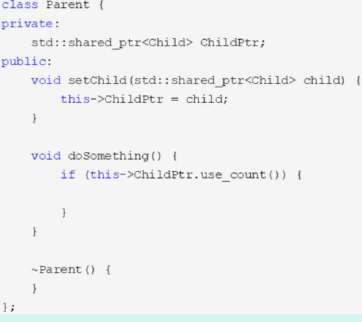
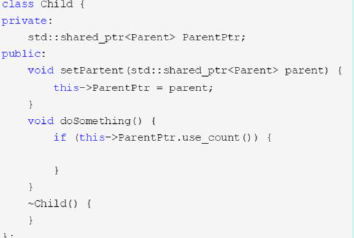
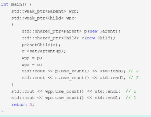

## 指针

### 指针和引用的区别？ 

区别：

1，指针是变量，内容是所指内存的地址，而引用只是内存的别名，不分配内存空间；
2，指针可变；引用只能在定义时被初始化一次，之后不可变；
3，引用不能为空，指针可以为空；
4，指针可以有多级指针（**p），而引用至于一级；
5，指针和引用使用++运算符的意义不一样；
6，如果返回动态内存分配的对象或者内存，必须使用指针，引用可能引起内存泄露。

### 空指针和野指针 

野指针就是指向一个已删除的对象或者未申请访问受限内存区域的指针

描述一下危害和怎么解决

### 函数指针和用途

1、定义
函数指针是指向函数的指针变量。
函数指针本身首先是一个指针变量，该指针变量指向一个具体的函数。这正如用指针变量可
指向整型变量、字符型、数组一样，这里是指向函数。
C 在编译时，每一个函数都有一个入口地址，该入口地址就是函数指针所指向的地址。有了
指向函数的指针变量后，可用该指针变量调用函数，就如同用指针变量可引用其他类型变量一样，
在这些概念上是大体一致的。
2、用途：
调用函数和做函数的参数，比如回调函数。
3、示例：
char * fun(char * p) {…} // 函数fun
char * (*pf)(char * p); // 函数指针pf
pf = fun; // 函数指针pf 指向函数fun
pf(p); // 通过函数指针pf 调用函数fun

### this 指针

1. `this` 指针是一个隐含于每一个非静态成员函数中的特殊指针。它指向调用该成员函数的那个对象。
2. 当对一个对象调用成员函数时，编译程序先将对象的地址赋给 `this` 指针，然后调用成员函数，每次成员函数存取数据成员时，都隐含使用 `this` 指针。
3. 当一个成员函数被调用时，自动向它传递一个隐含的参数，该参数是一个指向这个成员函数所在的对象的指针。
4. `this` 指针被隐含地声明为: `ClassName *const this`，这意味着不能给 `this` 指针赋值；在 `ClassName` 类的 `const` 成员函数中，`this` 指针的类型为：`const ClassName* const`，这说明不能对 `this` 指针所指向的这种对象是不可修改的（即不能对这种对象的数据成员进行赋值操作）；
5. `this` 并不是一个常规变量，而是个右值，所以不能取得 `this` 的地址（不能 `&this`）。
6. 在以下场景中，经常需要显式引用 `this` 指针：
   1. 为实现对象的链式引用；
   2. 为避免对同一对象进行赋值操作；
   3. 在实现一些数据结构时，如 `list`。

this指针是什么？

- this指针是类的指针，指向对象的首地址。
- this指针只能在成员函数中使用，在全局函数、静态成员函数中都不能用this。
- this指针只有在成员函数中才有定义，且存储位置会因编译器不同有不同存储位置。

### 防止指针的越界使用

必须让指针指向一个有效的内存地址, 
1 防止数组越界 
2 防止向一块内存中拷贝过多的内容 
3 防止使用空指针 
4 防止改变const修改的指针 
5 防止改变指向静态存储区的内容 
6 防止两次释放一个指针 
7 防止使用野指针. 

### 堆和栈上的指针

指针所指向的这块内存是在哪里分配的,在堆上称为堆上的指针,在栈上为栈上的指针. 
在堆上的指针,可以保存在全局数据结构中,供不同函数使用访问同一块内存. 
在栈上的指针,在函数退出后,该内存即不可访问.  


### 介绍智能指针及其实现（实现见牛客30题）

C++里面的四个智能指针: auto_ptr, shared_ptr, weak_ptr, unique_ptr，第一个已被C++11 弃用。

智能指针的作用：

管理指针，指针可能存在忘记释放造成内存泄漏。因为智能指针就是一个类，当超出了类的作用域时，类会自动调用析构函数，析构函数会自动释放资源。智能指针的作用原理就是在函数结束时自动释放内存空间，不需要手动释放内存空间。

1，auto_ptr（c++98 的方案，cpp11 已经抛弃）
采用所有权模式。
auto_ptr< string> p1 (new string ("I reigned lonely as a cloud.”));
auto_ptr<string> p2;
p2 = p1; //auto_ptr 不会报错.
此时不会报错，p2 剥夺了p1 的所有权，但是当程序运行时访问p1 将会报错。所以auto_ptr的缺点是：存在潜在的内存崩溃问题！

2，unique_ptr（替换auto_ptr）
unique_ptr 实现独占式拥有或严格拥有概念，保证同一时间内只有一个智能指针可以指向该对象。它对于避免资源泄露(例如“以new 创建对象后因为发生异常而忘记调用delete”)特别有用。
采用所有权模式，还是上面那个例子
unique_ptr<string> p3 (new string ("auto")); //#4
unique_ptr<string> p4； //#5
p4 = p3;//此时会报错！！

编译器认为p4=p3 非法，避免了p3 不再指向有效数据的问题。因此，unique_ptr 比auto_ptr更安全。另外unique_ptr 还有更聪明的地方：当程序试图将一个unique_ptr 赋值给另一个时，如果源unique_ptr 是个临时右值，编译器允许这么做；如果源unique_ptr 将存在一段时间，编译器将禁止这么做，比如：
  unique_ptr<string> pu1(new string ("hello world"));
  unique_ptr<string> pu2;
  pu2 = pu1; // #1 not allowed
  unique_ptr<string> pu3;
  pu3 = unique_ptr<string>(new string ("You")); // #2 allowed

其中#1 留下悬挂的unique_ptr(pu1)，这可能导致危害。而#2 不会留下悬挂的unique_ptr， 因为它调用unique_ptr 的构造函数，该构造函数创建的临时对象在其所有权让给pu3 后就会被销毁。这种随情况而已的行为表明，unique_ptr 优于允许两种赋值的auto_ptr 。
注：如果确实想执行类似与#1 的操作，要安全的重用这种指针，可给它赋新值。C++有一个标准库函数std::move()，让你能够将一个unique_ptr 赋给另一个。例如：
  unique_ptr<string> ps1, ps2;
  ps1 = demo("hello");
  ps2 = move(ps1);
  ps1 = demo("alexia");
  cout << *ps2 << *ps1 << endl；

3，shared_ptr
shared_ptr 实现共享式拥有概念。多个智能指针可以指向相同对象，该对象和其相关资源会在“最后一个引用被销毁”时候释放。从名字share 就可以看出了资源可以被多个指针共享，它使用计数机制来表明资源被几个指针共享。可以通过成员函数use_count()来查看资源的所有者个数。除了可以通过new 来构造，还可以通过传入auto_ptr, unique_ptr,weak_ptr 来构造。当我们调用release()时，当前指针会释放资源所有权，计数减一。当计数等于0 时，资源会被释放。

shared_ptr 是为了解决auto_ptr 在对象所有权上的局限性(auto_ptr 是独占的), 在使用引用计数的机制上提供了可以共享所有权的智能指针。成员函数：
  use_count 返回引用计数的个数
  unique 返回是否是独占所有权( use_count 为1)
  swap 交换两个shared_ptr 对象(即交换所拥有的对象)
  reset 放弃内部对象的所有权或拥有对象的变更, 会引起原有对象的引用计数的减少
  get 返回内部对象(指针), 由于已经重载了()方法, 因此和直接使用对象是一样的.如
  shared_ptr<int> sp(new int(1)); sp 与sp.get()是等价的

4，weak_ptr

weak_ptr 是一种不控制对象生命周期的智能指针, 它指向一个shared_ptr 管理的对象.进行该对象的内存管理的是那个强引用的shared_ptr. weak_ptr 只是提供了对管理对象的一个访问手段。weak_ptr 设计的目的是为配合shared_ptr 而引入的一种智能指针来协助shared_ptr 工作, 它只可以从一个shared_ptr 或另一个weak_ptr 对象构造, 它的构造和析构不会引起引用记数的增加或减少。weak_ptr 是用来解决shared_ptr 相互引用时的死锁问题,如果说两个shared_ptr 相互引用,那么这两个指针的引用计数永远不可能下降为0,资源永远不会释放。它是对对象的一种弱引用，不会增加对象的引用计数，和shared_ptr 之间可以相互转化，shared_ptr 可以直接赋值给它，它可以通过调用lock 函数来获得shared_ptr。

```c++
class B;
class A
{
    public:
    	shared_ptr<B> pb_;
        ~A()
        {
            cout<<"A delete\n";
        }
};

class B
{
    public:
    	shared_ptr<A> pa_;
        ~B()
        {
            cout<<"B delete\n";
        }
};

void fun()
{
    shared_ptr<B> pb(new B());
    shared_ptr<A> pa(new A());
    pb->pa_ = pa;
    pa->pb_ = pb;
    cout<<pb.use_count()<<endl;
    cout<<pa.use_count()<<endl;
}
int main()
{
    fun();
    return 0;
}
```

可以看到fun 函数中pa ，pb 之间互相引用，两个资源的引用计数为2，当要跳出函数时，智能指针pa，pb 析构时两个资源引用计数会减一，但是两者引用计数还是为1，导致跳出函数时资源没有被释放（A B 的析构函数没有被调用），如果把其中一个改为weak_ptr 就可以了，我们把类A 里面的shared_ptr pb_; 改为weak_ptr pb_; 运行结果如下，这样的话，资源B 的引用开始就只有1，当pb 析构时，B 的计数变为0，B 得到释放，B 释放的同时也会使A 的计数减一，同时pa 析构时使A 的计数减一，那么A 的计数为0，A 得到释放。注意的是我们不能通过weak_ptr 直接访问对象的方法，比如B 对象中有一个方法print(),我们不能这样访问，pa->pb_->print(); 英文pb_是一个weak_ptr，应该先把它转化为
shared_ptr,如：shared_ptr p = pa->pb_.lock(); p->print();

链接：

https://www.cnblogs.com/DswCnblog/p/5628195.html

https://www.cnblogs.com/diysoul/p/5930361.html

https://www.cnblogs.com/diysoul/p/5930372.html

一个基于计数的智能指针的实现：

```c++
template <typename T>
class SmartPointer {
public:
	//构造函数
	SmartPointer(T* p=0): _ptr(p), _reference_count(new size_t){
		if(p)
			*_reference_count = 1; 
		else
			*_reference_count = 0; 
	}
	//拷贝构造函数
	SmartPointer(const SmartPointer& src) {
		if(this!=&src) {
			_ptr = src._ptr;
			_reference_count = src._reference_count;
			(*_reference_count)++;
		}
	}
	//重载赋值操作符
	SmartPointer& operator=(const SmartPointer& src) {
		if(_ptr==src._ptr) {
			return *this;
		}
		releaseCount();
		_ptr = src._ptr;
		_reference_count = src._reference_count;
		(*_reference_count)++;
		return *this;
	}
 
	//重载操作符
	T& operator*() {
		if(ptr) {
			return *_ptr;
		}
		//throw exception
	}
	//重载操作符
	T* operator->() {
		if(ptr) {
			return _ptr;
		}
		//throw exception
	}
	//析构函数
	~SmartPointer() {
		if (--(*_reference_count) == 0) {
            delete _ptr;
            delete _reference_count;
        }
	}
private:
	T *_ptr;
        size_t *_reference_count;
        void releaseCount() {
		if(_ptr) {
			(*_reference_count)--;
    			if((*_reference_count)==0) {
    				delete _ptr;
    				delete _reference_count;
    			}
		}
    	}
};
 
int main() 
{
    SmartPointer<char> cp1(new char('a'));
    SmartPointer<char> cp2(cp1);
    SmartPointer<char> cp3;
    cp3 = cp2;
    cp3 = cp1;
    cp3 = cp3;
    SmartPointer<char> cp4(new char('b'));
    cp3 = cp4;
}
```

### 

### 智能指针有没有内存泄露的情况 ，如何解决 

当两个对象相互使用一个shared_ptr 成员变量指向对方，会造成循环引用，使引用计数失
效，从而导致内存泄漏。例如：







上述代码中，parent 有一个shared_ptr 类型的成员指向孩子，而child 也有一个shared_ptr
类型的成员指向父亲。然后在创建孩子和父亲对象时也使用了智能指针c 和p，随后将c 和p 分
别又赋值给child 的智能指针成员parent 和parent 的智能指针成员child。从而形成了一个循
环引用：

### 如何解决智能指针的内存泄漏

为了解决循环引用导致的内存泄漏，引入了weak_ptr 弱指针，weak_ptr 的构造函数不会修
改引用计数的值，从而不会对对象的内存进行管理，其类似一个普通指针，但不指向引用计数的
共享内存，但是其可以检测到所管理的对象是否已经被释放，从而避免非法访问。 