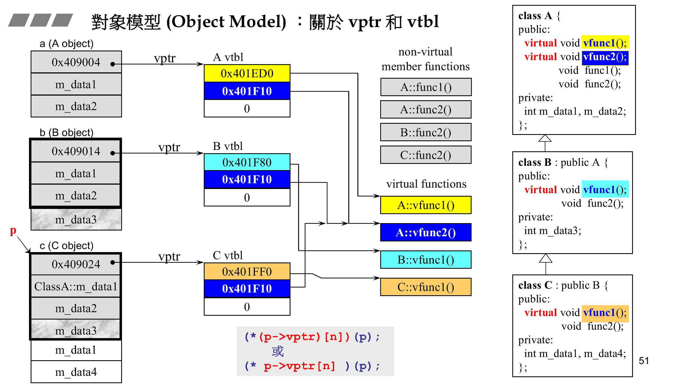

## 类

### C++空类有哪些成员函数?

- 首先，空类大小为1字节。
- 默认函数有：构造，析构，拷贝构造函数和赋值运算符。

### 构造函数和析构函数

构造没有返回值（包括void 类型），可以带参数，可以重载。

析构没有返回值，不能带参数，不能重载。只能有一个析构函数，

如果用户没有编写析构函数，编译系统会自动生成一个缺省的析构函数（即使自定义了析构函数，编译器也总是会为我们合成一个析构函数，并且如果自定义了析构函数，编译器在执行时会先调用自定义的析构函数再调用合成的析构函数），它也不进行任何操作。所以许多简单的类中没有用显式的析构函数。

### 构造顺序，析构顺序？

- 调用所有虚基类的构造函数，顺序为从左到右，从最底层到最上层
- 基类的构造函数：如果有多个基类，先纵向到最底层基类构造函数，如果横向继承了多个类，调用顺序为从左到右顺序。
- 如果该对象需要虚函数指针(vptr)，则该指针会被设置从而指向对应的虚函数表(vtbl)。
- 成员类对象的构造函数：如果类的变量中包含其他类（类的组合），需要在调用本类构造函数前先调用成员类对象的构造函数，调用顺序遵照在类中被声明的顺序。
- 派生类的构造函数。
- 析构函数与之相反。简要：1）派生类本身的析构函数；2）对象成员析构函数；3）基类析构函数。

### 哪些情况必须用到初始化成员列表

- 初始化一个const成员。
- 初始化一个引用成员(reference)。
- 调用一个基类的构造函数，而该函数有一组参数。
- 调用一个数据成员对象的构造函数，而该函数有一组参数。

```C++
#include <iostream>  
using namespace std;  
   
class Base  
{  
    public:  
		//初始化格式的记忆Bstr(str)看作Bstr = str,等同于赋值初始化
        Base(const string &str = "", int i = 0) : Bstr(str), _i(i) 
        {  
            cout << "Base Constructor" << " Bstr = " << Bstr << ", _i = " << _i << endl; 
        }      
        string Bstr;  
        int _i;  
};  

class CA 
{ 
	public: 
        int& counter; 
    	CA(int init):counter(&init){}; //注意用Reference类型
 }; 

class Derived : public Base  
{  
    public:  
        // 调用基类构造函数，而它拥有一组参数时，要使用成员初始化列表  
        Derived() : Base("DerivedStr", 200)  // 这个是正确的  
        {  
            //Base::Bstr = "DerivedStr"; // 基类构造函数再次之前调用，这里赋值没有用。  
            //Base::_i = 200;  
            cout << "Derived Constructor" << endl;  
        }  
        string Dstr;  
}; 
int main()  
{  
    Derived d;  
    return 0;  
}
```

### 初始化顺序和继承顺序

初始化列表中初始化的顺序是和变量声明的顺序一样，而与列表中的顺序无关

继承顺序按照继承从左到右进行。

### 拷贝构造函数中深拷贝和浅拷贝区别？

- 深拷贝时，当被拷贝对象存在动态分配的存储空间时，需要先动态申请一块存储空间，然后逐字节拷贝内容。
- 浅拷贝仅仅是拷贝指针字面值。
- 当使用浅拷贝时，如果原来的对象调用析构函数释放掉指针所指向的数据，则会产生空指针。因为所指向的内存空间已经被释放了。

### 拷贝构造函数和赋值运算符重载的区别？

- 拷贝构造函数是函数，赋值运算符是运算符重载。

- 拷贝构造函数会生成新的类对象，赋值运算符不能。

- 拷贝构造函数是直接构造一个新的类对象，所以在初始化对象前不需要检查源对象和新建对象是否相同；赋值运算符需要上述操作并提供两套不同的复制策略，另外赋值运算符中如果原来的对象有内存分配则需要先把内存释放掉。

- 形参传递是调用拷贝构造函数（调用的被赋值对象的拷贝构造函数），但并不是所有出现"="的地方都是使用赋值运算符，如下：

  ```C++
  Student s;
  Student s1 = s;    // 调用拷贝构造函数
  Student s2;
  s2 = s;    // 赋值运算符操作
  ```

**注：类中有指针变量时要重写析构函数、拷贝构造函数和赋值运算符**

### friend 友元类和友元函数

- 能访问私有成员  
- 破坏封装性
- 友元关系不可传递
- 友元关系的单向性
- 友元声明的形式及数量不受限制

## 面向对象

面向对象程序设计（Object-oriented programming，OOP）是种具有对象概念的程序编程典范，同时也是一种程序开发的抽象方针。

面向对象三大特征 —— 封装、继承、多态

### 封装

把客观事物封装成抽象的类，并且类可以把自己的数据和方法只让可信的类或者对象操作，对不可信的进行信息隐藏。关键字：public, protected, private。不写默认为 private。

- public成员：可以被任意实体访问
- protected 成员：只允许被子类及本类的成员函数访问
- private 成员：只允许被本类的成员函数访问

### 继承

- 基类（父类）——&gt; 派生类（子类）

### 多态

- 多态是以封装和继承为基础的。
- C++ 多态分类及实现：
  1. 重载多态（Ad-hoc Polymorphism，编译期）：函数重载、运算符重载
  2. 参数多态性（Parametric Polymorphism，编译期）：类模板、函数模板
  3. 强制多态（Coercion Polymorphism，编译期/运行期）：基本类型转换、自定义类型转换
  4. 子类型多态（Subtype Polymorphism，运行期）：虚函数

- 也可以简单分为静态多态和动态多态

静态和动态，重载、重写和模板，虚函数

C++的多态分为静态多态（编译时多态）和动态多态（运行时多态）两大类。
静态多态通过重载、模板来实现；动态多态通过虚函数来体现的。  

举个例子：一个父类类型的指针指向一个子类对象时候，使用父类的指针去调用子类中重写了的父类中的虚函数的时候，会调用子类重写过后的函数，在父类中声明为加了virtual 关键字的函数，在子类中重写时候不需要加virtual也是虚函数。
虚函数的实现：在有虚函数的类中，类的最开始部分是一个虚函数表的指针，这个指针指向一个虚函数表，表中放了虚函数的地址，实际的虚函数在代码段(.text)中。当子类继承了父类的时候也会继承其虚函数表，当子类重写父类中虚函数时候，会将其继承到的虚函数表中的地址替换为重新写的函数地址。使用了虚函数，会增加访问内存开销，降低效率。

### 虚函数：

```c++
class Shape                     // 形状类
{
    public:
        virtual double calcArea()
        {
        }
        virtual ~Shape();
};
class Circle : public Shape     // 圆形类
{
    public:
        virtual double calcArea();
};
class Rect : public Shape       // 矩形类
{
    public:
        virtual double calcArea();
};
int main()
{
    Shape * shape1 = new Circle(4.0);
    Shape * shape2 = new Rect(5.0, 6.0);
    shape1->calcArea();         // 调用圆形类里面的方法
    shape2->calcArea();         // 调用矩形类里面的方法
    delete shape1;
    shape1 = nullptr;
    delete shape2;
    shape2 = nullptr;
    return 0;
}
```

#### 虚函数的实现原理


虚函数实现原理:包括虚函数表、虚函数指针等 。以如下代码举例：

```C++
class A {
    public:
        virtual void vfunc1();
        virtual void vfunc2();
        void func1();
        void func2();
        virtual ~A();
    private:
        int m_data1, m_data2;
}; 

class B : A {
    public:
        virtual void vfunc1();;
        void func2();
        virtual ~B();
    private:
        int m_data3;
};

class C : B {
    public:
        virtual void vfunc1();
        void func();
    private:
        int m_data1, m_data4;
};
```



对其分析如下：

1. 每个含有虚函数的类在内存中多一根指针（vptr）,见图中a,b,c对象中第一个位置，存储的是虚函数表（vtbl）所在的位置。

2. 虚函数表（vtbl）存储着所有虚函数的位置，由于其动态绑定特性，在覆写（override）后在子类中存储的虚函数位置与父类中不相同。

3. 分析上述代码， B继承A，所以A中的数据部分也被B继承下来，同时B添加上了自己的数据部分m_data3，加之vptr，组成了B左侧的内存布局。

　　A中的虚函数vfunc1()，vfunc2()可以被覆写和动态绑定。

　　所以在B中，vfunc1()被覆写，其vtbl中对应项指向了新的函数的位置（亮蓝色）。vfunc2()未被覆写，仍然指向原先位置（深蓝色）。

　　C与B同理，vfunc1()被覆写，其vtbl中对应项指向了新的函数的位置（橘黄色）。vfunc2()未被覆写，仍然指向原先位置（深蓝色）。

非虚函数静态绑定，存储在单独的内存空间（code memory section，灰色函数部分），调用时把对象的this指针，传给一个invisible参数，以便确定谁在调用函数。

4. 调用虚函数的语句的C语言形式如图中下部分所示，其中n表示对应的函数在第几个位置（编译器在建立虚函数表的时候已知），从而实现动态绑定。

[原文链接](https://www.cnblogs.com/wangxiaobao/p/5850949.html)

#### 虚函数的内存访问

C++多态分为静态多态和动态多态。
静态多态是通过重载，重写和模板来实现，在编译的时候确定。
动态多态通过虚函数和继承关系来实现，执行动态绑定，在运行的时候确定。
动态多态实现有几个条件：
(1) 虚函数；
(2) 一个基类的指针或引用指向派生类的对象；
基类指针在调用成员函数(虚函数)时，就会去查找该对象的虚函数表。虚函数表的地址在每个对象的首地址。查找该虚函数表中该函数的指针进行调用。
每个对象中保存的只是一个虚函数表的指针，C++内部为每一个类维持一个虚函数表，该类的对象的都指向这同一个虚函数表。

虚函数表中为什么就能准确查找相应的函数指针呢？因为在类设计的时候，虚函数表直接从基类也继承过来，如果覆盖了其中的某个虚函数，那么虚函数表的指针就会被替换，因此可以根据指针准确找到该调用哪个函数。

virtual 修饰符
如果一个类是局部变量，则该类数据存储在栈区。如果一个类是通过new/malloc 动态申请的，则该类数据存储在堆区。
如果该类是virutal 继承而来的子类，则该类的虚函数表指针和该类其他成员一起存储。虚函数表指针指向只读数据段中的类虚函数表，虚函数表中存放着一个个函数指针，函数指针指向代码段中的具体函数。

#### 虚函数调用性能

虚函数调用过程如下（引自More Effective C++）:

通过对象的 vptr 找到类的 vtbl。
找到对应 vtbl 内的指向被调用函数的指针。编译器为每个虚函数在 vtbl 内分配了一个唯一的索引。这步的代价只是在 vtbl 数组内 的一个偏移。
调用第二步找到的的指针所指向的函数。

在单继承的情况下，调用虚函数所需的代价基本上和非虚函数效率一样，在大多数计算机上它多执行了很少的一些指令。

在多继承的情况下，由于会根据多个父类生成多个vptr，在对象里为寻找 vptr 而进行的偏移量计算会变得复杂一些，但这些并不是虚函数的性能瓶颈。 虚函数运行时所需的代价主要是虚函数不能是内联函数。因为内联函数是指在编译期间用被调用的函数体本身来代替函数调用的指令，但是虚函数的“虚”是指“直到运行时才能知道要调用的是哪一个函数。所以没法在编译时进行内联函数展开。当然如果通过对象直接调用虚函数它是可以被内联，但是大多数虚函数是通过对象的指针或引用被调用的，这种调用不能被内联。 因为这种调用是标准的调用方式，所以虚函数实际上不能被内联。

#### 虚函数占用空间

​	编译器会给每一个包含虚函数或继承了虚函数的类自动建立一个虚函数表，所以虚函数的一个代价就是会增加类的体积。在虚函数接口较少的类中这个代价并不明显，虚函数表vtbl的体积相当于几个函数指针的体积，如果你有大量的类或者在每个类中有大量的虚函数,你会发现 vtbl 会占用大量的地址空间。
​	但这并不是最主要的代价，主要的代价是发生在类的继承过程中，当子类继承父类的虚函数时，子类会有自己的vtbl，如果子类只覆盖父类的一两个虚函数接口，子类vtbl的其余部分内容会与父类重复。这在如果存在大量的子类继承，且重写父类的虚函数接口只占总数的一小部分的情况下，会造成大量地址空间浪费。
​	由于虚函数指针vptr的存在，虚函数也会增加该类的每个对象的体积。在单继承或没有继承的情况下，类的每个对象会多一个vptr指针的体积，也就是4个字节；在多继承的情况下，类的每个对象会多N个（N＝包含虚函数的父类个数）vptr的体积，也就是4N个字节。当一个类的对象体积较大时，这个代价不是很明显，但当一个类的对象很轻量的时候，如成员变量只有4个字节，那么再加上4（或4N）个字节的vptr，对象的体积相当于翻了1（或N）倍，这个代价是非常大的。

[C++中的虚函数(表)实现机制以及用C语言对其进行的模拟实现](https://blog.twofei.com/496/)

### 虚析构函数

虚析构函数是为了解决基类的指针指向派生类对象，并用基类的指针删除派生类对象。

```c++
class Shape
{
public:
    Shape();                    // 构造函数不能是虚函数
    virtual double calcArea();
    virtual ~Shape();           // 虚析构函数
};
class Circle : public Shape     // 圆形类
{
public:
    virtual double calcArea();
    ...
};
int main()
{
    Shape * shape1 = new Circle(4.0);
    shape1->calcArea();    
    delete shape1;  // 因为Shape有虚析构函数，所以delete释放内存时，先调用子类析构函数，再调用基类析构函数，防止内存泄漏。
    shape1 = NULL;
    return 0；
}
```

### 虚析构函数怎么应用?

​	C++中基类采用virtual虚析构函数是为了防止内存泄漏。如果派生类中申请了内存空间，并在其析构函数中对这些内存空间进行释放。假设基类中采用的是非虚析构函数，当删除基类指针指向的派生类对象时就不会触发动态绑定，因而只会调用基类的析构函数，而不会调用派生类的析构函数。派生类中申请的空间就得不到释放从而产生内存泄漏。
​	所以C++中基类的析构函数应采用virtual虚析构函数。一般只有当一个类被用来作为基类的时候，才把析构函数写成虚函数。因为当类里面有虚函数的时候，编译器会给类添加一个虚函数表，里面来存放虚函数指针，这样就会增加类的存储空间。

​	析构函数可以是纯虚函数，含有纯虚函数的类是抽象类，此时不能被实例化。但派生类中可以根据自身需求重新改写基类中的纯虚函数。

### 为什么C++默认的析构函数不是虚函数

C++默认的析构函数不是虚函数是因为虚函数需要额外的虚函数表和虚表指针，占用额外的内存。而对于不会被继承的类来说，其析构函数如果是虚函数，就会浪费内存。因此C++默认的析构函数不是虚函数，而是只有当需要当作父类时，设置为虚函数。

### 哪些函数不能为虚函数

#### 简答

- 普通函数（非类成员函数）
- 静态函数（static）
- 构造函数不能是虚函数
- 内联函数

#### 静态成员函数和虚函数

静态的成员函数是属于整个类的，不对某一个对象而言，同时其函数的指针存放也不同于一般的成员函数，其无法成为一个对象的虚函数的指针以实现由此带来的动态机制。     

#### 构造函数和虚函数

构造函数本身不能是虚函数。因为在调用构造函数时，虚表指针并没有在对象的内存空间中，必须要构造函数调用完成后才会形成虚表指针。

virtual函数基于vtable（内存空间），constructor函数如果是virtual的，调用时也需要根据vtable寻找，但是constructor是virtual的情况下是找不到的，因为constructor自己本身都不存在了，创建不到class的实例，没有实例，class的成员（除了public static/protected static for friend class/functions，其余无论是否virtual）都不能被访问了。

在构造函数内部可以调用虚函数，但是实际执行的是父类的对应函数，因为自己还没构造好, 多态是被disable的。

使用虚函数是为了创建对象后调用函数时多态，而构造函数是创建对象时自行调用的。目的不同。 

#### 内联函数和虚函数

因为内联函数是指在编译期间用被调用的函数体本身来代替函数调用的指令，但是虚函数的“虚”是指“直到运行时才能知道要调用的是哪一个函数。所以没法在编译时进行内联函数展开。当然如果通过对象直接调用虚函数它是可以被内联，但是大多数虚函数是通过对象的指针或引用被调用的，这种调用不能被内联。

也就是说虚函数可以是内联函数，内联是可以修饰虚函数的，但是当虚函数表现多态性的时候不能内联。内联是在编译器建议编译器内联，而虚函数的多态性在运行期，编译器无法知道运行期调用哪个代码。

### 虚函数的一些常见问题：

1) 虚函数是动态绑定的，也就是说，使用虚函数的指针和引用能够正确找到实际类的对应函数，而不是执行定义类的函数。 

2) 构造函数不能是虚函数。而且，在构造函数中调用虚函数，实际执行的是父类的对应函数，因为自己还没有构造好, 多态是被disable的。 

3) 析构函数可以是虚函数，而且，在一个复杂类结构中，这往往是必须的。

4) 将一个函数定义为纯虚函数，实际上是将这个类定义为抽象类，不能实例化对象。 

5) 纯虚函数通常没有定义体，但也完全可以拥有。

6) 析构函数可以是纯虚的，但纯虚析构函数必须有定义体，因为析构函数的调用是在子类中隐含的。 

7) 非纯的虚函数必须有定义体，不然是一个错误。 

8) 派生类的override虚函数定义必须和父类完全一致。除了一个特例，如果父类中返回值是一个指针或引用，子类override时可以返回这个指针（或引用）的派生。例如，在上面的例子中，在Base中定义了 virtual Base* clone(); 在Derived中可以定义为 virtual Derived* clone()。可以看到，这种放松对于Clone模式是非常有用的。

[虚析构函数(√)、纯虚析构函数(√)、虚构造函数(X)](http://www.cnblogs.com/chio/archive/2007/09/10/888260.html)

### 抽象类和纯虚函数


#### 概念：

纯虚函数是一种特殊的虚函数，在基类中声明，在子类中实现，在基类中实现。包含纯虚函数的类成为抽象类。

抽象类不能实例化。

纯虚函数的方法是在函数原型后加“=0”

```cpp
virtual int A() = 0;
```

#### 目的：

1、为了方便使用多态特性，我们常常需要在基类中定义虚拟函数。
2、在很多情况下，基类本身生成对象是不合情理的。例如，动物作为一个基类可以派生出老虎、孔雀等子类，但动物本身生成对象明显不合常理。

#### 虚函数和纯虚函数的区别

- 类里如果声明了虚函数，这个函数是实现的，哪怕是空实现，它的作用就是为了能让这个函数在它的子类里面可以被覆盖，这样的话，这样编译器就可以使用后期绑定来达到多态了。纯虚函数只是一个接口，是个函数的声明而已，它要留到子类里去实现。 
- 虚函数在子类里面也可以不重载的；但纯虚函数必须在子类去实现。
- 虚函数的类用于 “实作继承”，继承接口的同时也继承了父类的实现。当然大家也可以完成自己的实现。纯虚函数关注的是接口的统一性，实现由子类完成。 
- 带纯虚函数的类叫抽象类，这种类不能直接生成对象，而只有被继承，并重写其虚函数后，才能使用。抽象类和大家口头常说的虚基类还是有区别的，

- 纯虚函数只是相当于一个接口名，但含有纯虚函数的类不能够实例化。

[虚函数和纯虚函数的区别](http://blog.csdn.net/hackbuteer1/article/details/7558868)

### 虚继承

虚继承用于解决多继承条件下的菱形继承问题（浪费存储空间、存在二义性）。

底层实现原理与编译器相关，一般通过虚基类指针和虚基类表实现，每个虚继承的子类都有一个虚基类指针（占用一个指针的存储空间，4字节）和虚基类表（不占用类对象的存储空间）（需要强调的是，虚基类依旧会在子类里面存在拷贝，只是仅仅最多存在一份而已，并不是不在子类里面了）；当虚继承的子类被当做父类继承时，虚基类指针也会被继承。

实际上，vbptr 指的是虚基类表指针（virtual base table pointer），该指针指向了一个虚基类表（virtual table），虚表中记录了虚基类与本类的偏移地址；通过偏移地址，这样就找到了虚基类成员，而虚继承也不用像普通多继承那样维持着公共基类（虚基类）的两份同样的拷贝，节省了存储空间。

### 为什么需要虚继承?虚继承实现原理解析

虚拟继承是多重继承中特有的概念。虚拟基类是为解决多重继承而出现的。
如:类D继承自类B1、B2，而类B1、B2都继 承自类A，因此在类D中两次出现类A中的变量和函数。为了节省内存空间，可以将B1、B2对A的继承定义为虚拟继承，而A就成了虚拟基类,虚拟继承在一般的应用中很少用到，所以也往往被忽视，这也主要是因为在C++中，多重继承是不推荐的，也并不常用，而一旦离开了多重继承，虚拟继承就完全失去了存在的必要因为这样只会降低效率和占用更多的空间。

虚继承的特点是，在任何派生类中的virtual基类总用同一个（共享）对象表示，

### 虚继承、虚函数

- 相同之处：都利用了虚指针（均占用类的存储空间）和虚表（均不占用类的存储空间）
- 不同之处：
  - 虚继承
    - 虚基类依旧存在继承类中，只占用存储空间
    - 虚基类表存储的是虚基类相对直接继承类的偏移
  - 虚函数
    - 虚函数不占用存储空间
    - 虚函数表存储的是虚函数地址

### 模板类、成员模板、虚函数

- 模板类中可以使用虚函数
- 一个类（无论是普通类还是类模板）的成员模板（本身是模板的成员函数）不能是虚函数

### 抽象类、接口类、聚合类

- 抽象类：含有纯虚函数的类
- 接口类：仅含有纯虚函数的抽象类
- 聚合类：用户可以直接访问其成员，并且具有特殊的初始化语法形式。满足如下特点：
  - 所有成员都是 public
  - 没有定义任何构造函数
  - 没有类内初始化
  - 没有基类，也没有 virtual 函数

### C++设计一个不能被继承的类

构造函数或析构函数为私有函数，所以该类是无法被继承的，


