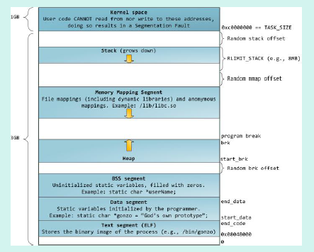

# 编译底层

## 编译底层

### C++源文件从文本到可执行文件经历的过程**？** 

对于C++源文件，从文本到可执行文件一般需要四个过程：
预处理阶段：对源代码中文件包含关系（头文件）、预编译语句（宏定义）进行分析和替换，生成预编译文件。
编译阶段：将经过预处理后的预编译文件转换成特定汇编代码，生成汇编文件
汇编阶段：将编译阶段生成的汇编文件转化成机器码，生成可重定位目标文件
链接阶段：将多个目标文件及所需要的库连接成最终的可执行目标文件

### C++的内存管理和内存分配 

在C++中，虚拟内存分为代码段、数据段、BSS 段、堆区、文件映射区以及栈区六部分。
代码段:包括只读存储区和文本区，其中只读存储区存储字符串常量，文本区存储程序的机器代码。
数据段：存储程序中已初始化的全局变量和静态变量
bss 段：存储未初始化的全局变量和静态变量（局部+全局），以及所有被初始化为0 的全局变量和静态变量。
堆区： 调用new/malloc 函数时在堆区动态分配内存，同时需要调用delete/free 来手动释放申请的内存。
映射区:存储动态链接库以及调用mmap 函数进行的文件映射

栈：使用栈空间存储函数的返回地址、参数、局部变量、返回值



32bitCPU 可寻址4G 线性空间，每个进程都有各自独立的4G 逻辑地址，其中0~3G 是用户态空间，3~4G 是内核空间，不同进程相同的逻辑地址会映射到不同的物理地址中。其逻辑地址其划分如下：
各个段说明如下：
3G 用户空间和1G 内核空间
静态区域：
text segment(代码段):包括只读存储区和文本区，其中只读存储区存储字符串常量，文本区存储程序的机器代码。
data segment(数据段)：存储程序中已初始化的全局变量和静态变量
bss segment：存储未初始化的全局变量和静态变量（局部+全局），以及所有被初始化为0的全局变量和静态变量，对于未初始化的全局变量和静态变量，程序运行main 之前时会统一清零。即未初始化的全局变量编译器会初始化为0

动态区域：
heap（堆）： 当进程未调用malloc 时是没有堆段的，只有调用malloc 时采用分配一个堆，并且在程序运行过程中可以动态增加堆大小(移动break 指针)，从低地址向高地址增长。分配小内存时使用该区域。堆的起始地址由mm_struct 结构体中的start_brk 标识，结束地址由brk标识。
memory mapping segment(映射区):存储动态链接库等文件映射、申请大内存（malloc 时调用mmap 函数）
stack（栈）：使用栈空间存储函数的返回地址、参数、局部变量、返回值，从高地址向低地址增长。在创建进程时会有一个最大栈大小，Linux 可以通过ulimit 命令指定。

### 内存泄露（memory leak）的判断

内存泄漏(memory leak)是指由于疏忽或错误造成了程序未能释放掉不再使用的内存的情况。内存泄漏并非指内存在物理上的消失，而是应用程序分配某段内存后，由于设计错误，失去了对该段内存的控制，因而造成了内存的浪费。
内存泄漏的分类：

1. 堆内存泄漏（Heap leak）。对内存指的是程序运行中根据需要分配通过malloc,realloc
   new 等从堆中分配的一块内存，再是完成后必须通过调用对应的free 或者delete 删掉。如果
   程序的设计的错误导致这部分内存没有被释放，那么此后这块内存将不会被使用，就会产生Heap
   Leak.
2. 系统资源泄露（Resource Leak）。主要指程序使用系统分配的资源比如
   Bitmap,handle ,SOCKET 等没有使用相应的函数释放掉，导致系统资源的浪费，严重可导致系统
   效能降低，系统运行不稳定。
3. 没有将基类的析构函数定义为虚函数。当基类指针指向子类对象时，如果基类的析构函
   数不是virtual，那么子类的析构函数将不会被调用，子类的资源没有正确是释放，因此造成内
   存泄露。

内存泄漏通常是由于调用了malloc/new 等内存申请的操作，但是缺少了对应的free/delete。
为了判断内存是否泄露，我们一方面可以使用linux 环境下的内存泄漏检查工具Valgrind,另一方面我们在写代码时可以添加内存申请和释放的统计功能，统计当前申请和释放的内存是否一致，以此来判断内存是否泄露。

### **malloc的原理**，**另外**brk系统调用**和m**map**系统调用的作用分别是什么

Malloc 函数用于动态分配内存。为了减少内存碎片和系统调用的开销，malloc 其采用内存池的方式，先申请大块内存作为堆区，然后将堆区分为多个内存块，以块作为内存管理的基本单位。当用户申请内存时，直接从堆区分配一块合适的空闲块。Malloc 采用隐式链表结构将堆区分成连续的、大小不一的块，包含已分配块和未分配块；同时malloc 采用显示链表结构来管理所有的空闲块，即使用一个双向链表将空闲块连接起来，每一个空闲块记录了一个连续的、未分配的地址。
当进行内存分配时，Malloc 会通过隐式链表遍历所有的空闲块，选择满足要求的块进行分配；当进行内存合并时，malloc 采用边界标记法，根据每个块的前后块是否已经分配来决定是否进行块合并。
Malloc 在申请内存时，一般会通过brk 或者mmap 系统调用进行申请。其中当申请内存小于128K 时，会使用系统函数brk 在堆区中分配；而当申请内存大于128K 时，会使用系统函数mmap在映射区分配。

### 什么时候会发生段错误 

段错误通常发生在访问非法内存地址的时候，具体来说分为以下几种情况：
使用野指针
试图修改字符串常量的内容

### I/O是什么

一个程序的 I/O 指代程序与外界的交互，包括文件、管程、网络、命令行、信号等。更广义地讲，I/O 指代操作系统理解为 “文件” 的事物。

### reactor模型

reactor 模型要求主线程只负责监听文件描述上是否有事件发生，有的话就立即将该事件通知工作线程，除此之外，主线程不做任何其他实质性的工作，读写数据、接受新的连接以及处理客户请求均在工作线程中完成。


1）Handle：即操作系统的句柄，是对资源在操作系统层面上的一种抽象，它可以是打开的文件、一个连接(Socket)、Timer 等。由于Reactor 模式一般使用在网络编程中，因而这里一般指Socket Handle，即一个网络连接。
2）Synchronous Event Demultiplexer（同步事件复用器）：阻塞等待一系列的Handle 中的事件到来，如果阻塞等待返回，即表示在返回的Handle 中可以不阻塞的执行返回的事件类型。这个模块一般使用操作系统的select 来实现。
3）Initiation Dispatcher：用于管理Event Handler，即EventHandler 的容器，用以注册、移除EventHandler 等；另外，它还作为Reactor 模式的入口调用Synchronous Event Demultiplexer 的select 方法以阻塞等待事件返回，当阻塞等待返回时，根据事件发生的Handle将其分发给对应的Event Handler 处理，即回调EventHandler 中的handle_event()方法。
4）Event Handler：定义事件处理方法：handle_event()，以供InitiationDispatcher 回调使用。
5）Concrete Event Handler：事件EventHandler 接口，实现特定事件处理逻辑。

### select，poll，epoll的区别**，**原理，性能，限制

#### select

是最初解决IO 阻塞问题的方法。用结构体fd_set 来告诉内核监听多个文件描述符，该结构体被称为描述符集。由数组来维持哪些描述符被置位了。对结构体的操作封装在三个宏定义中。通过轮寻来查找是否有描述符要被处理。
存在的问题：

1. 内置数组的形式使得select 的最大文件数受限与FD_SIZE；
2. 每次调用select 前都要重新初始化描述符集，将fd 从用户态拷贝到内核态，每次调用select 后，都需要将fd 从内核态拷贝到用户态；
3. 轮寻排查当文件描述符个数很多时，效率很低；
   

#### poll

通过一个可变长度的数组解决了select 文件描述符受限的问题。数组中元素是结构体，该结构体保存描述符的信息，每增加一个文件描述符就向数组中加入一个结构体，结构体只需要拷贝一次到内核态。poll 解决了select 重复初始化的问题。轮寻排查的问题未解决。

#### epoll：

轮寻排查所有文件描述符的效率不高，使服务器并发能力受限。因此，epoll 采用只返回状态发生变化的文件描述符，便解决了轮寻的瓶颈。  

epoll 对文件描述符的操作有两种模式：LT（level trigger）和ET（edge trigger）。LT模式是默认模式

##### LT 模式

LT(level triggered)是缺省的工作方式，并且同时支持block 和no-block socket.在这种做法中，内核告诉你一个文件描述符是否就绪了，然后你可以对这个就绪的fd 进行IO 操作。如果你不作任何操作，内核还是会继续通知。

##### ET 模式

ET(edge-triggered)是高速工作方式，只支持no-block socket。在这种模式下，当描述符从未就绪变为就绪时，内核通过epoll 告诉你。然后它会假设你知道文件描述符已经就绪，并且不会再为那个文件描述符发送更多的就绪通知，直到你做了某些操作导致那个文件描述符不再为就绪状态了(比如，你在发送，接收或者接收请求，或者发送接收的数据少于一定量时导致了一个EWOULDBLOCK 错误）。但是请注意，如果一直不对这个fd 作IO 操作(从而导致它再次变成未就绪)，内核不会发送更多的通知(only once)
ET 模式在很大程度上减少了epoll 事件被重复触发的次数，因此效率要比LT 模式高。epoll工作在ET 模式的时候，必须使用非阻塞套接口，以避免由于一个文件句柄的阻塞读/阻塞写操作把处理多个文件描述符的任务饿死。

##### LT 与ET 的区别：

LT 模式：当epoll_wait 检测到描述符事件发生并将此事件通知应用程序，应用程序可以不立即处理该事件。下次调用epoll_wait 时，会再次响应应用程序并通知此事件。
ET 模式：当epoll_wait 检测到描述符事件发生并将此事件通知应用程序，应用程序必须立即处理该事件。如果不处理，下次调用epoll_wait 时，不会再次响应应用程序并通知此事件。

### select,fork,wait,exec函数

select 在使用前，先将需要监控的描述符对应的bit 位置1，然后将其传给select,当有任何一个事件发生时，select 将会返回所有的描述符，需要在应用程序自己遍历去检查哪个描述符上有事件发生，效率很低，并且其不断在内核态和用户态进行描述符的拷贝，开销很大

父进程产生子进程使用fork 拷贝出来一个父进程的副本，此时只拷贝了父进程的页表，两个进程都读同一块内存，当有进程写的时候使用写实拷贝机制分配内存，exec 函数可以加载一个elf文件去替换父进程，从此父进程和子进程就可以运行不同的程序了。fork 从父进程返回子进程的pid，从子进程返回0.调用了wait 的父进程将会发生阻塞，直到有子进程状态改变,执行成功返回0，错误返回-1。exec 执行成功则子进程从新的程序开始运行，无返回值，执行失败返回-1

### DLL 库的编写（导出一个 DLL 模块）

```c++
// MyLib.h

#ifdef MYLIBAPI

// MYLIBAPI 应该在全部 DLL 源文件的 include "Mylib.h" 之前被定义
// 全部函数/变量正在被导出

#else

// 这个头文件被一个exe源代码模块包含，意味着全部函数/变量被导入
#define MYLIBAPI extern "C" __declspec(dllimport)

#endif

// 这里定义任何的数据结构和符号

// 定义导出的变量（避免导出变量）
MYLIBAPI int g_nResult;

// 定义导出函数原型
MYLIBAPI int Add(int nLeft, int nRight);

```

```c++
// MyLibFile1.cpp

// 包含标准Windows和C运行时头文件
#include <windows.h>

// DLL源码文件导出的函数和变量
#define MYLIBAPI extern "C" __declspec(dllexport)

// 包含导出的数据结构、符号、函数、变量
#include "MyLib.h"

// 将此DLL源代码文件的代码放在此处
int g_nResult;

int Add(int nLeft, int nRight)
{
    g_nResult = nLeft + nRight;
    return g_nResult;
}
```

```c++
//DLL 库的使用（运行时动态链接 DLL）

// A simple program that uses LoadLibrary and 
// GetProcAddress to access myPuts from Myputs.dll. 

#include <windows.h> 
#include <stdio.h> 

typedef int (__cdecl *MYPROC)(LPWSTR); 

int main( void ) 
{ 
    HINSTANCE hinstLib; 
    MYPROC ProcAdd; 
    BOOL fFreeResult, fRunTimeLinkSuccess = FALSE; 
// Get a handle to the DLL module.
 
hinstLib = LoadLibrary(TEXT("MyPuts.dll")); 
 
// If the handle is valid, try to get the function address.
 
if (hinstLib != NULL) 
{ 
    ProcAdd = (MYPROC) GetProcAddress(hinstLib, "myPuts"); 
 
    // If the function address is valid, call the function.
 
    if (NULL != ProcAdd) 
    {
        fRunTimeLinkSuccess = TRUE;
        (ProcAdd) (L"Message sent to the DLL function\n"); 
    }
    // Free the DLL module.
 
    fFreeResult = FreeLibrary(hinstLib); 
} 

// If unable to call the DLL function, use an alternative.
if (! fRunTimeLinkSuccess) 
    printf("Message printed from executable\n"); 

return 0;
}
```
### 运行库（Runtime Library）

#### 典型程序运行步骤

1. 操作系统创建进程，把控制权交给程序的入口（往往是运行库中的某个入口函数）
2. 入口函数对运行库和程序运行环境进行初始化（包括堆、I/O、线程、全局变量构造等等）。
3. 入口函数初始化后，调用 main 函数，正式开始执行程序主体部分。
4. main 函数执行完毕后，返回到入口函数进行清理工作（包括全局变量析构、堆销毁、关闭I/O等），然后进行系统调用结束进程。

###  内置数据类型大小

32位编译器：

​      char ：1个字节
​       **char\***（即指针变量）: 4个字节（32位的寻址空间是2^32, 即32个bit，也就是4个字节。同理64位编译器）
​       short int : 2个字节
​       int：  4个字节
​       unsigned int : 4个字节
​       float:  4个字节
​       double:   8个字节
​       **long**:   4个字节
​       long long:  8个字节
​       **unsigned long**:  4个字节

  64位编译器：

​      char ：1个字节
​       **char\***(即指针变量): 8个字节
​       short int : 2个字节
​       int：  4个字节
​       unsigned int : 4个字节
​       float:  4个字节
​       double:   8个字节
​       long:   8个字节
​       long long:  8个字节
​       unsigned long:  8个字节

### ++i和i++的区别和实现原理 

```c++
//++i 实现：
int& int::operator++（）
{
   *this +=1；
   return *this；
}
//i++ 实现：
const int int::operator（int）
{
   int oldValue = *this；
   ++（*this）；
   return oldValue；
}
```


### 写个函数在main函数执行前先运行

```c++
__attribute((constructor))void before()
{
	printf("before main\n");
}
```

在main执行之前执行的代码可能是什么？

- 全局对象的构造函数。