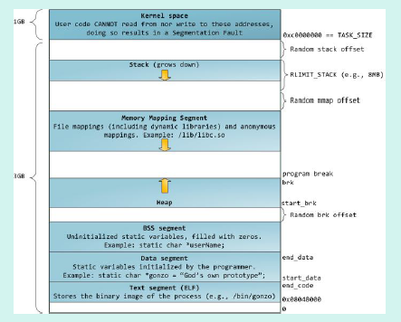

### C++编译过程

#### 总述：

对于C++源文件，从文本到可执行文件一般需要四个过程：
预处理阶段：对源代码中文件包含关系（头文件）、预编译语句（宏定义）进行分析和替换，生成预编译文件。
编译阶段：将经过预处理后的预编译文件转换成特定汇编代码，生成汇编文件
汇编阶段：将编译阶段生成的汇编文件转化成机器码，生成可重定位目标文件
链接阶段：将多个目标文件及所需要的库连接成最终的可执行目标文件

#### 1）预编译

主要处理源代码文件中的以“#”开头的预编译指令。处理规则见下
1、删除所有的#define，展开所有的宏定义。
2、处理所有的条件预编译指令，如“#if”、“#endif”、“#ifdef”、“#elif”和“#else”。
3、处理“#include”预编译指令，将文件内容替换到它的位置，这个过程是递归进行的，文件
中包含其他文件。
4、删除所有的注释，“//”和“/**/”。
5、保留所有的#pragma 编译器指令，编译器需要用到他们，如：#pragma once 是为了防止有文
件被重复引用。
6、添加行号和文件标识，便于编译时编译器产生调试用的行号信息，和编译时产生编译错误或
警告是能够显示行号。

#### 2）编译

把预编译之后生成的xxx.i 或xxx.ii 文件，进行一系列词法分析、语法分析、语义分析及优化
后，生成相应的汇编代码文件。
1、词法分析：利用类似于“有限状态机”的算法，将源代码程序输入到扫描机中，将其中的字
符序列分割成一系列的记号。
2、语法分析：语法分析器对由扫描器产生的记号，进行语法分析，产生语法树。由语法分析器
输出的语法树是一种以表达式为节点的树。

3、语义分析：语法分析器只是完成了对表达式语法层面的分析，语义分析器则对表达式是否有
意义进行判断，其分析的语义是静态语义——在编译期能分期的语义，相对应的动态语义是在运
行期才能确定的语义。
4、优化：源代码级别的一个优化过程。
5、目标代码生成：由代码生成器将中间代码转换成目标机器代码，生成一系列的代码序列——
汇编语言表示。
6、目标代码优化：目标代码优化器对上述的目标机器代码进行优化：寻找合适的寻址方式、使
用位移来替代乘法运算、删除多余的指令等。

#### 3）汇编

将汇编代码转变成机器可以执行的指令(机器码文件)。汇编器的汇编过程相对于编译器来说更
简单，没有复杂的语法，也没有语义，更不需要做指令优化，只是根据汇编指令和机器指令的对
照表一一翻译过来，汇编过程有汇编器as 完成。经汇编之后，产生目标文件(与可执行文件格式
几乎一样)xxx.o(Windows 下)、xxx.obj(Linux 下)。

#### 4）链接

将不同的源文件产生的目标文件进行链接，从而形成一个可以执行的程序。链接分为静态链接和
动态链接：

##### 1、静态链接：

函数和数据被编译进一个二进制文件。在使用静态库的情况下，在编译链接可执行文件时，链接
器从库中复制这些函数和数据并把它们和应用程序的其它模块组合起来创建最终的可执行文件。
空间浪费：因为每个可执行程序中对所有需要的目标文件都要有一份副本，所以如果多个程序对
同一个目标文件都有依赖，会出现同一个目标文件都在内存存在多个副本；
更新困难：每当库函数的代码修改了，这个时候就需要重新进行编译链接形成可执行程序。
运行速度快：但是静态链接的优点就是，在可执行程序中已经具备了所有执行程序所需要的任何
东西，在执行的时候运行速度快。

##### 2、动态链接：

动态链接的基本思想是把程序按照模块拆分成各个相对独立部分，在程序运行时才将它们链接在
一起形成一个完整的程序，而不是像静态链接一样把所有程序模块都链接成一个单独的可执行文
件。
共享库：就是即使需要每个程序都依赖同一个库，但是该库不会像静态链接那样在内存中存在多
分，副本，而是这多个程序在执行时共享同一份副本；
更新方便：更新时只需要替换原来的目标文件，而无需将所有的程序再重新链接一遍。当程序下
一次运行时，新版本的目标文件会被自动加载到内存并且链接起来，程序就完成了升级的目标。

性能损耗：因为把链接推迟到了程序运行时，所以每次执行程序都需要进行链接，所以性能会有
一定损失。

##### 3、动态链接和静态链接的区别

动态链接是只建立一个引用的接口，而真正的代码和数据存放在另外的可执行模块中，在运行时再装入；而静态链接是把所有的代码和数据都复制到本模块中，运行时就不再需要库了。

### C++的内存管理和内存分配 

在C++中，虚拟内存分为代码段、数据段、BSS 段、堆区、文件映射区以及栈区六部分。
代码段:包括只读存储区和文本区，其中只读存储区存储字符串常量，文本区存储程序的机器代码。
数据段：存储程序中已初始化的全局变量和静态变量
bss 段：存储未初始化的全局变量和静态变量（局部+全局），以及所有被初始化为0 的全局变量和静态变量。
堆区： 调用new/malloc 函数时在堆区动态分配内存，同时需要调用delete/free 来手动释放申请的内存。
栈：使用栈空间存储函数的返回地址、参数、局部变量、返回值
映射区:存储动态链接库以及调用mmap 函数进行的文件映射



32bitCPU 可寻址4G 线性空间，每个进程都有各自独立的4G 逻辑地址，其中0~3G 是用户态空间，3~4G 是内核空间，不同进程相同的逻辑地址会映射到不同的物理地址中。其逻辑地址其划分如下：
各个段说明如下：
3G 用户空间和1G 内核空间
静态区域：
text segment(代码段):包括只读存储区和文本区，其中只读存储区存储字符串常量，文本区存储程序的机器代码。
data segment(数据段)：存储程序中已初始化的全局变量和静态变量
bss segment：存储未初始化的全局变量和静态变量（局部+全局），以及所有被初始化为0的全局变量和静态变量，对于未初始化的全局变量和静态变量，程序运行main 之前时会统一清零。即未初始化的全局变量编译器会初始化为0

动态区域：
heap（堆）： 当进程未调用malloc 时是没有堆段的，只有调用malloc 时采用分配一个堆，并且在程序运行过程中可以动态增加堆大小(移动break 指针)，从低地址向高地址增长。分配小内存时使用该区域。堆的起始地址由mm_struct 结构体中的start_brk 标识，结束地址由brk标识。
memory mapping segment(映射区):存储动态链接库等文件映射、申请大内存（malloc 时调用mmap 函数）
stack（栈）：使用栈空间存储函数的返回地址、参数、局部变量、返回值，从高地址向低地址增长。在创建进程时会有一个最大栈大小，Linux 可以通过ulimit 命令指定。

### 内存泄露（memory leak）的判断

内存泄漏(memory leak)是指由于疏忽或错误造成了程序未能释放掉不再使用的内存的情况。内存泄漏并非指内存在物理上的消失，而是应用程序分配某段内存后，由于设计错误，失去了对该段内存的控制，因而造成了内存的浪费。
内存泄漏的分类：

1. 堆内存泄漏（Heap leak）。对内存指的是程序运行中根据需要分配通过malloc，realloc，new 等从堆中分配的一块内存，再是完成后必须通过调用对应的free 或者delete 删掉。如果程序的设计的错误导致这部分内存没有被释放，那么此后这块内存将不会被使用，就会产生HeapLeak.
2. 系统资源泄露（Resource Leak）。主要指程序使用系统分配的资源比如Bitmap,handle ,SOCKET 等没有使用相应的函数释放掉，导致系统资源的浪费，严重可导致系统效能降低，系统运行不稳定。
3. 没有将基类的析构函数定义为虚函数。当基类指针指向子类对象时，如果基类的析构函数不是virtual，那么子类的析构函数将不会被调用，子类的资源没有正确是释放，因此造成内存泄露。

内存泄漏通常是由于调用了malloc/new 等内存申请的操作，但是缺少了对应的free/delete。
为了判断内存是否泄露，我们一方面可以使用linux 环境下的内存泄漏检查工具Valgrind,另一方面我们在写代码时可以添加内存申请和释放的统计功能，统计当前申请和释放的内存是否一致，以此来判断内存是否泄露。

### DLL 库的编写

```c++
// MyLib.h
#ifdef MYLIBAPI

// MYLIBAPI 应该在全部 DLL 源文件的 include "Mylib.h" 之前被定义
// 全部函数/变量正在被导出
#else

// 这个头文件被一个exe源代码模块包含，意味着全部函数/变量被导入
#define MYLIBAPI extern "C" __declspec(dllimport)

#endif

// 这里定义任何的数据结构和符号

// 定义导出的变量（避免导出变量）
MYLIBAPI int g_nResult;

// 定义导出函数原型
MYLIBAPI int Add(int nLeft, int nRight);
```

```c++
// MyLibFile1.cpp

// 包含标准Windows和C运行时头文件
#include <windows.h>

// DLL源码文件导出的函数和变量
#define MYLIBAPI extern "C" __declspec(dllexport)

// 包含导出的数据结构、符号、函数、变量
#include "MyLib.h"

// 将此DLL源代码文件的代码放在此处
int g_nResult;

int Add(int nLeft, int nRight)
{
    g_nResult = nLeft + nRight;
    return g_nResult;
}
```

```c++
//DLL 库的使用（运行时动态链接 DLL）

// A simple program that uses LoadLibrary and 
// GetProcAddress to access myPuts from Myputs.dll. 

#include <windows.h> 
#include <stdio.h> 

typedef int (__cdecl *MYPROC)(LPWSTR); 

int main( void ) 
{ 
    HINSTANCE hinstLib; 
    MYPROC ProcAdd; 
    BOOL fFreeResult, fRunTimeLinkSuccess = FALSE; 
// Get a handle to the DLL module.
 
hinstLib = LoadLibrary(TEXT("MyPuts.dll")); 
 
// If the handle is valid, try to get the function address.
 
if (hinstLib != NULL) 
{ 
    ProcAdd = (MYPROC) GetProcAddress(hinstLib, "myPuts"); 
 
    // If the function address is valid, call the function.
 
    if (NULL != ProcAdd) 
    {
        fRunTimeLinkSuccess = TRUE;
        (ProcAdd) (L"Message sent to the DLL function\n"); 
    }
    // Free the DLL module.
 
    fFreeResult = FreeLibrary(hinstLib); 
} 

// If unable to call the DLL function, use an alternative.
if (! fRunTimeLinkSuccess) 
    printf("Message printed from executable\n"); 

return 0;
}
```
### 典型程序运行步骤

1. 操作系统创建进程，把控制权交给程序的入口（往往是运行库中的某个入口函数）
2. 入口函数对运行库和程序运行环境进行初始化（包括堆、I/O、线程、全局变量构造等等）。
3. 入口函数初始化后，调用 main 函数，正式开始执行程序主体部分。
4. main 函数执行完毕后，返回到入口函数进行清理工作（包括全局变量析构、堆销毁、关闭I/O等），然后进行系统调用结束进程。

###  内置数据类型大小

32位编译器：

​      char ：1个字节
​       **char\***（即指针变量）: 4个字节（32位的寻址空间是2^32, 即32个bit，也就是4个字节。同理64位编译器）
​       short int : 2个字节
​       int：  4个字节
​       unsigned int : 4个字节
​       float:  4个字节
​       double:   8个字节
​       **long**:   4个字节
​       long long:  8个字节
​       **unsigned long**:  4个字节

  64位编译器：

​      char ：1个字节
​       **char\***(即指针变量): 8个字节
​       short int : 2个字节
​       int：  4个字节
​       unsigned int : 4个字节
​       float:  4个字节
​       double:   8个字节
​       long:   8个字节
​       long long:  8个字节
​       unsigned long:  8个字节

### ++i和i++的区别和实现原理 

```c++
//++i 实现：
int& int::operator++（）
{
   *this +=1；
   return *this；
}
//i++ 实现：
const int int::operator（int）
{
   int oldValue = *this；
   ++（*this）；
   return oldValue；
}
```

### 写个函数在main函数执行前先运行

```c++
__attribute((constructor))void before()
{
	printf("before main\n");
}
```

在main执行之前执行的代码可能是什么？

- 全局对象的构造函数。