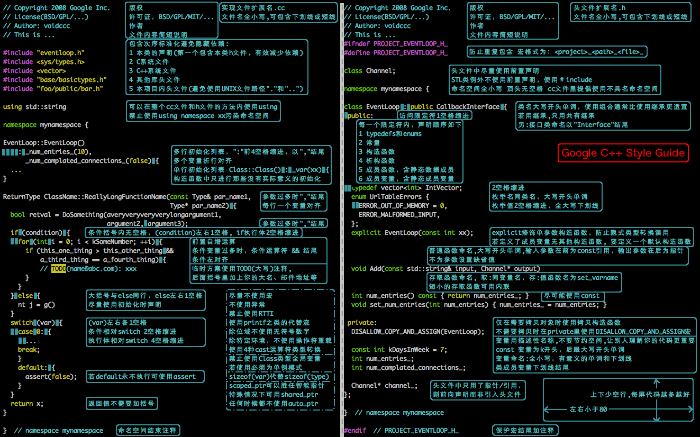

### Effective C++

1. 视 C++ 为一个语言联邦（C、Object-Oriented C++、Template C++、STL）
2. 宁可以编译器替换预处理器（尽量以 `const`、`enum`、`inline` 替换 `#define`）
3. 尽可能使用 const
4. 确定对象被使用前已先被初始化（构造时赋值（copy 构造函数）比 default 构造后赋值（copy assignment）效率高）
5. 了解 C++ 默默编写并调用哪些函数（编译器暗自为 class 创建 default 构造函数、copy 构造函数、copy assignment 操作符、析构函数）
6. 若不想使用编译器自动生成的函数，就应该明确拒绝（将不想使用的成员函数声明为 private，并且不予实现）
7. 为多态基类声明 virtual 析构函数（如果 class 带有任何 virtual 函数，它就应该拥有一个 virtual 析构函数）
8. 别让异常逃离析构函数（析构函数应该吞下不传播异常，或者结束程序，而不是吐出异常；如果要处理异常应该在非析构的普通函数处理）
9. 绝不在构造和析构过程中调用 virtual 函数（因为这类调用从不下降至 derived class）
10. 令 `operator=` 返回一个 `reference to *this` （用于连锁赋值）
11. 在 `operator=` 中处理 “自我赋值”
12. 赋值对象时应确保复制 “对象内的所有成员变量” 及 “所有 base class 成分”（调用基类复制构造函数）
13. 以对象管理资源（资源在构造函数获得，在析构函数释放，建议使用智能指针，资源取得时机便是初始化时机（Resource Acquisition Is Initialization，RAII））
14. 在资源管理类中小心 copying 行为（普遍的 RAII class copying 行为是：抑制 copying、引用计数、深度拷贝、转移底部资源拥有权（类似 auto_ptr））
15. 在资源管理类中提供对原始资源（raw resources）的访问（对原始资源的访问可能经过显式转换或隐式转换，一般而言显示转换比较安全，隐式转换对客户比较方便）
16. 成对使用 new 和 delete 时要采取相同形式（`new` 中使用 `[]` 则 `delete []`，`new` 中不使用 `[]` 则 `delete`）
17. 以独立语句将 newed 对象存储于（置入）智能指针（如果不这样做，可能会因为编译器优化，导致难以察觉的资源泄漏）
18. 让接口容易被正确使用，不易被误用（促进正常使用的办法：接口的一致性、内置类型的行为兼容；阻止误用的办法：建立新类型，限制类型上的操作，约束对象值、消除客户的资源管理责任）
19. 设计 class 犹如设计 type，需要考虑对象创建、销毁、初始化、赋值、值传递、合法值、继承关系、转换、一般化等等。
20. 宁以 pass-by-reference-to-const 替换 pass-by-value （前者通常更高效、避免切割问题（slicing problem），但不适用于内置类型、STL迭代器、函数对象）
21. 必须返回对象时，别妄想返回其 reference（绝不返回 pointer 或 reference 指向一个 local stack 对象，或返回 reference 指向一个 heap-allocated 对象，或返回 pointer 或 reference 指向一个 local static 对象而有可能同时需要多个这样的对象。）
22. 将成员变量声明为 private（为了封装、一致性、对其读写精确控制等）
23. 宁以 non-member、non-friend 替换 member 函数（可增加封装性、包裹弹性（packaging flexibility）、机能扩充性）
24. 若所有参数（包括被this指针所指的那个隐喻参数）皆须要类型转换，请为此采用 non-member 函数
25. 考虑写一个不抛异常的 swap 函数
26. 尽可能延后变量定义式的出现时间（可增加程序清晰度并改善程序效率）
27. 尽量少做转型动作（旧式：`(T)expression`、`T(expression)`；新式：`const_cast<T>(expression)`、`dynamic_cast<T>(expression)`、`reinterpret_cast<T>(expression)`、`static_cast<T>(expression)`、；尽量避免转型、注重效率避免 dynamic_casts、尽量设计成无需转型、可把转型封装成函数、宁可用新式转型）
28. 避免使用 handles（包括 引用、指针、迭代器）指向对象内部（以增加封装性、使 const 成员函数的行为更像 const、降低 “虚吊号码牌”（dangling handles，如悬空指针等）的可能性）
29. 为 “异常安全” 而努力是值得的（异常安全函数（Exception-safe functions）即使发生异常也不会泄露资源或允许任何数据结构败坏，分为三种可能的保证：基本型、强列型、不抛异常型）
30. 透彻了解 inlining 的里里外外（inlining 在大多数 C++ 程序中是编译期的行为；inline 函数是否真正 inline，取决于编译器；大部分编译器拒绝太过复杂（如带有循环或递归）的函数 inlining，而所有对 virtual 函数的调用（除非是最平淡无奇的）也都会使 inlining 落空；inline 造成的代码膨胀可能带来效率损失；inline 函数无法随着程序库的升级而升级）
31. 将文件间的编译依存关系降至最低（如果使用 object references 或 object pointers 可以完成任务，就不要使用 objects；如果能过够，尽量以 class 声明式替换 class 定义式；为声明式和定义式提供不同的头文件）
32. 确定你的 public 继承塑模出 is-a（是一种）关系（适用于 base classes 身上的每一件事情一定适用于 derived classes 身上，因为每一个 derived class 对象也都是一个 base class 对象）
33. 避免遮掩继承而来的名字（可使用 using 声明式或转交函数（forwarding functions）来让被遮掩的名字再见天日）
34. 区分接口继承和实现继承（在 public 继承之下，derived classes 总是继承 base class 的接口；pure virtual 函数只具体指定接口继承；非纯 impure virtual 函数具体指定接口继承及缺省实现继承；non-virtual 函数具体指定接口继承以及强制性实现继承）
35. 考虑 virtual 函数以外的其他选择（如 Template Method 设计模式的 non-virtual interface（NVI）手法，将 virtual 函数替换为 “函数指针成员变量”，以 `tr1::function` 成员变量替换 virtual 函数，将继承体系内的 virtual 函数替换为另一个继承体系内的 virtual 函数）
36. 绝不重新定义继承而来的 non-virtual 函数
37. 绝不重新定义继承而来的缺省参数值，因为缺省参数值是静态绑定（statically bound），而 virtual 函数却是动态绑定（dynamically bound）
38. 通过复合塑模 has-a（有一个）或 “根据某物实现出”（在应用域（application domain），复合意味 has-a（有一个）；在实现域（implementation domain），复合意味着 is-implemented-in-terms-of（根据某物实现出））
39. 明智而审慎地使用 private 继承（private 继承意味着 is-implemented-in-terms-of（根据某物实现出），尽可能使用复合，当 derived class 需要访问 protected base class 的成员，或需要重新定义继承而来的时候 virtual 函数，或需要 empty base 最优化时，才使用 private 继承）
40. 明智而审慎地使用多重继承（多继承比单一继承复杂，可能导致新的歧义性，以及对 virtual 继承的需要，但确有正当用途，如 “public 继承某个 interface class” 和 “private 继承某个协助实现的 class”；virtual 继承可解决多继承下菱形继承的二义性问题，但会增加大小、速度、初始化及赋值的复杂度等等成本）
41. 了解隐式接口和编译期多态（class 和 templates 都支持接口（interfaces）和多态（polymorphism）；class 的接口是以签名为中心的显式的（explicit），多态则是通过 virtual 函数发生于运行期；template 的接口是奠基于有效表达式的隐式的（implicit），多态则是通过 template 具现化和函数重载解析（function overloading resolution）发生于编译期）
42. 了解 typename 的双重意义（声明 template 类型参数是，前缀关键字 class 和 typename 的意义完全相同；请使用关键字 typename 标识嵌套从属类型名称，但不得在基类列（base class lists）或成员初值列（member initialization list）内以它作为 base class 修饰符）
43. 学习处理模板化基类内的名称（可在 derived class templates 内通过 `this->` 指涉 base class templates 内的成员名称，或藉由一个明白写出的 “base class 资格修饰符” 完成）
44. 将与参数无关的代码抽离 templates（因类型模板参数（non-type template parameters）而造成代码膨胀往往可以通过函数参数或 class 成员变量替换 template 参数来消除；因类型参数（type parameters）而造成的代码膨胀往往可以通过让带有完全相同二进制表述（binary representations）的实现类型（instantiation types）共享实现码）
45. 运用成员函数模板接受所有兼容类型（请使用成员函数模板（member function templates）生成 “可接受所有兼容类型” 的函数；声明 member templates 用于 “泛化 copy 构造” 或 “泛化 assignment 操作” 时还需要声明正常的 copy 构造函数和 copy assignment 操作符）
46. 需要类型转换时请为模板定义非成员函数（当我们编写一个 class template，而它所提供之 “与此 template 相关的” 函数支持 “所有参数之隐式类型转换” 时，请将那些函数定义为 “class template 内部的 friend 函数”）
47. 请使用 traits classes 表现类型信息（traits classes 通过 templates 和 “templates 特化” 使得 “类型相关信息” 在编译期可用，通过重载技术（overloading）实现在编译期对类型执行 if...else 测试）
48. 认识 template 元编程（模板元编程（TMP，template metaprogramming）可将工作由运行期移往编译期，因此得以实现早期错误侦测和更高的执行效率；TMP 可被用来生成 “给予政策选择组合”（based on combinations of policy choices）的客户定制代码，也可用来避免生成对某些特殊类型并不适合的代码）
49. 了解 new-handler 的行为（set\_new\_handler 允许客户指定一个在内存分配无法获得满足时被调用的函数；nothrow new 是一个颇具局限的工具，因为它只适用于内存分配（operator new），后继的构造函数调用还是可能抛出异常）
50. 了解 new 和 delete 的合理替换时机（为了检测运用错误、收集动态分配内存之使用统计信息、增加分配和归还速度、降低缺省内存管理器带来的空间额外开销、弥补缺省分配器中的非最佳齐位、将相关对象成簇集中、获得非传统的行为）
51. 编写 new 和 delete 时需固守常规（operator new 应该内涵一个无穷循环，并在其中尝试分配内存，如果它无法满足内存需求，就应该调用 new-handler，它也应该有能力处理 0 bytes 申请，class 专属版本则还应该处理 “比正确大小更大的（错误）申请”；operator delete 应该在收到 null 指针时不做任何事，class 专属版本则还应该处理 “比正确大小更大的（错误）申请”）
52. 写了 placement new 也要写 placement delete（当你写一个 placement operator new，请确定也写出了对应的 placement operator delete，否则可能会发生隐微而时断时续的内存泄漏；当你声明 placement new 和 placement delete，请确定不要无意识（非故意）地遮掩了它们地正常版本）
53. 不要轻忽编译器的警告
54. 让自己熟悉包括 TR1 在内的标准程序库（TR1，C++ Technical Report 1，C++11 标准的草稿文件）
55. 让自己熟悉 Boost（准标准库）

### **C++11有哪些新特性**

C++11 最常用的新特性如下：
auto 关键字：编译器可以根据初始值自动推导出类型。但是不能用于函数传参以及数组类型的推导
nullptr 关键字：nullptr 是一种特殊类型的字面值，它可以被转换成任意其它的指针类型；而NULL 一般被宏定义为0，在遇到重载时可能会出现问题。
智能指针：C++11 新增了std::shared_ptr、std::weak_ptr 等类型的智能指针，用于解决内存管理的问题。
初始化列表：使用初始化列表来对类进行初始化
右值引用：基于右值引用可以实现移动语义和完美转发，消除两个对象交互时不必要的对象拷贝，节省运算存储资源，提高效率
atomic 原子操作用于多线程资源互斥操作
新增STL 容器array 以及tuple

### Google C++ Style Guide

中文：[C++ 风格指南](https://zh-google-styleguide.readthedocs.io/en/latest/google-cpp-styleguide/contents/)

