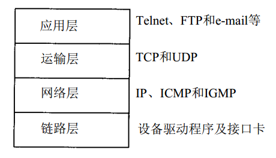
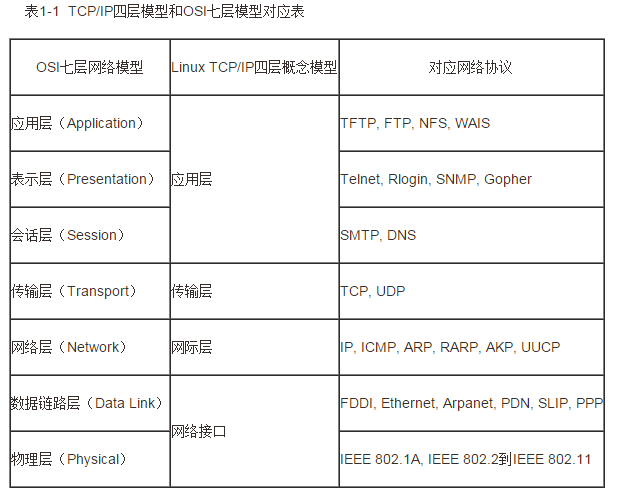

TCP/IP 四层模型与 OSI 参考模型

1. 链路层（数据链路层 / 网络接口层）：包括操作系统中的设备驱动程序、计算机中对应的网络接口卡

2. 网络层（互联网层）：处理分组在网络中的活动，比如分组的选路。

3. 运输层：主要为两台主机上的应用提供端到端的通信。

4. 应用层：负责处理特定的应用程序细节。

  

  假设在一个局域网 (LAN) 如以太网中有两台主机，二者运行FTP 协议：

  

  TCP/IP 四层模型：

  网络层与运输层的区别：
  　　在 TCP/TP 协议族中，网络层 IP 提供的是一种不可靠的服务。它只是尽可能快地把分组从源节点送到目的节点，但不提供任何可靠性的保证。
  　　Tcp 在不可靠的 ip 层上，提供了一个可靠的运输层，为了提供这种可靠的服务，TCP 采用了超时重传、发送和接受端到端的确认分组等机制。
  TCP/IP 协议族的分层：

  

  

  1、物理层：
  　　主要功能：利用传输介质为数据链路层提供屋里连接，实现比特流的透明传输。
  　　作用：实现相邻计算机节点之间比特流的透明传输，尽可能屏蔽掉具体传输介质与物理设备的差异。使其上面的数据链路层不必考虑网络的具体传输介质是什么。
  　　透明传输的意义就是：不管传的是什么，所采用的设备只是起一个通道作用，把要传输的内容完好的传到对方！
  2、数据链路层：负责建立和管理节点间的链路。
  　　主要功能：通过各种控制协议，将有差错的物理信道变为无差错的、能可靠传输数据帧的数据链路。
  　　具体工作：接受来自物理层的位流形式的数据，并封装成帧，传送到上一层；同样，也将来自上一层的数据帧，拆装为位流形式的数据转发到物理层；并且还负责处理接受端发回的确认帧的信息，以便提供可靠的数据传输。
  　　该层通常又被分为 介质访问控制 (MAC) 和逻辑链路控制 (LLC) 两个子层：
  　　MAC 子层的主要任务是解决共享型网络中多用户对信道竞争的问题，完成网络介质的访问控制。
  　　LLC 子层的主要任务是建立和维护网络连接，执行差错校验、流量控制和链路控制。
  3、网络层：是 OSI 参考模型中最复杂的一层，也是通信子网最高的一层，它在下两层的基础上向资源子网提供服务。
  　　主要任务：通过路由算法，为报文或分组通过通信子网选择最适当的路径。该层控制数据链路层与物理层之间的信息转发，建立、维持与终止网络的连接。具体的说，数据链路层的数据在这一层被转换为数据包，然后通过路径选择、分段组合、顺序、进 / 出路由等控制，将信息从一个网络设备传送到另一个网络设备。
  　　一般的，数据链路层是解决统一网络内节点之间的通信，而网络层主要解决不同子网之间的通信。例如路由选择问题。
  　　在实现网络层功能时，需要解决的主要问题如下：
  　　寻址：数据链路层中使用的物理地址（如 MAC 地址）仅解决网络内部的寻址问题。在不同子网之间通信时，为了识别和找到网络中的设备，每一子网中的设备都会被分配一 个唯一的地址。由于各个子网使用的物理技术可能不同因此这个地址应当是逻辑地址（如IP 地址）
  　　交换：规定不同的交换方式。常见的交换技术有：线路交换技术和存储转发技术，后者包括报文转发技术和分组转发技术。
  　　路由算法：当源节点和路由节点之间存在多条路径时，本层可以根据路由算法，通过网络为数据分组选择最佳路径，并将信息从最合适的路径，由发送端传送的接受端。
  　　连接服务：与数据链路层的流量控制不同的是，前者控制的是网络相邻节点间的流量，后者控制的是从源节点到目的节点间的流量。其目的在于防止阻塞，并进行差错检测
  4、传输层：
  　　OSI 的下三层的主要任务是数据传输，上三层的主要任务是数据处理。而传输层是第四层，因此该层是通信子网和资源子网的接口和桥梁，起到承上启下的作用。
  　　主要任务：向用户提供可靠的、端到端的差错和流量控制，保证报文的正确传输。
  　　主要作用：向高层屏蔽下层数据通信的具体细节，即向用户透明的传送报文。
  　　传输层提供会话层和网络层之间的传输服务，这种服务从会话层获得数据，并在必要时，对数据进行分割，然后，传输层将数据传送到网络层，并确保数据能准确无误的传送到网络层。因此，传输层负责提供两节点之间数据的可靠传送，当两节点的联系确定之后，传输层负责监督工作。综上，传输层的主要功能如下：
  	传输连接管理：提供建立、连接和拆除传输连接的功能。传输层在网络层的基础上，提供 “面向连接” 和 “面向无连接” 两种服务。　　　　　　　　　　　　　　　　　
  	处理理传输差错：提供可靠的 “面向连接” 和不可靠的 “面向无连接” 的数据传输服务、差错控制和流量控制。在提供 “面向连接” 服务时，通过这一层传输的数据将由目标设备确认如果在指定的时间内未收到确认信息数据将被重新发送。　　　　　　　　　　　　　　　　　　　　　　　　
  5、会话层：是 OSI 参考模型的第五层，是用户应用程序和网络之间的接口
  　　主要任务：向两个实体的表示层提供建立和使用连接的方法。将不同实体之间的表示层的连接称为会话。因此会话层的任务就是组织和协调两个会话进程之间的通信，并对数据交换进行管理。
  　　用户可以按照半双工、单工和全工的方式建立会话。当建立会话时，用户必须提供他们想要连接的远程地址。而这些地址与 MAC（介质访问控制子层）地址或网络层的逻辑地址不同，他们是为用户专门设计的，更便于用户记忆。域名(DN) 就是网络上使用的远程地址。会话层的具体功能如下：

  　　会话管理：允许用户在两个实体设备之间建立、维持和终止会话，并支持它们之间的数据交换。例如提供单方向会话或双向同时会话，并管理会话中的发送顺序，以及会话所占用时间的长短。

  ​	会话流量控制：提供流量控制和交叉会话功能。　　　　　　　　　　　　　　　　　　　　　　　　
  ​	寻址：使用远程地址建立会话连接。　　　　　　　　　　　　　　　　　　　　　　　　
  ​	出错控制：从逻辑上讲，会话层主要负责数据交换的建立、保持和终止，但实际的工作却是接收来自传输层的数据，并负责纠错。会话控制和远程过程调用均属于这一层的功能。但应注意，此层检查的错误不是通信介质的错误而是磁盘空间打印机缺纸等高级类的错误。
  6、表示层：
  　　表示层是 OSI 模型的第六层，它对来自应用层的命令和数据进行解释，对各种语法赋予相应的含义，并按照一定的格式传送给会话层。
  　　其主要功能是 “处理用户信息的表示问题，如编码、数据格式转换和加密解密” 等。
  　　表示层的具体功能如下：
  　　数据格式处理：协商和建立数据交换的格式，解决各应用程序之间在数据格式表示上的差异。
  　　数据的编码：处理字符集和数字的转换。例如由于用户程序中的数据类型（整型或实型、有符号或无符号
  等）、用户标识等都可以有不同的表示方式，因此，在设备之间需要具有在不同字符集或格式之间转换的功能。
  　　压缩和解压缩：为了减少数据的传输量，这一层还负责数据的压缩与恢复。
  　　数据的加密和解密：可以提高网络的安全性。
  7、应用层
  　　应用层是 OSI 参考模型的最高层，它是计算机用户，以及各种应用程序和网络之间的接口。
  　　主要功能：直接向用户提供服务，完成用户希望在网络上完成的各种工作。它在其他 6 层工作的基础上，负责完成网络中应用程序与网络操作系统之间的联系，建立与结束使用者之间的联系，并完成网络用户提出的各种网络服务及应用所需的监督、管理和服务等各种协议。此外，该层还负责协调各个应用程序间的工作。
  　　应用层为用户提供的服务和协议有：文件服务、目录服务、文件传输服务（FTP）、远程登录服务（Telnet）、电子邮件服务（E-mail）、打印服务、安全服务、网络管理服务数据库服务等上述的各种网络服务由该层的不同应用协议和程序完成，不同的网络操作系统之间在功能、界面、实现技术、对硬件的支持、安全可靠性以及具有的各种应用程序接口等各个方面的差异是很大的。应用层的主要功能如下：
  　　用户接口：应用层是用户与网络，以及应用程序与网络间的直接接口，使得用户能够与网络进行交互式联系。
  　　实现各种服务：该层具有的各种应用程序可以完成和实现用户请求的各种服务。
  OSI 7 层模型的小结
  由于 OSI 是一个理想的模型，因此一般网络系统只涉及其中的几层，很少有系统能够具有所有的 7 层，并完全遵循它的规定。
  在 7 层模型中，每一层都提供一个特殊的网络功能。从网络功能的角度观察：下面 4 层（物理层、数据链路层、网络层和传输层）主要提供数据传输和交换功能，即以节点到节点之间的通信为主；第 4 层作为上下两部分的桥梁，是整个网络体系结构中最关键的部分；而上 3 层（会话层、表示层和应用层）则以提供用户与应用程序之间的信息和数据处理功能为主。简言之，下 4 层主要完成通信子网的功能，上 3 层主要完成资源子网的功能。
  一个很容易理解 OSI 七层模型的例子：
  OSI 七层模式简单通俗理解这个模型推出的最开始，是因为美国人有两台机器之间进行通信的需求。
  需求 1：
  科学家要解决的第一个问题是，两个硬件之间怎么通信。具体就是一台发些比特流，然后另一台能收到。
  于是，科学家发明了物理层：
  主要定义物理设备标准如网线的接类型光纤的接类

  主要定义物理设备标准，如网线的接口类型、光纤的接口类型、各种传输介质的传输速率等。它的主要作用是传输比特流 (就是由 1、0 转化为电流强弱来进行传输，到达目的地后在转化为 1、0，也就是我们常说的数模转换与模数转换)。这一层的数据叫做比特。
  需求 2：
  现在通过电线我能发数据流了，但是，我还希望通过无线电波，通过其它介质来传输。然后我还要保证传输过去的比特流是正确的，要有纠错功能。
  于是，发明了数据链路层：
  通过各种控制协议，将有差错的物理信道变为无差错的、能可靠传输数据帧的数据链路。
  需求 3：
  现在我可以在两台计算机之间发送数据了，那么如果我要在多台计算机之间发送数据呢？怎么找到我要发的那台？或者，A 要给 F 发信息，中间要经过 B，C，D,E，但是中间还有好多节点如 K.J.Z.Y。我怎么选择最佳路径？这就是路由要做的事。
  于是，发明了网络层。　　　　　　　　　　　　　　　　　　　　　　　　
  　　　　　　　　　　　　　　　　　　　　　　　　　　
  通过路由算法，
  为报文或分组通过通信子网选择最适当的路径。该层控制数据链路层与物理层之间的信息转发，建立、维持与终止网络的连接。具体的说，数据链路层的数据在这一层被转换为数据包，然后通过路径选择、分段组合、顺序、进 / 出路由等控制，将信息从一个网络设备传送到另一个网络设备。一般的，数据链路层是解决统一网络内节点之间的通信，而网络层主要解决不同子网之间的通信。例如路由选择问题。
  需求
  4：　　　　　　　　　　　　　　　　　　　　　　　　　
  现在
  我能发正确的发比特流数据到另一台计算机了，但是当我发大量数据时候，可能需要好长时间，例如一个视频格式的，网络会中断好多次（事实上，即使有了物理层和数据链路层，网络还是经常中断，只是中断的时间是毫秒级别的）。
  那么，我还须要保证传输大量文件时的准确性。于是，我要对发出去的数据进行封装。就像发快递一样，一个个地发。于是，先发明了传输层。向用户提供可靠的、端到端的差错和流量控制，保证报文的正确传输。提供建立、连接和拆除传输连接的功能。传输层在网络层基础上，提供 “面向连接” 和“面向无连接”两种服务。例如 TCP，是用于发大量数据的，我发了 1 万个包出去，另一台电脑就要告诉我是否接受到了 1 万个包，如果缺
  了 3 个包，就告诉我是第 1001，234，8888 个包丢了，那我再发一次。这样，就能保证对方把这个视频完整接收了。例如 UDP，是用于发送少量数据的。我发 20 个包出去，一般不会丢包，所以，我不管你收到多少个。在多人互动游戏，也经常用 UDP 协议，因为一般都是简单的信息，而且有广播的需求。如果用 TCP，效率就很低，因为它会不停地告诉主机我收到了 20 个包，或者我收到了 18 个包，再发我两个！如果同时有 1 万台计算机都这样做，那么用 TCP 反而会降低效率，还不如用 UDP，主机发出去就算了，丢几个包你就卡一下，算了，下次再发包你再更新。
  需求 5：
  现在我们已经保证给正确的计算机，发送正确的封装过后的信息了。但是用户级别的体验好不好？难道我每次都要调用TCP 去打包，然后调用 IP 协议去找路由，自己去发？当然不行，所以我们要建立一个自动收发包，自动寻址的功能。于是，发明了会话层。　　　　　　　　　　　　　　　　　　　　　　　　
  	会话层的作用就是建立和管理应用程序之间的通信。允许用户在两个实体设备之间建立、维持和终止会话，并支持它们之间的数据交换。例如提供单方向会话或双向同时会话，并管理会话中的发送顺序，以及会话所占用时间的长短。

  需求 6：
  现在我能保证应用程序自动收发包和寻址了。但是我要用Linux 给 window 发包，两个系统语法不一致，就像安装包一样，exe 是不能在 linux 下用的，shell 在 window 下也是不能直接运行的。于是需要表示层，帮我们解决不同系统之间的通信语法问题。
  需求 7：
  OK，现在所有必要条件都准备好了，我们可以写个 android程序，web 程序去实现需求把。
  TCP/IP 与 OSI 最大的不同在于 OSI 是一个理论上的网络通信模型，而 TCP/IP 则是实际运行的网络协议。

  　
