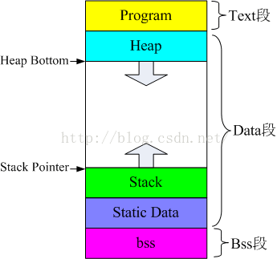

### 源码到可执行文件的过程

1）预编译
主要处理源代码文件中的以“#”开头的预编译指令。处理规则见下
1、删除所有的#define，展开所有的宏定义。
2、处理所有的条件预编译指令，如“#if”、“#endif”、“#ifdef”、“#elif”和“#else”。
3、处理“#include”预编译指令，将文件内容替换到它的位置，这个过程是递归进行的，文件
中包含其他文件。
4、删除所有的注释，“//”和“/**/”。
5、保留所有的#pragma 编译器指令，编译器需要用到他们，如：#pragma once 是为了防止有文
件被重复引用。
6、添加行号和文件标识，便于编译时编译器产生调试用的行号信息，和编译时产生编译错误或
警告是能够显示行号。
2）编译

把预编译之后生成的xxx.i 或xxx.ii 文件，进行一系列词法分析、语法分析、语义分析及优化
后，生成相应的汇编代码文件。
1、词法分析：利用类似于“有限状态机”的算法，将源代码程序输入到扫描机中，将其中的字
符序列分割成一系列的记号。
2、语法分析：语法分析器对由扫描器产生的记号，进行语法分析，产生语法树。由语法分析器
输出的语法树是一种以表达式为节点的树。

3、语义分析：语法分析器只是完成了对表达式语法层面的分析，语义分析器则对表达式是否有
意义进行判断，其分析的语义是静态语义——在编译期能分期的语义，相对应的动态语义是在运
行期才能确定的语义。
4、优化：源代码级别的一个优化过程。
5、目标代码生成：由代码生成器将中间代码转换成目标机器代码，生成一系列的代码序列——
汇编语言表示。
6、目标代码优化：目标代码优化器对上述的目标机器代码进行优化：寻找合适的寻址方式、使
用位移来替代乘法运算、删除多余的指令等。
3）汇编
将汇编代码转变成机器可以执行的指令(机器码文件)。汇编器的汇编过程相对于编译器来说更
简单，没有复杂的语法，也没有语义，更不需要做指令优化，只是根据汇编指令和机器指令的对
照表一一翻译过来，汇编过程有汇编器as 完成。经汇编之后，产生目标文件(与可执行文件格式
几乎一样)xxx.o(Windows 下)、xxx.obj(Linux 下)。
4）链接
将不同的源文件产生的目标文件进行链接，从而形成一个可以执行的程序。链接分为静态链接和
动态链接：

1、静态链接：
函数和数据被编译进一个二进制文件。在使用静态库的情况下，在编译链接可执行文件时，链接
器从库中复制这些函数和数据并把它们和应用程序的其它模块组合起来创建最终的可执行文件。
空间浪费：因为每个可执行程序中对所有需要的目标文件都要有一份副本，所以如果多个程序对
同一个目标文件都有依赖，会出现同一个目标文件都在内存存在多个副本；
更新困难：每当库函数的代码修改了，这个时候就需要重新进行编译链接形成可执行程序。
运行速度快：但是静态链接的优点就是，在可执行程序中已经具备了所有执行程序所需要的任何
东西，在执行的时候运行速度快。
2、动态链接：
动态链接的基本思想是把程序按照模块拆分成各个相对独立部分，在程序运行时才将它们链接在
一起形成一个完整的程序，而不是像静态链接一样把所有程序模块都链接成一个单独的可执行文
件。
共享库：就是即使需要每个程序都依赖同一个库，但是该库不会像静态链接那样在内存中存在多
分，副本，而是这多个程序在执行时共享同一份副本；
更新方便：更新时只需要替换原来的目标文件，而无需将所有的程序再重新链接一遍。当程序下
一次运行时，新版本的目标文件会被自动加载到内存并且链接起来，程序就完成了升级的目标。

性能损耗：因为把链接推迟到了程序运行时，所以每次执行程序都需要进行链接，所以性能会有
一定损失。


动态链接和静态链接的区别

动态链接是只建立一个引用的接口，而真正的代码和数据存放在另外的可执行模块中，在运行时再装入；而静态链接是把所有的代码和数据都复制到本模块中，运行时就不再需要库了。

### 锁有哪些

锁包括互斥锁，条件变量，自旋锁和读写锁。Linux 的4 种锁机制：

互斥锁：mutex，用于保证在任何时刻，都只能有一个线程访问该对象。当获取锁操作失败时，线程会进入睡眠，等待锁释放时被唤醒
读写锁：rwlock，分为读锁和写锁。处于读操作时，可以允许多个线程同时获得读操作。但是同一时刻只能有一个线程可以获得写锁。其它获取写锁失败的线程都会进入睡眠状态，直到写锁释放时被唤醒。注意：写锁会阻塞其它读写锁。当有一个线程获得写锁在写时，读锁也不能被其它线程获取；写者优先于读者（一旦有写者，则后续读者必须等待，唤醒时优先考虑写者）。适用于读取数据的频率远远大于写数据的频率的场合。

自旋锁：spinlock，在任何时刻同样只能有一个线程访问对象。但是当获取锁操作失败时，不会进入睡眠，而是会在原地自旋，直到锁被释放。这样节省了线程从睡眠状态到被唤醒期间的消耗，在加锁时间短暂的环境下会极大的提高效率。但如果加锁时间过长，则会非常浪费CPU资源。

RCU：即read-copy-update，在修改数据时，首先需要读取数据，然后生成一个副本，对副本进行修改。修改完成后，再将老数据update 成新的数据。使用RCU 时，读者几乎不需要同步开销，既不需要获得锁，也不使用原子指令，不会导致锁竞争，因此就不用考虑死锁问题了。而对于写者的同步开销较大，它需要复制被修改的数据，还必须使用锁机制同步并行其它写者的修改操作。在有大量读操作，少量写操作的情况下效率非常高。

### 互斥锁（**mutex）机制**，**以及**互斥锁和读写锁的区别 

1、互斥锁和读写锁区别：
互斥锁：mutex，用于保证在任何时刻，都只能有一个线程访问该对象。当获取锁操作失败时，线程会进入睡眠，等待锁释放时被唤醒。
读写锁：rwlock，分为读锁和写锁。处于读操作时，可以允许多个线程同时获得读操作。但是同一时刻只能有一个线程可以获得写锁。其它获取写锁失败的线程都会进入睡眠状态，直到写锁释放时被唤醒。注意：写锁会阻塞其它读写锁。当有一个线程获得写锁在写时，读锁也不能被其它线程获取；写者优先于读者（一旦有写者，则后续读者必须等待，唤醒时优先考虑写者）。适用于读取数据的频率远远大于写数据的频率的场合。

互斥锁和读写锁的区别：
1）读写锁区分读者和写者，而互斥锁不区分
2）互斥锁同一时间只允许一个线程访问该对象，无论读写；读写锁同一时间内只允许一个写者，但是允许多个读者同时读对象。

生产者消费者问题利用互斥锁和条件变量可以很容易解决，条件变量这里起到了替代信号量的作用。

### 内核态和用户态，操作系统为什么要分内核态和用户态，转化原理

用户态和内核态是操作系统的两种运行级别，两者最大的区别就是特权级不同。用户态拥有最低的特权级，内核态拥有较高的特权级。运行在用户态的程序不能直接访问操作系统内核数据结构和程序。

内核态和用户态之间的转换方式主要包括：系统调用，异常和中断。

为了安全性。在cpu 的一些指令中，有的指令如果用错，将会导致整个系统崩溃。分了内核态和用户态后，当用户需要操作这些指令时候，内核为其提供了API，可以通过系统调用，让内核去执行这些操作。

1）用户态切换到内核态的3 种方式
1、系统调用
这是用户进程主动要求切换到内核态的一种方式，用户进程通过系统调用申请操作系统提供的服务程序完成工作。而系统调用的机制其核心还是使用了操作系统为用户特别开放的一个中断来实现，例如Linux 的ine 80h 中断。
2、异常
当CPU 在执行运行在用户态的程序时，发现了某些事件不可知的异常，这是会触发由当前运行进程切换到处理此。异常的内核相关程序中，也就到了内核态，比如缺页异常。
3、外围设备的中断
当外围设备完成用户请求的操作之后，会向CPU 发出相应的中断信号，这时CPU 会暂停执行下一条将要执行的指令，转而去执行中断信号的处理程序，如果先执行的指令是用户态下的程序，那么这个转换的过程自然也就发生了有用户态到内核态的切换。比如硬盘读写操作完成，系统会切换到硬盘读写的中断处理程序中执行后续操作等。

2）切换操作
从出发方式看，可以在认为存在前述3 种不同的类型，但是从最终实际完成由用户态到内核态的切换操作上来说，涉及的关键步骤是完全一样的，没有任何区别，都相当于执行了一个中断响应的过程，因为系统调用实际上最终是中断机制实现的，而异常和中断处理机制基本上是一样的，用户态切换到内核态的步骤主要包括：
1、从当前进程的描述符中提取其内核栈的ss0 及esp0 信息。
2、使用ss0 和esp0 指向的内核栈将当前进程的cs,eip，eflags，ss,esp 信息保存起来，这个过程也完成了由用户栈找到内核栈的切换过程，同时保存了被暂停执行的程序的下一条指令。
3、将先前由中断向量检索得到的中断处理程序的cs，eip 信息装入相应的寄存器，开始执行中断处理程序，这时就转到了内核态的程序执行了。

### 系统调用是什么，你用过哪些系统调用

1）概念：
在计算机中，系统调用（英语：system call），又称为系统呼叫，指运行在使用者空间的程序向操作系统内核请求需要更高权限运行的服务。系统调用提供了用户程序与操作系统之间的接口（即系统调用是用户程序和内核交互的接口）。
操作系统中的状态分为内核态和用户态。大多数系统交互式操作需求在内核态执行。如设备IO 操作或者进程间通信。

特权指令：一类只能在核心态下运行而不能在用户态下运行的特殊指令。不同的操作系统特权指令会有所差异，但是一般来说主要是和硬件相关的一些指令。用户程序只在用户态下运行，有时需要访问系统核心功能，这时通过系统调用接口使用系统调用。
应用程序有时会需要一些危险的、权限很高的指令，如果把这些权限放心地交给用户程序是很危险的(比如一个进程可能修改另一个进程的内存区，导致其不能运行)，但是又不能完全不给这些权限。于是有了系统调用，危险的指令被包装成系统调用，用户程序只能调用而无权自己运行那些危险的指令。另外，计算机硬件的资源是有限的，为了更好的管理这些资源，所有的资源都由操作系统控制，进程只能向操作系统请求这些资源。操作系统是这些资源的唯一入口，这个入口就是系统调用。
2）系统调用举例：
对文件进行写操作，程序向打开的文件写入字符串“hello world”，open 和write 都是系统调用。如下：
#include<stdio.h>

还有写数据write，创建进程fork，vfork 等都是系统调用。

### 手写**一下**fork调用示例，fork和vfork的区别 

fork 的基础知识：
fork:创建一个和当前进程映像一样的进程可以通过fork( )系统调用：
#include <sys/types.h>
#include <unistd.h>
pid_t fork(void);
成功调用fork( )会创建一个新的进程，它几乎与调用fork( )的进程一模一样，这两个进程都会继续运行。在子进程中，成功的fork( )调用会返回0。在父进程中fork( )返回子进程的pid。如果出现错误，fork( )返回一个负值。
最常见的fork( )用法是创建一个新的进程，然后使用exec( )载入二进制映像，替换当前进程的映像。这种情况下，派生（fork）了新的进程，而这个子进程会执行一个新的二进制可执行文件的映像。这种“派生加执行”的方式是很常见的。
在早期的Unix 系统中，创建进程比较原始。当调用fork 时，内核会把所有的内部数据结构复制一份，复制进程的页表项，然后把父进程的地址空间中的内容逐页的复制到子进程的地址空间中。但从内核角度来说，逐页的复制方式是十分耗时的。现代的Unix 系统采取了更多的优化，例如Linux，采用了写时复制的方法，而不是对父进程空间进程整体复制。

```c++
//fork 实例
int main(void)
{
    pid_t pid;
    signal(SIGCHLD, SIG_IGN);
    printf("before fork pid:%d\n", getpid());
    int abc = 10;
    pid = fork();
    if (pid == -1) { //错误返回
        perror("tile");
        return -1;
	}
    if (pid > 0) { //父进程空间
        abc++;
        printf("parent:pid:%d \n", getpid());
        printf("abc:%d \n", abc);
        sleep(20);
    }
    else if (pid == 0) { //子进程空间
        abc++;
        printf("child:%d,parent: %d\n", getpid(), getppid());
        printf("abc:%d", abc);
    }
    printf("fork after...\n");
}
```


vfork 的基础知识：
在实现写时复制之前，Unix 的设计者们就一直很关注在fork 后立刻执行exec 所造成的地址空间的浪费。BSD 的开发者们在3.0 的BSD 系统中引入了vfork( )系统调用。

#include <sys/types.h>
#include <unistd.h>
pid_t vfork(void);
除了子进程必须要立刻执行一次对exec 的系统调用，或者调用_exit( )退出，对vfork( )的成功调用所产生的结果和fork( )是一样的。vfork( )会挂起父进程直到子进程终止或者运行了一个新的可执行文件的映像。通过这样的方式，vfork( )避免了地址空间的按页复制。在这个过程中，父进程和子进程共享相同的地址空间和页表项。实际上vfork( )只完成了一件事：复制内部的内核数据结构。因此，子进程也就不能修改地址空间中的任何内存。
vfork( )是一个历史遗留产物，Linux 本不应该实现它。需要注意的是，即使增加了写时复制，vfork( )也要比fork( )快，因为它没有进行页表项的复制。然而，写时复制的出现减少了

对于替换fork( )争论。实际上，直到2.2.0 内核，vfork( )只是一个封装过的fork( )。因为对vfork( )的需求要小于fork( )，所以vfork( )的这种实现方式是可行的。

补充知识点：写时复制
Linux 采用了写时复制的方法，以减少fork 时对父进程空间进程整体复制带来的开销。写时复制是一种采取了惰性优化方法来避免复制时的系统开销。它的前提很简单：如果有多个进程要读取它们自己的那部门资源的副本，那么复制是不必要的。每个进程只要保存一个指向这个资源的指针就可以了。只要没有进程要去修改自己的“副本”，就存在着这样的幻觉：每个进程好像独占那个资源。从而就避免了复制带来的负担。如果一个进程要修改自己的那份资源“副本”，那么就会复制那份资源，并把复制的那份提供给进程。不过其中的复制对进程来说是透明的。这个进程就可以修改复制后的资源了，同时其他的进程仍然共享那份没有修改过的资源。所以这就是名称的由来：在写入时进行复制。
写时复制的主要好处在于：如果进程从来就不需要修改资源，则不需要进行复制。惰性算法的好处就在于它们尽量推迟代价高昂的操作，直到必要的时刻才会去执行。在使用虚拟内存的情况下，写时复制（Copy-On-Write）是以页为基础进行的。所以，只要进程不修改它全部的地址空间，那么就不必复制整个地址空间。在fork( )调用结束后，父进程和子进程都相信它们有一个自己的地址空间，但实际上它们共享父进程的原始页，接下来这些页又可以被其他的父进程或子进程共享。
写时复制在内核中的实现非常简单。与内核页相关的数据结构可以被标记为只读和写时复制。如果有进程试图修改一个页，就会产生一个缺页中断。内核处理缺页中断的方式就是对该页进行一次透明复制。这时会清除页面的COW 属性，表示着它不再被共享。
现代的计算机系统结构中都在内存管理单元（MMU）提供了硬件级别的写时复制支持，所以实现是很容易的。

在调用fork( )时，写时复制是有很大优势的。因为大量的fork 之后都会跟着执行exec，那么复制整个父进程地址空间中的内容到子进程的地址空间完全是在浪费时间：如果子进程立刻执行一个新的二进制可执行文件的映像，它先前的地址空间就会被交换出去。写时复制可以对这种情况进行优化。
fork 和vfork 的区别：

1. fork( )的子进程拷贝父进程的数据段和代码段；vfork( )的子进程与父进程共享数据段
2. fork( )的父子进程的执行次序不确定；vfork( )保证子进程先运行，在调用exec 或exit之前与父进程数据是共享的，在它调用exec 或exit 之后父进程才可能被调度运行。
3. vfork( )保证子进程先运行，在它调用exec 或exit 之后父进程才可能被调度运行。如果在调用这两个函数之前子进程依赖于父进程的进一步动作，则会导致死锁。
   4.当需要改变共享数据段中变量的值，则拷贝父进程。

### 内存溢出和内存泄漏

1、内存溢出
指程序申请内存时，没有足够的内存供申请者使用。此时系统相当于没法满足你的需求，就会报内存溢出的错误
内存溢出原因：
内存中加载的数据量过于庞大，如一次从数据库取出过多数据集合类中有对对象的引用，使用完后未清空，使得不能回收代码中存在死循环或循环产生过多重复的对象实体使用的第三方软件中的BUG启动参数内存值设定的过小
2、内存泄漏

内存泄漏是指由于疏忽或错误造成了程序未能释放掉不再使用的内存的情况。
内存泄漏的分类：
1、堆内存泄漏（Heap leak）。对内存指的是程序运行中根据需要分配通过malloc,realloc new等从堆中分配的一块内存，再是完成后必须通过调用对应的free 或者delete 删掉。如果程序的设计的错误导致这部分内存没有被释放，那么此后这块内存将不会被使用，就会产生Heap Leak。
2、系统资源泄露（Resource Leak）。主要指程序使用系统分配的资源比如Bitmap,handle ,SOCKET等没有使用相应的函数释放掉，导致系统资源的浪费，严重可导致系统效能降低，系统运行不稳定。
3、没有将基类的析构函数定义为虚函数。当基类指针指向子类对象时，如果基类的析构函数不是virtual，那么子类的析构函数将不会被调用，子类的资源没有正确是释放，因此造成内存泄露。

### Linux虚拟地址空间

为了防止不同进程同一时刻在物理内存中运行而对物理内存的争夺和践踏，采用了虚拟内存。所有进程共享同一物理内存，每个进程只把自己目前需要的虚拟内存空间映射并存储到物理内存上。事实上，在每个进程创建加载时，内核只是为进程“创建”了虚拟内存的布局，具体就是初始化进程控制表中内存相关的链表，实际上并不立即就把虚拟内存对应位置的程序数据和代码（比如.text .data 段）拷贝到物理内存中，只是建立好虚拟内存和磁盘文件之间的映射就好（叫做存储器映射），等到运行到对应的程序时，才会通过缺页异常，来拷贝数据。还有进程运行过程中，要动态分配内存，比如malloc 时，也只是分配了虚拟内存，即为这块虚拟内存对应的页表项做相应设置，当进程真正访问到此数据时，才引发缺页异常。请求分页系统、请求分段系统和请求段页式系统都是针对虚拟内存的，通过请求实现内存与外存的信息置换。


虚拟内存的好处：
1.扩大地址空间；
2.内存保护：每个进程运行在各自的虚拟内存地址空间，互相不能干扰对方。虚存还对特定的内存地址提供写保护，可以防止代码或数据被恶意篡改。
3.公平内存分配。采用了虚存之后，每个进程都相当于有同样大小的虚存空间。
4.当进程通信时，可采用虚存共享的方式实现。
5.当不同的进程使用同样的代码时，比如库文件中的代码，物理内存中可以只存储一份这样的代码，不同的进程只需要把自己的虚拟内存映射过去就可以了，节省内存
6.虚拟内存很适合在多道程序设计系统中使用，许多程序的片段同时保存在内存中。当一个程序等待它的一部分读入内存时，可以把CPU 交给另一个进程使用。在内存中可以保留多个进程，系统并发度提高

7.在程序需要分配连续的内存空间的时候，只需要在虚拟内存空间分配连续空间，而不需要实际物理内存的连续空间，可以利用碎片
虚拟内存的代价：
1.虚存的管理需要建立很多数据结构，这些数据结构要占用额外的内存
2.虚拟地址到物理地址的转换，增加了指令的执行时间。
3.页面的换入换出需要磁盘I/O，这是很耗时的
4.如果一页中只有一部分数据，会浪费内存。

### 操作系统中的程序的内存结构 



可执行程序在存储（没有调入内存）时分为代码段、数据区和未初始化数据区三部分。

1、text段（代码段）：存放函数体的二进制代码。这部分区域的大小在程序运行前就已经确定，并且内存区域属于只读。在代码段中，也有可能包含一些只读的常数变量。（文字常量区很多情况下在代码区，因为代码段和常量一样是只读的。）

2、data段（数据段）：已初始化的全局变量和静态变量。全局变量和静态变量的存储是放在一块的，初始化的全局变量和静态变量在一块区域。数据段也属于静态内存分配。

3、bss段（未初始化数据区）:已定义而未初始化的全局变量和静态变量。通常只是记录变量名和大小，相当于一个占位符。BSS 段属于静态分配，程序结束后静态变量资源由系统自动释放。


可执行程序在运行（调入内存）时又多出两个区域：栈区和堆区。
栈区：由编译器自动释放，存放函数的参数值、局部变量等。每当一个函数被调用时，该函数的返回类型和一些调用的信息被存放到栈中。然后这个被调用的函数再为他的自动变量和临时变量在栈上分配空间。每调用一个函数一个新的栈就会被使用。栈区是从高地址位向低地址位增长的，是一块连续的内存区域，最大容量是由系统预先定义好的，申请的栈空间超过这个界限时会提示溢出，用户能从栈中获取的空间较小。
堆区：用于动态分配内存，位于BSS 和栈中间的地址区域。由程序员申请分配和释放。堆是从低地址位向高地址位增长，采用链式存储结构。频繁的malloc/free 造成内存空间的不连续，产生碎片。当申请堆空间时库函数是按照一定的算法搜索可用的足够大的空间。因此堆的效率比栈要低的多。

### 静态变量什么时候初始化 

静态变量存储在虚拟地址空间的数据段和bss 段，C 语言中其在代码执行之前初始化，属于编译期初始化。而C++中由于引入对象，对象生成必须调用构造函数，因此C++规定全局或局部静态对象当且仅当对象首次用到时进行构造。

### 一个类里面有static，virtual，说说这个类的内存分布 

1、static 修饰符
1）static 修饰成员变量
对于非静态数据成员，每个类对象都有自己的拷贝。而静态数据成员被当做是类的成员，无论这个类被定义了多少个，静态数据成员都只有一份拷贝，为该类型的所有对象所共享(包括其派生类)。所以，静态数据成员的值对每个对象都是一样的，它的值可以更新。
因为静态数据成员在全局数据区分配内存，属于本类的所有对象共享，所以它不属于特定的类对象，在没有产生类对象前就可以使用。
2）static 修饰成员函数
与普通的成员函数相比，静态成员函数由于不是与任何的对象相联系，因此它不具有this指针。从这个意义上来说，它无法访问属于类对象的非静态数据成员，也无法访问非静态成员函数，只能调用其他的静态成员函数。
Static 修饰的成员函数，在代码区分配内存。

### 虚函数中的内存访问

C++多态分为静态多态和动态多态。静态多态是通过重载和模板技术实现，在编译的时候确定。

动态多态通过虚函数和继承关系来实现，执行动态绑定，在运行的时候确定。
动态多态实现有几个条件：
(1) 虚函数；
(2) 一个基类的指针或引用指向派生类的对象；
基类指针在调用成员函数(虚函数)时，就会去查找该对象的虚函数表。虚函数表的地址在每个对象的首地址。查找该虚函数表中该函数的指针进行调用。
每个对象中保存的只是一个虚函数表的指针，C++内部为每一个类维持一个虚函数表，该类的对象的都指向这同一个虚函数表。

虚函数表中为什么就能准确查找相应的函数指针呢？因为在类设计的时候，虚函数表直接从基类也继承过来，如果覆盖了其中的某个虚函数，那么虚函数表的指针就会被替换，因此可以根据指针准确找到该调用哪个函数。

virtual 修饰符
如果一个类是局部变量，则该类数据存储在栈区。如果一个类是通过new/malloc 动态申请的，则该类数据存储在堆区。
如果该类是virutal 继承而来的子类，则该类的虚函数表指针和该类其他成员一起存储。虚函数表指针指向只读数据段中的类虚函数表，虚函数表中存放着一个个函数指针，函数指针指向代码段中的具体函数。

### 为什么要有page cache，操作系统怎么设计的page cache

加快从磁盘读取文件的速率。page cache 中有一部分磁盘文件的缓存，因为从磁盘中读取文件比较慢，所以读取文件先去page cache 中去查找，如果命中，则不需要去磁盘中读取，大大加快读取速度。在Linux 内核中，文件的每个数据块最多只能对应一个Page Cache 项，它通过两个数据结构来管理这些Cache项，一个是radix tree，另一个是双向链表。Radix tree 是一种搜索树，Linux内核利用这个数据结构来通过文件内偏移快速定位Cache 项

### 操作系统中的缺页中断 

malloc()和mmap()等内存分配函数，在分配时只是建立了进程虚拟地址空间，并没有分配虚拟内存对应的物理内存。当进程访问这些没有建立映射关系的虚拟内存时，处理器自动触发一个缺页异常。
缺页中断：在请求分页系统中，可以通过查询页表中的状态位来确定所要访问的页面是否存在于内存中。每当所要访问的页面不在内存是，会产生一次缺页中断，此时操作系统会根据页表中的外存地址在外存中找到所缺的一页，将其调入内存。
缺页本身是一种中断，与一般的中断一样，需要经过4 个处理步骤：
1、保护CPU 现场
2、分析中断原因

3、转入缺页中断处理程序进行处理
4、恢复CPU 现场，继续执行
但是缺页中断是由于所要访问的页面不存在于内存时，由硬件所产生的一种特殊的中断，因此，与一般的中断存在区别：
1、在指令执行期间产生和处理缺页中断信号
2、一条指令在执行期间，可能产生多次缺页中断
3、缺页中断返回是，执行产生中断的一条指令，而一般的中断返回是，执行下一条指令。 

### 并发(concurrency)和并行(parallelism) 的区别

并发（concurrency）：指宏观上看起来两个程序在同时运行，比如说在单核cpu 上的多任务。但是从微观上看两个程序的指令是交织着运行的，你的指令之间穿插着我的指令，我的指令之间穿插着你的，在单个周期内只运行了一个指令。这种并发并不能提高计算机的性能，只能提高效率。
并行（parallelism）：指严格物理意义上的同时运行，比如多核cpu，两个程序分别运行在两个核上，两者之间互不影响，单个周期内每个程序都运行了自己的指令，也就是运行了两条指令。这样说来并行的确提高了计算机的效率。所以现在的cpu 都是往多核方面发展。

### OS**缺页置换算法** 

当访问一个内存中不存在的页，并且内存已满，则需要从内存中调出一个页或将数据送至磁盘对换区，替换一个页，这种现象叫做缺页置换。当前操作系统最常采用的缺页置换算法如下：
先进先出(FIFO)算法：置换最先调入内存的页面，即置换在内存中驻留时间最久的页面。按照进入内存的先后次序排列成队列，从队尾进入，从队首删除。
最近最少使用（LRU）算法: 置换最近一段时间以来最长时间未访问过的页面。根据程序局部性原理，刚被访问的页面，可能马上又要被访问；而较长时间内没有被访问的页面，可能最近不会被访问。
当前最常采用的就是LRU 算法。

### 操作系统中的结构体对齐，字节对齐 

1、原因：
1）平台原因（移植原因）：不是所有的硬件平台都能访问任意地址上的任意数据的；某些硬件平台只能在某些地址处取某些特定类型的数据，否则抛出硬件异常。
2）性能原因：数据结构（尤其是栈）应该尽可能地在自然边界上对齐。原因在于，为了访问未对齐的内存，处理器需要作两次内存访问；而对齐的内存访问仅需要一次访问。
2、规则

1）数据成员对齐规则：结构(struct)(或联合(union))的数据成员，第一个数据成员放在offset 为0 的地方，以后每个数据成员的对齐按照#pragma pack 指定的数值和这个数据成员自身长度中，比较小的那个进行。
2）结构(或联合)的整体对齐规则：在数据成员完成各自对齐之后，结构(或联合)本身也要进行对齐，对齐将按照#pragma pack 指定的数值和结构(或联合)最大数据成员长度中，比较小的那个进行。
3）结构体作为成员：如果一个结构里有某些结构体成员，则结构体成员要从其内部最大元素大小的整数倍地址开始存储。
3、定义结构体对齐
可以通过预编译命令#pragma pack(n)，n=1,2,4,8,16 来改变这一系数，其中的n 就是指定的“对齐系数”。

4、举例
#pragma pack(2)
struct AA {
int a; //长度4 > 2 按2 对齐；偏移量为0；存放位置区间[0,3]
char b; //长度1 < 2 按1 对齐；偏移量为4；存放位置区间[4]
short c; //长度2 = 2 按2 对齐；偏移量要提升到2 的倍数6；存放位置区间[6,7]
char d; //长度1 < 2 按1 对齐；偏移量为7；存放位置区间[8]；共九个字节
};
#pragma pack()

### 微内核与宏内核

宏内核：除了最基本的进程、线程管理、内存管理外，将文件系统，驱动，网络协议等等都集成在内核里面，例如linux 内核。
优点：效率高。
缺点：稳定性差，开发过程中的bug 经常会导致整个系统挂掉。
微内核：内核中只有最基本的调度、内存管理。驱动、文件系统等都是用户态的守护进程去实现的。
优点：稳定，驱动等的错误只会导致相应进程死掉，不会导致整个系统都崩溃
缺点：效率低。典型代表QNX，QNX 的文件系统是跑在用户态的进程，称为resmgr 的东西，是订阅发布机制，文件系统的错误只会导致这个守护进程挂掉。不过数据吞吐量就比较不乐观了。

### 大端小端以及判断

Little-Endian就是低位字节排放在内存的低地址端，高位字节排放在内存的高地址端。
Big-Endian就是高位字节排放在内存的低地址端，低位字节排放在内存的高地址端。

判断方法：

```C++
//法一：
bool IsBigEndian()  
{  
    int a = 0x1234;  
    char b =  *(char *)&a;  //通过将int强制类型转换成char单字节，通过判断起始存储位置。即等于 取b等于a的低地址部分  
    if( b == 0x12)  
    {  
        return TRUE;  
    }  
    return FALSE;  
}

//法二联合体union的存放顺序是所有成员都从低地址开始存放，利用该特性可以轻松地获得了CPU对内存采用Little-endian还是Big-endian模式读写：
bool IsBigEndian()  
{  
    union NUM  
    {  
        int a;  
        char b;  
    }num;  
    num.a = 0x1234;  
    if( num.b == 0x12 )  
    {  
        return TRUE;  
    }  
    return FALSE;  
}
```

### 标准库函数和系统调用的区别

1、系统调用

系统调用提供的函数如open, close, read, write, ioctl等，需包含头文件unistd.h。以write为例：其函数原型为 size_t write(int fd, const void *buf, size_t nbytes)，其操作对象为文件描述符或文件句柄fd(file descriptor)，要想写一个文件，必须先以可写权限用open系统调用打开一个文件，获得所打开文件的fd，例如fd=open(/"/dev/video/", O_RDWR)。fd是一个整型值，每新打开一个文件，所获得的fd为当前最大fd加1。Linux系统默认分配了3个文件描述符值：0－standard input，1－standard output，2－standard error。

系统调用通常用于底层文件访问（low-level file access），例如在驱动程序中对设备文件的直接访问。

系统调用是操作系统相关的，因此一般没有跨操作系统的可移植性。

系统调用发生在内核空间，因此如果在用户空间的一般应用程序中使用系统调用来进行文件操作，会有用户空间到内核空间切换的开销。事实上，即使在用户空间使用库函数来对文件进行操作，因为文件总是存在于存储介质上，因此不管是读写操作，都是对硬件（存储器）的操作，都必然会引起系统调用。也就是说，库函数对文件的操作实际上是通过系统调用来实现的。例如C库函数fwrite()就是通过write()系统调用来实现的。

这样的话，使用库函数也有系统调用的开销，为什么不直接使用系统调用呢？这是因为，读写文件通常是大量的数据（这种大量是相对于底层驱动的系统调用所实现的数据操作单位而言），这时，使用库函数就可以大大减少系统调用的次数。这一结果又缘于缓冲区技术。在用户空间和内核空间，对文件操作都使用了缓冲区，例如用fwrite写文件，都是先将内容写到用户空间缓冲区，当用户空间缓冲区满或者写操作结束时，才将用户缓冲区的内容写到内核缓冲区，同样的道理，当内核缓冲区满或写结束时才将内核缓冲区内容写到文件对应的硬件媒介。
2、库函数调用

标准C库函数提供的文件操作函数如fopen, fread, fwrite, fclose,fflush, fseek等，需包含头文件stdio.h。以fwrite为例，其函数原型为size_t fwrite(const void *buffer,size_t size, size_t item_num, FILE *pf)，其操作对象为文件指针FILE *pf，要想写一个文件，必须先以可写权限用fopen函数打开一个文件，获得所打开文件的FILE结构指针pf，例如pf=fopen(/"~/proj/filename/",/"w/")。实际上，由于库函数对文件的操作最终是通过系统调用实现的，因此，每打开一个文件所获得的FILE结构指针都有一个内核空间的文件描述符fd与之对应。同样有相应的预定义的FILE指针：stdin－standard input，stdout－standard output，stderr－standard error。

库函数调用通常用于应用程序中对一般文件的访问。

库函数调用是系统无关的，因此可移植性好。

由于库函数调用是基于C库的，因此也就不可能用于内核空间的驱动程序中对设备的操作

### 5种IO模型

阻塞，非阻塞，信号驱动IO、IO复用、异步IO

1.阻塞IO:调用者调用了某个函数，等待这个函数返回，期间什么也不做，不停的去检查这个函数有没有返回，必须等这个函数返回才能进行下一步动作
2.非阻塞IO:非阻塞等待，每隔一段时间就去检测IO 事件是否就绪。没有就绪就可以做其他事。
3.信号驱动IO:信号驱动IO:linux 用套接口进行信号驱动IO，安装一个信号处理函数，进程继续运行并不阻塞，当IO 时间就绪，进程收到SIGIO 信号。然后处理IO 事件。
4.IO 复用:linux 用select/poll/epoll 函数实现IO 复用模型，这两个函数也会使进程阻塞，但是和阻塞IO 所不同的是这两个函数可以同时阻塞多个IO 操作。而且可以同时对多个读操作、写操作的IO 函数进行检测。知道有数据可读或可写时，才真正调用IO操作函数
5.异步IO:linux 中，可以调用aio_read 函数告诉内核描述字缓冲区指针和缓冲区的大小、文件偏移及通知的方式，然后立即返回，当内核将数据拷贝到缓冲区后，再通知应用程序。


同步：线程自己等待IO完成（不管非阻塞等待还是阻塞等待，强调自己等待完成）
异步：强调别的线程等待完成或者内核等待完成，然后回调
阻塞：数据未准备好前是一直阻塞
非阻塞：数据未准备好时会立即返回，并轮询。

epoll实际上只是通过多路事件分离器分离事件，起到的仅仅是告知某个文件描述符可以读写了，也就是说epoll并不具有区别同步、异步的属性，区别还是得看产生I/O的线程是如何做的。

Reactor和proactor的通俗解释:
以读操作为例：
角色分工 
顾客：读就绪事件 厨师：事件处理器 传话员：事件分离器 代工：内核
Reactor:注册读就绪事件和事件处理器，分离器等待读就绪事件发生，有读就绪事件发生（有人点餐），事件分离器通知事件处理器，事件处理器进行读取操作并处理（记录要吃啥并做好）
Proactor:注册异步读取事件和事件处理器，分离器等待读完成事件发生，有读就绪事件发生（有人点餐），内核去读取（记录吃啥），并复制给线程缓存区，通知事件分离器，给到处理器，事件处理器不用做读取操作（），只处理。

区别：读就绪事件未到来，re要等，pro不等，让内核通知，所以sre同步，要等待就绪。Pro异步，不用自己等待读就绪，是由内核读取并通知。Pro关注读完成，且内核读取并给到线程缓存区。

https://blog.csdn.net/caiwenfeng_for_23/article/details/8458299


```C++
#include <sys/epoll.h>
int epoll_create1(int flags);
功能：创建一个多路复用的实例
参数：
flags：
0:如果这个参数是0，这个函数等价于poll_create（0）
EPOLL_CLOEXEC：这是这个参数唯一的有效值，如果这个参数设置为这个。那么当进程替换映像的时候会关闭这个文件描述符，这样新的映像中就无法对这个文件描述符操作，适用于多进程编程+映像替换的环境里
返回值：
success：返回一个非0 的未使用过的最小的文件描述符
error：-1 errno被设置

--------------------------------------------------------------------

int epoll_ctl(int epfd, int op, int fd, struct epoll_event *event);
功能：操作一个多路复用的文件描述符
参数：
epfd：epoll_create1的返回值
op：要执行的命令
EPOLL_CTL_ADD：向多路复用实例加入一个连接socket的文件描述符
EPOLL_CTL_MOD：改变多路复用实例中的一个socket的文件描述符的触发事件
EPOLL_CTL_DEL：移除多路复用实例中的一个socket的文件描述符
fd：要操作的socket的文件描述符
event：
typedef union epoll_data {
               void        *ptr;
               int          fd;
               uint32_t     u32;
               uint64_t     u64;
           } epoll_data_t;

struct epoll_event {
               uint32_t     events;      /* Epoll events */
               epoll_data_t data;        /* User data variable */
};
events可以是下列命令的任意按位与
EPOLLIN：对应的文件描述有可以读取的内容
EPOLLOUT：对应的文件描述符有可以写入
EPOLLRDHUP：写到一半的时候连接断开
EPOLLPRI：发生异常情况，比如所tcp连接中收到了带外消息
EPOLLET：设置多路复用实例的文件描述符的事件触发机制为边沿触发，默认为水平触发
1、当多路复用的实例中注册了一个管道，并且设置了触发事件EPOLLIN，
2、管道对端的写入2kb的数据，
3、epoll_wait收到了一个可读事件，并向上层抛出，这个文件描述符
4、调用者调用read读取了1kb的数据，
5、再次调用epoll_wait


边沿触发：上面的调用结束后，在输入缓存区中还有1kb的数据没有读取，但是epoll_wait将不会再抛出文件描述符。这就导致接受数据不全，对端得不到回应，可能会阻塞或者自己关闭
因为边沿触发的模式下，只有改变多路复用实例中某个文件描述符的状态，才会抛出事件。
相当于，边沿触发方式，内核只会在第一次通知调用者，不管对这个文件描述符做了怎么样的操作

水平触发：
只要文件描述符处于可操作状态，每次调用epoll_wait，内核都会通知你

EPOLLONESHOT：epoll_wait只会对该文件描述符第一个到达的事件有反应，之后的其他事件都不向调用者抛出。需要调用epoll_ctl函数，对它的事件掩码重新设置
EPOLLWAKEUP
EPOLLEXCLUSIVE
返回值：
success：0
error：-1 errno被设置

--------------------------------------------------------------------

int epoll_wait(int epfd, struct epoll_event *events,int maxevents, int timeout);
功能：等待一个epoll队列中的文件描述符的I/O事件发生
参数：
epfd：目标epoll队列的描述符
events：用于放置epoll队列中准备就绪（被触发）的事件
maxevents：最大事件？
timeout：指定函数等待的时间。这个函数阻塞这么长一段时间之后接触阻塞。
返回值：
>=0，表示准备就绪的文件描述符个数
-1：出错，errno被设置

```

https://blog.csdn.net/qq_34802511/article/details/81543817

https://www.cnblogs.com/pang1567/p/4057375.html


错误码 / errno
Linux中系统调用的错误都存储于 errno中，errno由操作系统维护，存储就近发生的错误，即下一次的错误码会覆盖掉上一次的错误。


循环处理流程里的细节：如边沿触发

线程池，简单来说就是有一堆已经创建好的线程（最大数目一定），初始时他们都处于空闲状态，当有新的任务进来，从线程池中取出一个空闲的线程处理任务，然后当任务处理完成之后，该线程被重新放回到线程池中，供其他的任务使用，当线程池中的线程都在处理任务时，就没有空闲线程供使用，此时，若有新的任务产生，只能等待线程池中有线程结束任务空闲才能执行，
使用互斥锁虽然可以解决一些资源竞争的问题，但互斥锁只有两种状态（加锁和解锁），这限制了互斥锁的用途。


条件变量（条件锁）也可以解决线程同步和共享资源访问的问题，条件变量是对互斥锁的补充，它允许一个线程阻塞并等待另一个线程发送的信号，当收到信号时，阻塞的线程被唤醒并试图锁定与之相关的互斥锁。


线程池可以说是项目中经常会用到的组件，在这里假设读者都有一定的多线程基础，如果没有的话不妨在这里进行了解：POSIX 多线程基础。

线程池是什么？我的简单理解是有一组预先派生的线程，然后有一个管理员来管理和调度这些线程，你只需不断把需要完成的任务交给他，他就会调度线程的资源来帮你完成。

那么管理员是怎么做的呢？一种简单的方式就是，管理员管理一个任务的队列，如果收到新的任务，就把任务加到队列尾。每个线程盯着队列，如果队列非空，就去队列头拿一个任务来处理（每个任务只能被一个线程拿到），处理完了就继续去队列取任务。如果没有任务了，线程就休眠，直到任务队列不为空。如果这个管理员更聪明一点，他可能会在没有任务或任务少的时候减少线程的数量，任务处理不过来的时候增加线程的数量，这样就实现了资源的动态管理。
立刻结束指不管任务队列是否为空，立刻结束。平和结束指等待任务队列的任务全部执行完后再结束，在这个过程中不可以添加新的任务。


线程操纵函数（省略参数）
pthread_create	创建一个线程
pthread_exit	终止当前线程
pthread_cancel	中断另外一个线程的运行
pthread_join	阻塞当前的线程，直到另外一个线程运行结束
pthread_attr_init	初始化线程的属性
pthread_attr_setdetachstate	设置脱离状态的属性（决定这个线程在终止时是否可以被结合）
pthread_attr_getdetachstate	获取脱离状态的属性
pthread_attr_destroy	删除线程的属性
pthread_kill	向线程发送一个终止信号
同步函数
用于 mutex 和条件变量
pthread_mutex_init	初始化互斥锁
pthread_mutex_destroy	删除互斥锁
pthread_mutex_lock	占有互斥锁（阻塞操作）
pthread_mutex_trylock	试图占有互斥锁（不阻塞操作）。当互斥锁空闲时将占有该锁；否则立即返回　
pthread_mutex_unlock	释放互斥锁
pthread_cond_init	初始化条件变量
pthread_cond_destroy	销毁条件变量
pthread_cond_wait	等待条件变量的特殊条件发生
pthread_cond_signal	唤醒第一个调用pthread_cond_wait()而进入睡眠的线程

函数定义： int pthread_join(pthread_t thread, void **retval);
描述 ：pthread_join()函数，以阻塞的方式等待thread指定的线程结束。当函数返回时，被等待线程的资源被收回。
pthread_exit()函数  //终止当前线程
互斥锁一个明显的缺点是它只有两种状态：锁定和非锁定。而条件变量通过允许线程阻塞和等待另一个线程发送信号的方法弥补了互斥锁的不足，它常和互斥锁一起配合使用。使用时，条件变量被用来阻塞一个线程，当条件不满足时，线程往往解开相应的互斥锁并等待条件发生变化。一旦其他的某个线程改变了条件变量，他将通知相应的条件变量唤醒一个或多个正被此条件变量阻塞的线程。这些线程将重新锁定互斥锁并重新测试条件是否满足。一般说来，条件变量被用来进行线程间的同步。
两个线程操作同一临界区时，通过互斥锁保护，若A线程已经加锁，B线程再加锁时候会被阻塞，直到A释放锁，B再获得锁运行，进程B必须不停的主动获得锁、检查条件、释放锁、再获得锁、再检查、再释放，一直到满足运行的条件的时候才可以（而此过程中其他线程一直在等待该线程的结束），这种方式是比较消耗系统的资源的。而条件变量同样是阻塞，还需要通知才能唤醒，线程被唤醒后，它将重新检查判断条件是否满足，如果还不满足，该线程就休眠了，应该仍阻塞在这里，等待条件满足后被唤醒，节省了线程不断运行浪费的资源。这个过程一般用while语句实现。当线程B发现被锁定的变量不满足条件时会自动的释放锁并把自身置于等待状态，让出CPU的控制权给其它线程。其它线程 此时就有机会去进行操作，当修改完成后再通知那些由于条件不满足而陷入等待状态的线程。这是一种通知模型的同步方式，大大的节省了CPU的计算资源，减少了线程之间的竞争，而且提高了线程之间的系统工作的效率。这种同步方式就是条件变量。     
总结：
为了避免因条件判断语句与其后的正文或wait语句之间的间隙而产生的漏判或误判，所以用一个mutex来保证: 对于某个cond的包括(判断,修改)在内的任何有关操作某一时刻只有一个线程在访问。也就是说条件变量本身就是一个竞争资源，这个资源的作用是对其后程序正文的执行权，于是用一个锁来保护。
条件变量用于某个线程需要在某种条件成立时才去保护它将要操作的临界区，这种情况从而避免了线程不断轮询检查该条件是否成立而降低效率的情况，这是实现了效率提高。。。在条件满足时，自动退出阻塞，再加锁进行操作。
以上是关于效率问题，此外互斥锁还有一个缺点就是会造成死锁。
例如线程A和线程B都需要独占使用2个资源，但是他们都分别先占据了一个资源，然后又相互等待另外一个资源的释放，这样就形成了一个死锁。

条件变量起到了阻塞和唤醒线程的作用，所以通常互斥锁要和条件变量配合。

为了解决以上问题，条件变量常和互斥锁一起使用，条件变量通过允许线程阻塞和等待另一个线程发送信号的方法弥补了互斥锁的不足。使用时，条件变量被用来阻塞一个线程，当条件不满足时，线程往往解开相应的互斥锁并等待条件发生变化。一旦其它的某个线程改变了条件变量，它将通知相应的条件变量唤醒一个或多个正被此条件变量阻塞的线程。这些线程将重新锁定互斥锁并重新测试条件是否满足。

互斥锁的不足：要么固定时间去等待，多费时间。要么不断跑线程去主动查询，耗费计算资源。
条件变量：本身是竞争资源，要加锁保护，该线程内条件不满足，释放锁，该线程阻塞。其他线程改变条件，唤醒该线程，该线程重新加锁，判条件。


线程池的设计：生产者和消费者

### PPC，TPC，select , poll ，epoll模型

一般来说，程序进行输入操作有两步：
1．等待有数据可以读
2．将数据从系统内核拷贝到程序数据区。

对于socket编程来说:

 第一步:   等待数据从网络上传到本地。当数据包到达时，数据会从网络层拷贝到内核的缓存中；

 第二步:   将数据从系统内核拷贝到程序数据区。


PPC/TPC 模型（Process Per Connection，Thread Per Connection）

这两种模型思想类似，就是为每一个到来的连接开设进程或线程。 PPC 是为它开一个进程，而 TPC 开一个线程。连接多了之后，那么多的进程 / 线程切换，这开销就上来了；因此这类模型能接受的最大连接数都不会高，一般在几百个左右。

2.2 select 模型

1. 最大并发数限制，因为一个进程所打开的 FD （文件描述符）是有限制的，www.linuxidc.com 由FD_SETSIZE 设置，默认值是 1024/2048 ，因此 Select 模型的最大并发数就被相应限制了。自己改改这个 FD_SETSIZE ？想法虽好，可是先看看下面吧 …

2. 效率问题， select 每次调用都会线性扫描全部的 FD 集合，这样效率就会呈现线性下降，把 FD_SETSIZE 改大的后果就是，大家都慢慢来，什么？都超时了？？！！

3. 内核 / 用户空间内存拷贝问题，如何让内核把 FD 消息通知给用户空间呢？在这个问题上 select 采取了内存拷贝方法。

2.3 poll 模型

基本上效率和select 是相同的，select 缺点的 2 和 3 它都没有改掉。

3. Epoll 的提升

3.1. Epoll 没有最大并发连接的限制，上限是最大可以打开文件的数目，这个数字一般远大于 2048, 一般来说这个数目和系统内存关系很大，具体数目可以 cat /proc/sys/fs/file-max 察看。

3.2. 效率提升， Epoll 最大的优点就在于它只管你“活跃”的连接，而跟连接总数无关，因此在实际的网络环境中， Epoll 的效率就会远远高于 select 和 poll 。

3.3. 内存拷贝， Epoll 在这点上使用了“共享内存 ”，这个内存拷贝也省略了。


4. Epoll 为什么高效

首先回忆一下select 模型，当有I/O 事件到来时，select 通知应用程序有事件到了快去处理，而应用程序必须轮询所有的 FD 集合，测试每个 FD 是否有事件发生，并处理事件；代码像下面这样：

int res = select(maxfd+1, &readfds,NULL, NULL, 120);

if (res > 0)

{

for (int i = 0; i <MAX_CONNECTION; i++)

{

   if (FD_ISSET(allConnection[i], &readfds))

   {

   handleEvent(allConnection[i]);

   }

}

}

// if(res == 0) handle timeout, res < 0handle error


Epoll 不仅会告诉应用程序有I/0事件到来，还会告诉应用程序相关的信息，这些信息是应用程序填充的，因此根据这些信息应用程序就能直接定位到事件，而不必遍历整个FD 集合。

int res = epoll_wait(epfd, events, 20,120);

for (int i = 0; i < res;i++)

{

handleEvent(events[n]);

}

5. Epoll 关键数据结构

前面提到Epoll 速度快和其数据结构密不可分，其关键数据结构就是：

struct epoll_event {

__uint32_tevents;      // Epoll events

epoll_data_tdata;      // User data variable

};

typedef union epoll_data {

void *ptr;

int fd;

__uint32_t u32;

__uint64_t u64;

} epoll_data_t;

可见epoll_data 是一个 union 结构体 , 借助于它应用程序可以保存很多类型的信息 :fd 、指针等等。有了它，应用程序就可以直接定位目标了。

### select()和poll() IO多路复用模型

select的缺点：

单个进程能够监视的文件描述符的数量存在最大限制，通常是1024，当然可以更改数量，但由于select采用轮询的方式扫描文件描述符，文件描述符数量越多，性能越差；(在linux内核头文件中，有这样的定义：#define __FD_SETSIZE    1024)

内核 / 用户空间内存拷贝问题，select需要复制大量的句柄数据结构，产生巨大的开销；

select返回的是含有整个句柄的数组，应用程序需要遍历整个数组才能发现哪些句柄发生了事件；

select的触发方式是水平触发，应用程序如果没有完成对一个已经就绪的文件描述符进行IO操作，那么之后每次select调用还是会将这些文件描述符通知进程。

相比select模型，poll使用链表保存文件描述符，因此没有了监视文件数量的限制，但其他三个缺点依然存在。

 

拿select模型为例，假设我们的服务器需要支持100万的并发连接，则在__FD_SETSIZE 为1024的情况下，则我们至少需要开辟1k个进程才能实现100万的并发连接。除了进程间上下文切换的时间消耗外，从内核/用户空间大量的无脑内存拷贝、数组轮询等，是系统难以承受的。因此，基于select模型的服务器程序，要达到10万级别的并发访问，是一个很难完成的任务。

 

设想一下如下场景：有100万个客户端同时与一个服务器进程保持着TCP连接。而每一时刻，通常只有几百上千个TCP连接是活跃的(事实上大部分场景都是这种情况)。如何实现这样的高并发？

 

在select/poll时代，服务器进程每次都把这100万个连接告诉操作系统(从用户态复制句柄数据结构到内核态)，让操作系统内核去查询这些套接字上是否有事件发生，轮询完后，再将句柄数据复制到用户态，让服务器应用程序轮询处理已发生的网络事件，这一过程资源消耗较大，因此，select/poll一般只能处理几千的并发连接。

epoll的设计和实现与select完全不同。epoll通过在Linux内核中申请一个简易的文件系统(文件系统一般用什么数据结构实现？B+树)。把原先的select/poll调用分成了3个部分：

1）调用epoll_create()建立一个epoll对象(在epoll文件系统中为这个句柄对象分配资源)

2）调用epoll_ctl向epoll对象中添加这100万个连接的套接字

3）调用epoll_wait收集发生的事件的连接

如此一来，要实现上面说是的场景，只需要在进程启动时建立一个epoll对象，然后在需要的时候向这个epoll对象中添加或者删除连接。同时，epoll_wait的效率也非常高，因为调用epoll_wait时，并没有一股脑的向操作系统复制这100万个连接的句柄数据，内核也不需要去遍历全部的连接。

(1)select==>时间复杂度O(n)

它仅仅知道了，有I/O事件发生了，却并不知道是哪那几个流（可能有一个，多个，甚至全部），我们只能无差别轮询所有流，找出能读出数据，或者写入数据的流，对他们进行操作。所以**select具有O(n)的无差别轮询复杂度**，同时处理的流越多，无差别轮询时间就越长。

(2)poll==>时间复杂度O(n)

poll本质上和select没有区别，它将用户传入的数组拷贝到内核空间，然后查询每个fd对应的设备状态， **但是它没有最大连接数的限制**，原因是它是基于链表来存储的.

(3)epoll==>时间复杂度O(1)

**epoll****可以理解为event poll**，不同于忙轮询和无差别轮询，epoll会把哪个流发生了怎样的I/O事件通知我们。所以我们说epoll实际上是**事件驱动（每个事件关联上fd）**的，此时我们对这些流的操作都是有意义的。**（复杂度降低到了O(1)）**

select，poll，epoll都是IO多路复用的机制。I/O多路复用就通过一种机制，可以监视多个描述符，一旦某个描述符就绪（一般是读就绪或者写就绪），能够通知程序进行相应的读写操作。**但select，poll，epoll本质上都是同步I/O，因为他们都需要在读写事件就绪后自己负责进行读写，也就是说这个读写过程是阻塞的**，而异步I/O则无需自己负责进行读写，异步I/O的实现会负责把数据从内核拷贝到用户空间。  


**select**：

select本质上是通过设置或者检查存放fd标志位的数据结构来进行下一步处理。这样所带来的缺点是：

1、 单个进程可监视的fd数量被限制，即能监听端口的大小有限。

​      一般来说这个数目和系统内存关系很大，具体数目可以cat /proc/sys/fs/file-max察看。32位机默认是1024个。64位机默认是2048.

2、 对socket进行扫描时是线性扫描，即采用轮询的方法，效率较低：

​       当套接字比较多的时候，每次select()都要通过遍历FD_SETSIZE个Socket来完成调度,不管哪个Socket是活跃的,都遍历一遍。这会浪费很多CPU时间。如果能给套接字注册某个回调函数，当他们活跃时，自动完成相关操作，那就避免了轮询，这正是epoll与kqueue做的。

3、需要维护一个用来存放大量fd的数据结构，这样会使得用户空间和内核空间在传递该结构时复制开销大

**poll**：

poll本质上和select没有区别，它将用户传入的数组拷贝到内核空间，然后查询每个fd对应的设备状态，如果设备就绪则在设备等待队列中加入一项并继续遍历，如果遍历完所有fd后没有发现就绪设备，则挂起当前进程，直到设备就绪或者主动超时，被唤醒后它又要再次遍历fd。这个过程经历了多次无谓的遍历。

**它没有最大连接数的限制**，原因是它是基于链表来存储的，但是同样有一个缺点：

1、大量的fd的数组被整体复制于用户态和内核地址空间之间，而不管这样的复制是不是有意义。                   

2、poll还有一个特点是“水平触发”，如果报告了fd后，没有被处理，那么下次poll时会再次报告该fd。

**epoll:**

epoll有EPOLLLT和EPOLLET两种触发模式，LT是默认的模式，ET是“高速”模式。LT模式下，只要这个fd还有数据可读，每次 epoll_wait都会返回它的事件，提醒用户程序去操作，而在ET（边缘触发）模式中，它只会提示一次，直到下次再有数据流入之前都不会再提示了，无 论fd中是否还有数据可读。所以在ET模式下，read一个fd的时候一定要把它的buffer读光，也就是说一直读到read的返回值小于请求值，或者 遇到EAGAIN错误。还有一个特点是，epoll使用“事件”的就绪通知方式，通过epoll_ctl注册fd，一旦该fd就绪，内核就会采用类似callback的回调机制来激活该fd，epoll_wait便可以收到通知。

**epoll****为什么要有EPOLLET触发模式？

如果采用EPOLLLT模式的话，系统中一旦有大量你不需要读写的就绪文件描述符，它们每次调用epoll_wait都会返回，这样会大大降低处理程序检索自己关心的就绪文件描述符的效率.。而采用EPOLLET这种边沿触发模式的话，当被监控的文件描述符上有可读写事件发生时，epoll_wait()会通知处理程序去读写。如果这次没有把数据全部读写完(如读写缓冲区太小)，那么下次调用epoll_wait()时，它不会通知你，也就是它只会通知你一次，直到该文件描述符上出现第二次可读写事件才会通知你！！！**这种模式比水平触发效率高，系统不会充斥大量你不关心的就绪文件描述符**

**epoll**的优点：

1、没有最大并发连接的限制，能打开的FD的上限远大于1024（1G的内存上能监听约10万个端口）；
2、效率提升，不是轮询的方式，不会随着FD数目的增加效率下降。只有活跃可用的FD才会调用callback函数；
即Epoll最大的优点就在于它只管你活跃的连接，而跟连接总数无关，因此在实际的网络环境中，Epoll的效率就会远远高于select和poll。

3、内存拷贝，利用mmap()文件映射内存加速与内核空间的消息传递；即epoll使用mmap减少复制开销。


句柄：IO事件，信号和定时事件统称为事件源。一个时间通常和句柄绑在一起，句柄的作用是当内核检测到某一事件就绪后，通过句柄通知应用程序。对于IO事件，句柄就是文件描述符。

Ppid：父进程ID

### select和epoll的区别

select的本质是采用32个整数的32位，即32*32= 1024来标识，fd值为1-1024。当fd的值超过1024限制时，就必须修改FD_SETSIZE的大小。这个时候就可以标识32*max值范围的fd。

对于单进程多线程，每个线程处理多个fd的情况，select是不适合的。

1.所有的线程均是从1-32*max进行扫描，每个线程处理的均是一段fd值，这样做有点浪费

2.1024上限问题，一个处理多个用户的进程，fd值远远大于1024

所以这个时候应该采用poll，poll传递的是数组头指针和该数组的长度，只要数组的长度不是很长，性能还是很不错的，因为poll一次在内核中申请4K（一个页的大小来存放fd），尽量控制在4K以内

epoll还是poll的一种优化，返回后不需要对所有的fd进行遍历，在内核中维持了fd的列表。select和poll是将这个内核列表维持在用户态，然后传递到内核中。但是只有在2.6的内核才支持。

epoll更适合于处理大量的fd ，且活跃fd不是很多的情况，毕竟fd较多还是一个串行的操作

### 详LT和ET的区别(ET在编程中要做哪些更多的确认）

epoll可以同时支持水平触发和边缘触发（Edge Triggered，只告诉进程哪些文件描述符刚刚变为就绪状态，它只说一遍，如果我们没有采取行动，那么它将不会再次告知，这种方式称为边缘触发），理论上边缘触发的性能要更高一些，但是代码实现相当复杂。

epoll同样只告知那些就绪的文件描述符，而且当我们调用epoll_wait()获得就绪文件描述符时，返回的不是实际的描述符，而是一个代表就绪描述符数量的值，你只需要去epoll指定的一个数组中依次取得相应数量的文件描述符即可，这里也使用了内存映射（mmap）技术，这样便彻底省掉了这些文件描述符在系统调用时复制的开销。

另一个本质的改进在于epoll采用基于事件的就绪通知方式。在select/poll中，进程只有在调用一定的方法后，内核才对所有监视的文件描述符进行扫描，而epoll事先通过epoll_ctl()来注册一个文件描述符，一旦基于某个文件描述符就绪时，内核会采用类似callback的回调机制，迅速激活这个文件描述符，当进程调用epoll_wait()时便得到通知。     

### 惊群现象

鸽子抢食，即为惊群。对于操作系统来说，多个进程/线程在等待同一资源时，也会产生类似的效果，其结果就是每当资源可用，所有的进程/线程都来竞争资源，造成的后果：
1）系统对用户进程/线程频繁的做无效的调度、上下文切换，系统系能大打折扣。
2）为了确保只有一个线程得到资源，用户必须对资源操作进行加锁保护，进一步加大了系统开销。

这个问题是一个古老的问题，新的操作系统内核已经解决了这一问题。

linux内核解决惊群问题的方法

对于一些已知的惊群问题，内核开发者增加了一个“互斥等待”选项。一个互斥等待的行为与睡眠基本类似，主要的不同点在于：
1）当一个等待队列入口有 WQ_FLAG_EXCLUSEVE 标志置位, 它被添加到等待队列的尾部. 没有这个标志的入口项, 相反, 添加到开始.
2）当 wake_up 被在一个等待队列上调用时, 它在唤醒第一个有 WQ_FLAG_EXCLUSIVE 标志的进程后停止。
也就是说，对于互斥等待的行为，比如如对一个listen后的socket描述符，多线程阻塞accept时，系统内核只会唤醒所有正在等待此时间的队列的第一个，队列中的其他人则继续等待下一次事件的发生，这样就避免的多个线程同时监听同一个socket描述符时的惊群问题。

### linux文件系统：inode，inode存储了哪些东西，目录名，文件名存在哪里

inode包含文件的元信息，具体来说有以下内容：
　　* 文件的字节数
　　* 文件拥有者的User ID
　　* 文件的Group ID
　　* 文件的读、写、执行权限
　　* 文件的时间戳，共有三个：ctime指inode上一次变动的时间，mtime指文件内容上一次变动的时间，atime指文件上一次打开的时间。
　　* 链接数，即有多少文件名指向这个inode
　　* 文件数据block的位置

inode也会消耗硬盘空间，所以硬盘格式化的时候，操作系统自动将硬盘分成两个区域。一个是数据区，存放文件数据；另一个是inode区（inode table），存放inode所包含的信息。
每个inode节点的大小，一般是128字节或256字节。inode节点的总数，在格式化时就给定，一般是每1KB或每2KB就设置一个inode。假定在一块1GB的硬盘中，每个inode节点的大小为128字节，每1KB就设置一个inode，那么inode table的大小就会达到128MB，占整块硬盘的12.8%。

每个inode都有一个号码，操作系统用inode号码来识别不同的文件。
这里值得重复一遍，Unix/Linux系统内部不使用文件名，而使用inode号码来识别文件。对于系统来说，文件名只是inode号码便于识别的别称或者绰号。
表面上，用户通过文件名，打开文件。实际上，系统内部这个过程分成三步：首先，系统找到这个文件名对应的inode号码；其次，通过inode号码，获取inode信息；最后，根据inode信息，找到文件数据所在的block，读出数据。

一般情况下，文件名和inode号码是"一一对应"关系，每个inode号码对应一个文件名。但是，Unix/Linux系统允许，多个文件名指向同一个inode号码。
这意味着，可以用不同的文件名访问同样的内容；对文件内容进行修改，会影响到所有文件名；但是，删除一个文件名，不影响另一个文件名的访问。这种情况就被称为"硬链接"（hard link）。
ln命令可以创建硬链接：ln 源文件 目标文件

文件A和文件B的inode号码虽然不一样，但是文件A的内容是文件B的路径。读取文件A时，系统会自动将访问者导向文件B。因此，无论打开哪一个文件，最终读取的都是文件B。这时，文件A就称为文件B的"软链接"（soft link）或者"符号链接（symbolic link）。
这意味着，文件A依赖于文件B而存在，如果删除了文件B，打开文件A就会报错："No such file or directory"。这是软链接与硬链接最大的不同：文件A指向文件B的文件名，而不是文件B的inode号码，文件B的inode"链接数"不会因此发生变化。

ln -s命令可以创建软链接。：ln -s 源文文件或目录 目标文件或目录

### 软链接和硬链接区别

为了解决文件共享问题，Linux 引入了软链接和硬链接。除了为Linux 解决文件共享使用，还带来了隐藏文件路径、增加权限安全及节省存储等好处。若1 个inode 号对应多个文件名，则为硬链接，即硬链接就是同一个文件使用了不同的别名,使用ln 创建。若文件用户数据块中存放的内容是另一个文件的路径名指向，则该文件是软连接。软连接是一个普通文件，有自己独立的inode,但是其数据块内容比较特殊。 

软链接和硬链接：
先讲三个概念：inode,文件名，文件数据
Inode和文件数据分开存储，文件名看作是inode的访问别名，inode包含文件的元信息（如文件大小，文件所有者，权限,多少个文件指向它，文件数据位置等等）
硬链接里，包含多个文件名（访问别名），同一个inode，删除一个硬链接只是inode里的文件指向减一，直至为0才删除文件数据。
软链接会生成不同的inode，但是软连接文件的文件内容是目标文件的路径，故可以跨文件系统，删除目标文件会使软连接无法再打开连接内容。类似于win的快捷方式。

### Linux 内核的同步方式

#### 原因

在现代操作系统里，同一时间可能有多个内核执行流在执行，因此内核其实象多进程多线程编程一样也需要一些同步机制来同步各执行单元对共享数据的访问。尤其是在多处理器系统上，更需要一些同步机制来同步不同处理器上的执行单元对共享的数据的访问。

#### 同步方式

- 原子操作
- 信号量（semaphore）
- 读写信号量（rw_semaphore）
- 自旋锁（spinlock）
- 大内核锁（BKL，Big Kernel Lock）
- 读写锁（rwlock）
- 大读者锁（brlock-Big Reader Lock）
- 读-拷贝修改(RCU，Read-Copy Update)
- 顺序锁（seqlock）

### 页面置换算法

在地址映射过程中，若在页面中发现所要访问的页面不在内存中，则产生缺页中断。当发生缺页中断时，如果操作系统内存中没有空闲页面，则操作系统必须在内存选择一个页面将其移出内存，以便为即将调入的页面让出空间。而用来选择淘汰哪一页的规则叫做页面置换算法。

#### 分类

- 全局置换：在整个内存空间置换
- 局部置换：在本进程中进行置换

#### 算法

全局：

- 工作集算法
- 缺页率置换算法

局部：

- 最佳置换算法（OPT）
- 先进先出置换算法（FIFO）
- 最近最久未使用（LRU）算法
- 时钟（Clock）置换算法

### OS功能介绍

1、操作系统分类
批处理操作系统、分时操作系统（Unix）、实时操作系统、网络操作系统、分布式操作系统、微机操作系统（Linux、Windows、IOS等）、嵌入式操作系统。
2、操作系统的4个特征：并发性、共享性、虚拟性、不确定性。
3、操作系统的功能有：处理机管理、文件管理、存储管理、设备管理、作业管理。
处理机管理：也称进程管理。实质上是对处理机执行时间进行管理，采用多道程序等技术将CPU的时间真正合理地分配给每个任务。主要包括进程管理、进程同步、进程通信和进程调度。
文件管理：又称信息管理。主要包括文件存储空间管理、目录管理、文件的读写管理和存取管理。
存储管理：是对主存储器空间的管理。主要包括存储分配与回收、存储保护、地址映射（变换）和主存扩充。（即内存管理）
设备管理：实质上是对硬件设备进行管理，其中包括输入输出设备的分配、启动、完成和回收。
作业管理：包括人物、人机交互和用户界面管理等。
4、处理机管理
1、程序顺序执行的特征：
顺序性：每一操作必须在下一操作开始之前结束
封闭性：程序运行时独占全机资源，资源的状态（除初始状态外）只有本程序才能改变，程序一旦执行，其结果不受外界影响
可再现性：程序执行环境和初始条件相同，重复执行时，结果相同
2、程序并发执行的特征：
间断性：程序并发运行时，共享系统资源，为完成同一任务相互合作，会形成相互制约关系，导致并发程序具有“执行-暂停-执行”这种间断性的活动规律
失去封闭性：程序并发执行时，资源状态由多个程序改变，某程序执行时，会受到其他程序影响，失去封闭性
不可再现性：失去封闭性，导致失去可再现性
3、进程的特征
结构特征：程序段、相关数据段和PCB三部分构成进程实体
动态性：进程实体的一次执行过程，具有生命期，而程序是有序指令集合，是静态的
并发性：多个进程同时存于内存，在一段时间内同时运行
独立性：进程实体是一个能独立运行、独立分配资源和独立接受调度的基本单位
异步性：进程按各自独立的、不可预知的速度向前推进

7、进程调度：如何分配CPU。
调度方法分为可剥夺和不可剥夺两种。即当有更高优先级的进程到来时，是否可以将正在运行进程的CPU分配给高优先级的进程，可以则为可剥夺，否则为不可剥夺的。
在某些操作系统中，一个作业从提交到完成需要经历高、中、低三级调度。

高级调度：又称长调度或作业调度。它决定处于输入池中的哪个后备作业可以调入主系统做好运行的准备，成为一个或一组就绪进程。系统中一个作业只需经过一次高级调度。
中级调度：又称短程调度或对换调度。它决定处于交换区中的就绪进程哪个可以调入内存，以便直接参与对CPU的竞争。在内存资源紧张时，为了将进程调入内存，必须将内存中处于阻塞状态的进程调出交换区，以便为调入进
程腾出空间。
低级调度：又称短程调度或进程调度。它决定处于内存中的就绪进程中的哪个可以占用CPU。最活跃、最重要的调度程序，对系统影响也是最大的。
常见的进程调度算法：先来先服务（FCFS）、短作业优先、时间片轮转（固定时间片、可变时间片）、优先级调度（静态优先级、动态优先级）、多级反馈调度（时间片轮转+优先级调度）。
8、死锁：两个以上的进程互相要求对方已经占有的资源导致无法继续运行下去的现象
产生死锁的原因主要是：
（1） 因为系统资源不足。
（2） 进程运行推进的顺序不合适。
（3） 资源分配不当等。
如果系统资源充足，进程的资源请求都能够得到满足，死锁出现的可能性就很低，否则就会因争夺有限的资源而陷入死锁。其次，进程运行推进顺序与速度不同，也可能产生死锁。
产生死锁的四个必要条件：互斥条件、请求与保持条件、不剥夺条件、循环等待条件。
（1） 互斥条件：一个资源每次只能被一个进程使用。
（2） 请求与保持条件：一个进程因请求资源而阻塞时，对已获得的资源保持不放。
（3） 不剥夺条件:进程已获得的资源，在末使用完之前，不能强行剥夺。
（4） 循环等待条件:若干进程之间形成一种头尾相接的循环等待资源关系。
这四个条件是死锁的必要条件，只要系统发生死锁，这些条件必然成立，而只要上述条件之一不满足，就不会发生死锁。
解决死锁的4种处理策略：鸵鸟策略（即不理睬策略）、预防策略、避免策略、检测与解除策略。

死锁预防：预先静态分配法（破坏不可剥夺条件）、资源有序分配法（将资源分类按顺序排列，保证不形成环路）。
死锁避免：银行家算法（对每个资源请求进行检测，确保安全。需要很大的系统开销）。
死锁解除：资源剥夺法、撤销进程法。
9、线程与进程
定义：
进程是具有一定独立功能的程序关于某个数据集合上的一次运行活动，是系统进行资源分配和调度的一个独立单位。
线程是进程的一个实体，是CPU调度和分派的基本单位，它是比进程更小的能独立运行的基本单位。线程自己基本上不拥有系统资源，只拥有一点在运行中必不可少的资源(如程序计数器，一组寄存器和栈)，但是它可与同属一个进程的其他的线程共享进程所拥有的全部资源。也有就绪、运行、阻塞三态。
关系
一个线程可以创建和撤销另一个线程;同一个进程中的多个线程之间可以并发执行.
相对进程而言，线程是一个更加接近于执行体的概念，它可以与同进程中的其他线程共享数据，但拥有自己的栈空间，拥有独立的执行序列。
区别：
1 ) 简而言之,一个程序至少有一个进程,一个进程至少有一个线程.
2) 线程的划分尺度小于进程，使得多线程程序的并发性高。
3) 另外，进程在执行过程中拥有独立的内存单元，而多个线程共享内存，从而极大地提高了程序的运行效率。
4) 线程在执行过程中与进程还是有区别的。每个独立的线程有一个程序运行的入口、顺序执行序列和程序的出口。但是线程不能够独立执行，必须依存在应用程序中，由应用程序提供多个线程执行控制。
5) 从逻辑角度来看，多线程的意义在于一个应用程序中，有多个执行部分可以同时执行。但操作系统并没有将多个线程看做多个独立的应用，来实现进程的调度和管理以及资源分配。这就是
进程和线程的重要区别。
优缺点
线程执行开销小，但不利于资源的管理和保护；而进程正相反。
同时，线程适合于在SMP机器上运行，而进程则可以跨机器迁移。
5、存储管理
1 . 地址重定位：指将逻辑地址变换成物理地址的过程。分为静态重定位和动态重定位。

2.存储管理方案：分区存储管理（固定分区、可变分区、可重定位分区）、分页存储管理（将一个进程的地址空间划分为若干个大小相等的区域，成为页，相应地，将主存空间划分成与页相同大小的若干个物理块，称为
块。至少需要两次访问主存）、分段存储管理、段页式存储管理（地址结构：段号+段内页号+页内地址）、虚拟存储管理。
可变分区的请求和释放主要算法：最佳适应算法、最差适应算法、首次适应算法、循环首次适应算法。
快表：在页式存储管理中将当前最活跃的少数几页的物理块号保存在高速存储器中，用以提高页式存储管理的性能。（不用两次访问主存）
页面置换算法：最佳置换算法（最长时间内不再被访问的页面置换出去）、先进先出置换算法、最近最少未使用置换算法、最近未用置换算法。

6、设备管理

1. 设备管理采用的缓冲技术：通道技术、DMA技术、缓冲技术、Spooling
   技术。
2. 磁盘调度算法：先来先服务（FCFS）、最短寻道时间（SSTF）、扫描算法（SCAN）（先由里向外，到达最外后由外向里）、单向扫描调度算法（CSCAN）（无法换向，只能由里向外）。

7、文件管理
1 . 文件的逻辑结构：有结构的记录式文件（由一个以上的记录构成。记录分为定长记录、不定长记录）、无结构的流式文件（由一串顺序的字符流构成的文件，不划分记录）。

2.文件的物理结构：顺序结构、链接结构、索引结构、多个物理块的索引表。

3.Unix的三级索引结构：

4.文件的存取方法：顺序存取法、随机存取法。

5.文件的存储空间管理：外存空闲空间管理的数据结构通常称为磁盘分配表。常用的空闲空间的管理方法：位示图（用一个bit为的0、1表示一个物理块的空闲情况）、空闲区表、空闲块链、成组链接法（每100块为一组进行记录空闲的块号和大小）。

6.文件链接：
	硬链接（两个文件目录表目指向同一个索引节点，即指不同的文件名与同一个文件实体的链接）、符号链接（在建立的新文件或目录并与原来的文件或目录的路径名进行映射）。
	硬连接：原文件名和连接文件名都指向相同的物理地址。目录不能有硬连接；硬连接不能跨越文件系统（不能跨越不同的分区）文件在磁盘中只有一个拷贝，节省硬盘空间；由于删除文件要在同一个索引节点属于唯一的
连接时才能成功，因此可以防止不必要的误删除。
	符号连接（软链接）：用ln -s命令建立文件的符号连接符号连接是linux特殊文件的一种，作为一个文件，它的数据是它所连接的文件的路径名。类似windows下的快捷方式。可以删除原有的文件而保存连接文件，没有防止误删除功能。
  8、作业管理
  1 . 作业状态分为4种：提交（通过输入设备送入计算机）、后备（通过Spooling系统将作业输入到计算机系统的后备存储器中，等待作业调度程序调度）、执行和完成。
  2.常用的作业调度算法：先来先服务、短作业优先、响应比高优先、优先级调度算法、均衡调度算法。