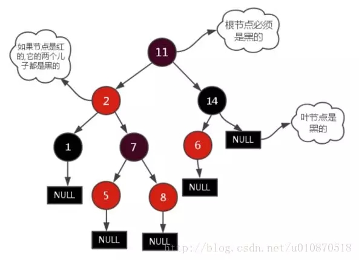
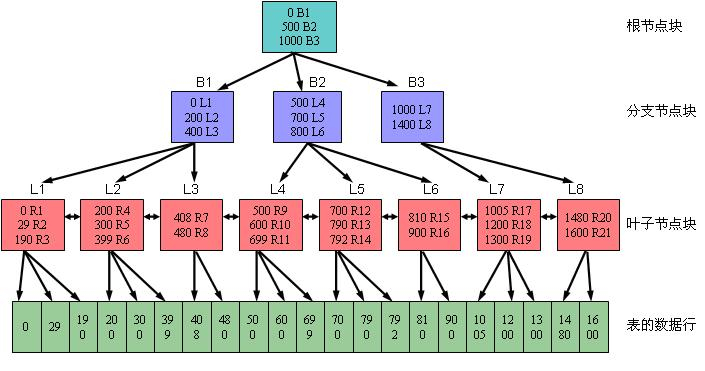
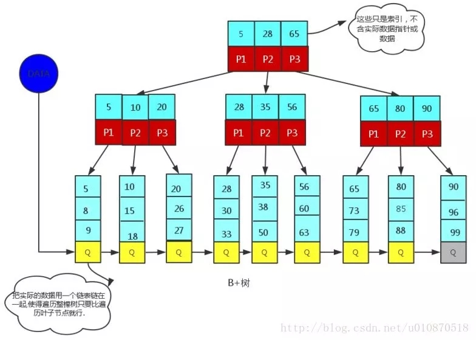

### 基本概念

- 数据（data）：描述事物的符号记录称为数据。
- 数据库（DataBase，DB）：是长期存储在计算机内、有组织的、可共享的大量数据的集合，具有永久存储、有组织、可共享三个基本特点。
- 数据库管理系统（DataBase Management System，DBMS）：是位于用户与操作系统之间的一层数据管理软件。
- 数据库系统（DataBase System，DBS）：是有数据库、数据库管理系统（及其应用开发工具）、应用程序和数据库管理员（DataBase Administrator DBA）组成的存储、管理、处理和维护数据的系统。
- 实体（entity）：客观存在并可相互区别的事物称为实体。
- 属性（attribute）：实体所具有的某一特性称为属性。
- 码（key）：唯一标识实体的属性集称为码。
- 实体型（entity type）：用实体名及其属性名集合来抽象和刻画同类实体，称为实体型。
- 实体集（entity set）：同一实体型的集合称为实体集。
- 联系（relationship）：实体之间的联系通常是指不同实体集之间的联系。
- 模式（schema）：模式也称逻辑模式，是数据库全体数据的逻辑结构和特征的描述，是所有用户的公共数据视图。
- 外模式（external schema）：外模式也称子模式（subschema）或用户模式，它是数据库用户（包括应用程序员和最终用户）能够看见和使用的局部数据的逻辑结构和特征的描述，是数据库用户的数据视图，是与某一应用有关的数据的逻辑表示。
- 内模式（internal schema）：内模式也称为存储模式（storage schema），一个数据库只有一个内模式。他是数据物理结构和存储方式的描述，是数据库在数据库内部的组织方式。

### 常用数据模型

- 层次模型（hierarchical model）
- 网状模型（network model）
- 关系模型（relational model）
  - 关系（relation）：一个关系对应通常说的一张表
  - 元组（tuple）：表中的一行即为一个元组
  - 属性（attribute）：表中的一列即为一个属性
  - 码（key）：表中可以唯一确定一个元组的某个属性组
  - 域（domain）：一组具有相同数据类型的值的集合
  - 分量：元组中的一个属性值
  - 关系模式：对关系的描述，一般表示为 `关系名(属性1, 属性2, ..., 属性n)`
- 面向对象数据模型（object oriented data model）
- 对象关系数据模型（object relational data model）
- 半结构化数据模型（semistructure data model）

### 关系型数据库

- 基本关系操作：查询（选择、投影、连接（等值连接、自然连接、外连接（左外连接、右外连接））、除、并、差、交、笛卡尔积等）、插入、删除、修改
- 关系模型中的三类完整性约束：实体完整性、参照完整性、用户定义的完整性

### 并发控制

- 事务是并发控制的基本单位。
- 并发操作带来的数据不一致性包括：丢失修改、不可重复读、读 “脏” 数据。
- 并发控制主要技术：封锁、时间戳、乐观控制法、多版本并发控制等。
- 基本封锁类型：排他锁（X 锁 / 写锁）、共享锁（S 锁 / 读锁）。
- 活锁死锁：
  - 活锁：事务永远处于等待状态，可通过先来先服务的策略避免。
  - 死锁：事物永远不能结束
    - 预防：一次封锁法、顺序封锁法；
    - 诊断：超时法、等待图法；
    - 解除：撤销处理死锁代价最小的事务，并释放此事务的所有的锁，使其他事务得以继续运行下去。
- 可串行化调度：多个事务的并发执行是正确的，当且仅当其结果与按某一次序串行地执行这些事务时的结果相同。可串行性时并发事务正确调度的准则。

### 事务以及四个特性

事务（Transaction）是由一系列对系统中数据进行访问与更新的操作所组成的一个程序执行逻辑单元。
事务具有4 个基本特性，分别是：原子性（Atomicity）、一致性（Consistency）、隔离性（Isolation）、持久性（Duration），简称ACID。

1.原子性（Atomicity）
原子性是指事务包含的所有操作要么全部成功，要么全部失败回滚。

2.一致性（Consistency）
一致性是指事务必须使数据库从一个一致性状态变换到另一个一致性状态，也就是说一个事务执行之前和执行之后都必须处于一致性状态。拿转账来说，假设用户A 和用户B 两者的钱加起来一共是5000，那么不管A 和B 之间如何转账，转几次账，事务结束后两个用户的钱相加起来应该还得是5000，这就是事务的一致性。

3.隔离性（Isolation）
隔离性是当多个用户并发访问数据库时，不能被其他事务的操作所干扰，多个并发事务之间要相互隔离。即要达到一种效果：对于任意两个并发的事务T1 和T2，在事务T1 看来，T2 要么在T1 开始之前就已经结束，要么在T1 结束之后才开始，这样每个事务都感觉不到有其他事务在并发地执行。

4.持久性（Durability）

持久性是指一个事务一旦被提交了，那么对数据库中的数据的改变就是永久性的，即便是在数据库系统遇到故障的情况下也不会丢失提交事务的操作。

### 隔离的四个级别

Read Uncommitted（读取未提交）：最低的隔离级别，什么都不需要做，一个事务可以读到另一个事务未提交的结果。所有的并发事务问题都会发生。
Read Committed（读取提交内容）：只有在事务提交后，其更新结果才会被其他事务看见。可以解决脏读问题。
Repeated Read（可重复读）：在一个事务中，对于同一份数据的读取结果总是相同的，无论是否有其他事务对这份数据进行操作，以及这个事务是否提交。可以解决脏读、不可重复读。
Serialization（可串行化）：事务串行化执行，隔离级别最高，牺牲了系统的并发性。可以解决并发事务的所有问题。

| 隔离级别 | 脏读(Dirty Read) | 不可重复读(NoneRepeatable Read) | 幻读（Phantom Read） |
| -------- | ---------------- | ------------------------------- | -------------------- |
| 未提交读 | 可能             | 可能                            | 可能                 |
| 已提交读 | 不可能           | 可能                            | 可能                 |
| 可重复读 | 不可能           | 不可能                          | 可能                 |
| 可串行化 | 不可能           | 不可能                          | 不可能               |

脏读：一个事务访问数据，对数据进行修改未提交，而另一个事务访问，使用了这个数据，读取的这个数据就称为脏数据。
不可重复读：一个事务A多次读取数据，假设在第一次读取数据的过程中，另一个事务B修改了数据，导致A两次读取的数据不一致。
幻读：事务A对数据进行了修改操作，同时事务B对数据进行了插入操作，事务A查询时会发现还有一条未修改的数据，就跟幻象一样。

### 数据库的三大范式

第一范式：当关系模式R 的所有属性都不能再分解为更基本的数据单位时，称R是满足第一范式，即属性不可分
第二范式：如果关系模式R 满足第一范式，并且R 得所有非主属性都完全依赖于R的每一个候选关键属性，称R满足第二范式
第三范式：设R是一个满足第一范式条件的关系模式，X 是R的任意属性集，如果X非传递依赖于R 的任意一个候选关键字，称R满足第三范式，即非主属性不传递依赖于键码

### 数据库索引

#### 概念：

索引是对数据库表中一列或多列的值进行排序的一种结构。
索引的一个主要目的就是加快检索表中数据的方法，亦即能协助信息搜索者尽快的找到符合限制条件的记录ID 的辅助数据结构。

#### 分类：

##### 主键索引：

某一个属性组能唯一标识一条记录，如：学号可唯一标识学生，可以作为主键

##### 唯一索引：

避免同一个表中某数据列中的值重复

#### 主键和唯一索引的区别

主键索引只能有一个唯一索引可有多个
唯一性索引列允许空值，而主键列不允许为空值。

#### 优点：

1.大大加快数据的检索速度;
2.创建唯一性索引，保证数据库表中每一行数据的唯一性;
3.加速表和表之间的连接;
4.在使用分组和排序子句进行数据检索时，可以显著减少查询中分组和排序的时间。

#### 缺点：

创建索引和维护索引要耗费时间，这种时间随着数据量的增加而增加。索引需要占物理空间，除了数据表占数据空间之外，每一个索引还要占一定的物理空间，如果要建立聚簇索引，那么需要的空间就会更大。
当对表中的数据进行增加、删除和修改的时候，索引也要动态的维护，这样就降低了数据的维护速度。

#### 添加索引原则：

在查询中很少使用或者参考的列不应该创建索引。因为这些列很少使用到，有无索引，并不能影响查询速度。相反，由于增加了索引，反而降低了系统的维护速度和增大了空间需求。
只有很少数据值的列也不应该增加索引。因为这些列的取值很少，例如人事表的性别列，在查询的结果中，结果集的数据行占了表中数据行的很大比例，即需要在表中搜索的数据行的比例很大。增加索引，并不能明显加快检索速度。
定义为text、image 和bit 数据类型的列不应该增加索引。因为这些列的数据量要么相当大，要么取值很少。
当修改性能远远大于检索性能时，不应该创建索引。因为修改性能和检索性能是互相矛盾的。当增加索引时，会提高检索性能，但是会降低修改性能。当减少索引时，会提高修改性能，降低检索性能。

#### 索引的数据结构：

索引使用的数据结构一般有B树，B+树，哈希表。

##### 树的知识补充：

###### BST:

BST的查找也就是从根节点到某一个叶节点的过程，与树高有关。那么可以推得节点数为n的BST的查找平均时间复杂度是logn。但是BST高度可能为线性。

###### AVL:

AVL树是带有平衡条件的二叉查找树，一般是用平衡因子差值判断是否平衡并通过旋转来实现平衡，左右子树树高不超过1，和红黑树相比，它是严格的平衡二叉树，平衡条件必须满足（所有节点的左右子树高度差不超过1）。不管我们是执行插入还是删除操作，只要不满足上面的条件，就要通过旋转来保持平衡，而旋转是非常耗时的，由此我们可以知道AVL树适合用于插入删除次数比较少，但查找多的情况。

局限性：

由于维护这种高度平衡所付出的代价比从中获得的效率收益还大，故而实际的应用不多，更多的地方是用追求局部而不是非常严格整体平衡的红黑树。当然，如果应用场景中对插入删除不频繁，只是对查找要求较高，那么AVL还是较优于红黑树。

应用

1、Windows NT内核中广泛存在；

###### 红黑树：

简介

一种二叉查找树，但在每个节点增加一个存储位表示节点的颜色，可以是red或black。通过对任何一条从根到叶子的路径上各个节点着色的方式的限制，红黑树确保没有一条路径会比其它路径长出两倍。它是一种弱平衡二叉树(由于是若平衡，可以推出，相同的节点情况下，AVL树的高度低于红黑树)，相对于要求严格的AVL树来说，它的旋转次数变少，所以对于查找、插入、删除操作多的情况下，我们就用红黑树。

性质

1、每个节点非红即黑； 
2、根节点是黑的； 
3、每个叶节点(叶节点即树尾端NULL指针或NULL节点)都是黑的； 
4、如果一个节点是红的,那么它的两儿子都是黑的； 
5、对于任意节点而言，其到叶子点树NULL指针的每条路径都包含相同数目的黑节点； 
6、每条路径都包含相同的黑节点；

应用

1、广泛用于C++的STL中，Map和Set都是用红黑树实现的； 
2、著名的Linux进程调度Completely Fair Scheduler，用红黑树管理进程控制块，进程的虚拟内存区域都存储在一颗红黑树上，每个虚拟地址区域都对应红黑树的一个节点，左指针指向相邻的地址虚拟存储区域，右指针指向相邻的高地址虚拟地址空间； 
3、IO多路复用epoll的实现采用红黑树组织管理sockfd，以支持快速的增删改查； 
4、Nginx中用红黑树管理timer，因为红黑树是有序的，可以很快的得到距离当前最小的定时器； 
5、Java中TreeMap的实现；

##### B树：

B-树就是B树，-只是一个符号。这是网上的误导。

###### B树的性质：

1、定义任意非叶子结点最多只有M个儿子，且M>2； 
2、根结点的儿子数为[2, M]； 
3、除根结点以外的非叶子结点的儿子数为[M/2, M]； 
4、每个结点存放至少M/2-1（取上整）和至多M-1个关键字；（至少2个关键字） 
5、非叶子结点的关键字个数=指向儿子的指针个数-1； 
6、非叶子结点的关键字：K[1], K[2], …, K[M-1]；且K[i] < K[i+1]； 
7、非叶子结点的指针：P[1], P[2], …, P[M]；其中P[1]指向关键字小于K[1]的子树，P[M]指向关键字大于K[M-1]的子树，其它P[i]指向关键字属于(K[i-1], K[i])的子树； 
8、所有叶子结点位于同一层；

 

##### B+树：

B+树是应文件系统所需而产生的一种B树的变形（文件的目录一级一级索引，只有最底层的叶子节点（文件）保存数据）非叶子节点只保存索引，不保存实际的数据，数据都保存在叶子节点中，这不就是文件系统文件的查找吗?

我们就举个文件查找的例子：有3个文件夹a、b、c， a包含b，b包含c，一个文件yang.c，a、b、c就是索引（存储在非叶子节点）， a、b、c只是要找到的yang.c的key，而实际的数据yang.c存储在叶子节点上。

所有的非叶子节点都可以看成索引部分！

B+树的性质

(下面提到的都是和B树不相同的性质)

1、非叶子节点的子树指针与关键字个数相同； 
2、非叶子节点的子树指针p[i],指向关键字值属于[k[i],k[i+1]]的子树.(B树是开区间,也就是说B树不允许关键字重复,B+树允许重复)； 
3、为所有叶子节点增加一个链指针； 
4、所有关键字都在叶子节点出现(稠密索引). (且链表中的关键字恰好是有序的)； 
5、非叶子节点相当于是叶子节点的索引(稀疏索引),叶子节点相当于是存储(关键字)数据的数据层； 
6、更适合于文件系统；

数据一般是放在磁盘中的，读取数据的时候肯定会访问磁盘，磁盘中有两个机械运动的部分，分别是盘片旋转和磁臂移动。盘片旋转就是我们市面上所提到的多少转每分钟，而磁盘移动则是在盘片旋转到指定位置以后，移动磁臂后开始进行数据的读写。那么这就存在一个定位到磁盘中的块的过程，而定位是磁盘的存取中花费时间比较大的一块，但是我们可以通过B树进行优化，提高磁盘读取时定位的效率。

构造一个多阶的B类树，尽量多的在结点上存储相关的信息，保证层数尽量的少，磁盘的I/O操作也少一些，而且B类树是平衡树，保证了查询的稳定。

总的来说，B/B+树是为了磁盘或其它存储设备而设计的一种平衡多路查找树(相对于二叉，B树每个内节点有多个分支)，与红黑树相比，在相同的的节点的情况下，一颗B/B+树的高度远远小于红黑树的高度(在下面B/B+树的性能分析中会提到)。B/B+树上操作的时间通常由存取磁盘的时间和CPU计算时间这两部分构成，而CPU的速度非常快，所以B树的操作效率取决于访问磁盘的次数，关键字总数相同的情况下B树的高度越小，磁盘I/O所花的时间越少。

#### 为什么说B+树比B树更适合数据库索引

1、 B+树的磁盘读写代价更低：B+树的内部节点并没有指向关键字具体信息的指针，因此其内部节点相对B树更小，如果把所有同一内部节点的关键字存放在同一盘块中，那么盘块所能容纳的关键字数量也越多，一次性读入内存的需要查找的关键字也就越多，相对IO读写次数就降低了。

2、B+树的查询效率更加稳定：由于非终结点并不是最终指向文件内容的结点，而只是叶子结点中关键字的索引。所以任何关键字的查找必须走一条从根结点到叶子结点的路。所有关键字查询的路径长度相同，导致每一个数据的查询效率相当。

3、由于B+树的数据都存储在叶子结点中，分支结点均为索引，方便扫库，只需要扫一遍叶子结点即可，但是B树因为其分支结点同样存储着数据，我们要找到具体的数据，需要进行一次中序遍历按序来扫，所以B+树更加适合在区间查询的情况，所以通常B+树用于数据库索引。

数据库索引采用B+树的主要原因是：B树在提高了IO性能的同时并没有解决元素遍历的效率低下的问题，正是为了解决这个问题，B+树应用而生。B+树只需要去遍历叶子节点就可以实现整棵树的遍历。而且在数据库中基于范围的查询是非常频繁的，而B树不支持这样的操作或者说效率太低。

[BST,AVL,RBtree以及mysql索引数据结构](https://www.cnblogs.com/tiancai/p/9024351.html)

https://www.cnblogs.com/George1994/p/7008732.html

### 数据库锁：

　　数据库锁是为了处理并发问题，因为数据库是一个多用户共享的资源，并发时就会导致各种问题。数据库并发需要使用事务来控制，事务并发问题需要数据库锁来控制，所以数据库锁是跟并发控制和事务联系在一起的。

　　并发控制一般采用三种方法，分别是乐观锁和悲观锁以及时间戳。乐观锁认为一个用户读数据的时候，别人不会去写自己所读的数据；悲观锁就刚好相反，觉得自己读数据库的时候，别人可能刚好在写自己刚读的数据；时间戳就是不加锁，通过时间戳来控制并发出现的问题。

​	悲观锁就是在读取数据的时候，为了不让别人修改自己读取的数据，就会先对自己读取的数据加锁，只有自己把数据读完了，才允许别人修改那部分数据，或者反过来说，就是自己修改某条数据的时候，不允许别人读取该数据，只有等自己的整个事务提交了，才释放自己加上的锁，才允许其他用户访问那部分数据。乐观锁就比较简单了，就是不做控制，这只是一部分人对于并发所持有的一种态度而已。时间戳就是在数据库表中单独加一列时间戳，比如“TimeStamp”，每次读出来的时候，把该字段也读出来，当写回去的时候，把该字段加1，提交之前 ，跟数据库的该字段比较一次，如果比数据库的值大的话，就允许保存，否则不允许保存，这种处理方法虽然不使用数据库系统提供的锁机制，但是这种方法可以大大提高数据库处理的并发量，因为这种方法可以避免了长事务中的数据库加锁开销（操作员A 和操作员B操作过程中，都没有对数据库数据加锁），大大提升了大并发量下的系 统整体性能表现。 需要注意的是，乐观锁机制往往基于系统中的数据存储逻辑，因此也具备一定的局限性，如在上例中，由于乐观锁机制是在我们的系统中实现，来自外部系统的用户余额更新操作不受我们系统的控制，因此可能会造成脏数据被更新到数据库中。在系统设计阶段，我们应该充分考虑到这些情况出现的可能性，并进行相应调整（如将乐观锁策略在数据库存储过程中实现，对外只开放基于此存储过程的数据更新途 径，而不是将数据库表直接对外公开）。以上悲观锁所说的加“锁”，其实分为几种锁，分别是：排它锁和共享锁，其中排它锁又称为写锁，共享锁又称为读锁。

### 关系型数据库和非关系数据库的特点

关系模型指的就是二维表格模型，而一个关系型数据库就是由二维表及其之间的联系所组成的一个数据组织。

非关系型数据库提出另一种理念，例如，以键值对存储，且结构不固定，每一个元组可以有不一样的字段，每个元组可以根据需要增加一些自己的键值对，这 样就不会局限于固定的结构，可以减少一些时间和空间的开销。使用这种方式，用户可以根据需要去添加自己需要的字段，这样，为了获取用户的不同信息，不需要 像关系型数据库中，要对多表进行关联查询。仅需要根据id取出相应的value就可以完成查询。但非关系型数据库由于很少的约束，他也不能够提供像SQL 所提供的where这种对于字段属性值情况的查询。并且难以体现设计的完整性。他只适合存储一些较为简单的数据，对于需要进行较复杂查询的数据，SQL数 据库显的更为合适。

关系型数据库的最大特点就是事务的一致性：传统的关系型数据库读写操作都是事务的，具有ACID的特点，这个特性使得关系型数据库可以用于几乎所有对一致性有要求的系统中，如典型的银行系统。

但是，在网页应用中，尤其是SNS应用中，一致性却不是显得那么重要，用户A看到的内容和用户B看到同一用户C内容更新不一致是可以容忍的，或者 说，两个人看到同一好友的数据更新的时间差那么几秒是可以容忍的，因此，关系型数据库的最大特点在这里已经无用武之地，起码不是那么重要了。

相反地，关系型数据库为了维护一致性所付出的巨大代价就是其读写性能比较差，而像微博、facebook这类SNS的应用，对并发读写能力要求极 高，关系型数据库已经无法应付(在读方面，传统上为了克服关系型数据库缺陷，提高性能，都是增加一级memcache来静态化网页，而在SNS中，变化太 快，memchache已经无能为力了)，因此，必须用新的一种数据结构存储来代替关系数据库。

关系数据库的另一个特点就是其具有固定的表结构，因此，其扩展性极差，而在SNS中，系统的升级，功能的增加，往往意味着数据结构巨大变动，这一点关系型数据库也难以应付，需要新的结构化数据存储。

于是，非关系型数据库应运而生，由于不可能用一种数据结构化存储应付所有的新的需求，因此，非关系型数据库严格上不是一种数据库，应该是一种数据结构化存储方法的集合。

必须强调的是，数据的持久存储，尤其是海量数据的持久存储，还是需要一种关系数据库这员老将。
非关系型数据库分类：
主要分为以下几类：
         
面向高性能并发读写的key-value数据库：

key-value数据库的主要特点即使具有极高的并发读写性能，Redis,Tokyo Cabinet,Flare就是这类的代表

面向海量数据访问的面向文档数据库：

这类数据库的特点是，可以在海量的数据中快速的查询数据，典型代表为MongoDB以及CouchDB

面向可扩展性的分布式数据库：

这类数据库想解决的问题就是传统数据库存在可扩展性上的缺陷，这类数据库可以适应数据量的增加以及数据结构的变化

[关系型数据库和非关系型数据库](http://my.oschina.net/u/1773689/blog/364548)

### inner join和left join

left join(左联接) 返回包括左表中的所有记录和右表中联结字段相等的记录
right join(右联接) 返回包括右表中的所有记录和左表中联结字段相等的记录
inner join(等值连接) 只返回两个表中联结字段相等的行

### SQL优化方法有哪些 

通过建立索引对查询进行优化
对查询进行优化，应尽量避免全表扫描

### MySQL引擎和区别 

 1、MySQL 引擎
MySQL 中的数据用各种不同的技术存储在文件（或者内存）中。这些技术中的每一种技术都使用不同的存储机制、索引技巧、锁定水平并且最终提供广泛的不同的功能和能力。通过选择不同的技术，你能够获得额外的速度或者功能，从而改善你的应用的整体功能。
数据库引擎是用于存储、处理和保护数据的核心服务。利用数据库引擎可控制访问权限并快速处理事务，从而满足企业内大多数需要处理大量数据的应用程序的要求。使用数据库引擎创建用于联机事务处理或联机分析处理数据的关系数据库。这包括创建用于存储数据的表和用于查看、管理和保护数据安全的数据库对象（如索引、视图和存储过程）。
MySQL 存储引擎主要有： MyIsam、InnoDB、Memory、Blackhole、CSV、Performance_Schema、Archive、Federated、Mrg_Myisam。但是最常用的是InnoDB 和Mylsam。

2、InnoDB
InnoDB 是一个事务型的存储引擎，有行级锁定和外键约束。
Innodb 引擎提供了对数据库ACID 事务的支持，并且实现了SQL 标准的四种隔离级别，关于数据库事务与其隔离级别的内容请见数据库事务与其隔离级别这类型的文章。该引擎还提供了行级锁和外键约束，它的设计目标是处理大容量数据库系统，它本身其实就是基于MySQL 后台的完整数据库系统，MySQL 运行时Innodb 会在内存中建立缓冲池，用于缓冲数据和索引。但是该引擎不支持FULLTEXT 类型的索引，而且它没有保存表的行数，当SELECT COUNT(*) FROM TABLE时需要扫描全表。当需要使用数据库事务时，该引擎当然是首选。由于锁的粒度更小，写操作不会锁定全表，所以在并发较高时，使用Innodb 引擎会提升效率。但是使用行级锁也不是绝对的，如果在执行一个SQL 语句时MySQL 不能确定要扫描的范围，InnoDB 表同样会锁全表。
适用场景：
经常更新的表，适合处理多重并发的更新请求。

支持事务。
可以从灾难中恢复（通过bin-log 日志等）。
外键约束。只有他支持外键。
支持自动增加列属性auto_increment。

索引结构：
InnoDB 也是B+Treee 索引结构。Innodb 的索引文件本身就是数据文件，即B+Tree 的数据域存储的就是实际的数据，这种索引就是聚集索引。这个索引的key 就是数据表的主键，因此InnoDB 表数据文件本身就是主索引。
InnoDB 的辅助索引数据域存储的也是相应记录主键的值而不是地址，所以当以辅助索引查找时，会先根据辅助索引找到主键，再根据主键索引找到实际的数据。所以Innodb 不建议使用过长的主键，否则会使辅助索引变得过大。建议使用自增的字段作为主键，这样B+Tree 的每一个结点都会被顺序的填满，而不会频繁的分裂调整，会有效的提升插入数据的效率。
3、Mylsam
MyIASM 是MySQL 默认的引擎，但是它没有提供对数据库事务的支持，也不支持行级锁和外键，因此当INSERT 或UPDATE 数据时即写操作需要锁定整个表，效率便会低一些。MyIsam 存储引擎独立于操作系统，也就是可以在windows 上使用，也可以比较简单的将数据转移到linux操作系统上去。
适用场景：
不支持事务的设计，但是并不代表着有事务操作的项目不能用MyIsam 存储引擎，可以在service 层进行根据自己的业务需求进行相应的控制。
不支持外键的表设计。
查询速度很快，如果数据库insert 和update 的操作比较多的话比较适用。整天对表进行加锁的场景。
MyISAM 极度强调快速读取操作。
MyIASM 中存储了表的行数，于是SELECT COUNT(*) FROM TABLE 时只需要直接读取已经保存好的值而不需要进行全表扫描。如果表的读操作远远多于写操作且不需要数据库事务的支持，那么MyIASM 也是很好的选择。
缺点：就是不能在表损坏后主动恢复数据。

索引结构：
MyISAM 索引结构：MyISAM 索引用的B+ tree 来储存数据，MyISAM 索引的指针指向的是键值的地址，地址存储的是数据。B+Tree 的数据域存储的内容为实际数据的地址，也就是说它的索引和实际的数据是分开的，只不过是用索引指向了实际的数据，这种索引就是所谓的非聚集索引。
3、InnoDB 和Mylsam 的区别：
1）事务：MyISAM 类型不支持事务处理等高级处理，而InnoDB 类型支持，提供事务支持已经外部键等高级数据库功能。
2）性能：MyISAM 类型的表强调的是性能，其执行数度比InnoDB 类型更快。
3）行数保存：InnoDB 中不保存表的具体行数，也就是说，执行select count() fromtable时，InnoDB 要扫描一遍整个表来计算有多少行，但是MyISAM 只要简单的读出保存好的行数即可。
注意的是，当count()语句包含where 条件时，两种表的操作是一样的。
4）索引存储：对于AUTO_INCREMENT 类型的字段，InnoDB 中必须包含只有该字段的索引，但是在MyISAM 表中，可以和其他字段一起建立联合索引。MyISAM 支持全文索引（FULLTEXT）、压缩索引，InnoDB 不支持。

MyISAM 的索引和数据是分开的，并且索引是有压缩的，内存使用率就对应提高了不少。能加载更多索引，而Innodb 是索引和数据是紧密捆绑的，没有使用压缩从而会造成Innodb 比MyISAM 体积庞大不小。
InnoDB 存储引擎被完全与MySQL 服务器整合，InnoDB 存储引擎为在主内存中缓存数据和索引而维持它自己的缓冲池。InnoDB 存储它的表＆索引在一个表空间中，表空间可以包含数个文件（或原始磁盘分区）。这与MyISAM 表不同，比如在MyISAM 表中每个表被存在分离的文件中。
InnoDB 表可以是任何尺寸，即使在文件尺寸被限制为2GB 的操作系统上。
5）服务器数据备份：InnoDB 必须导出SQL 来备份，LOAD TABLE FROM MASTER 操作对InnoDB是不起作用的，解决方法是首先把InnoDB 表改成MyISAM 表，导入数据后再改成InnoDB 表，但是对于使用的额外的InnoDB 特性(例如外键)的表不适用。
MyISAM 应对错误编码导致的数据恢复速度快。MyISAM 的数据是以文件的形式存储，所以在跨平台的数据转移中会很方便。在备份和恢复时可单独针对某个表进行操作。
InnoDB 是拷贝数据文件、备份binlog，或者用mysqldump，在数据量达到几十G 的时候就相对痛苦了。
6）锁的支持：MyISAM 只支持表锁。InnoDB 支持表锁、行锁行锁大幅度提高了多用户并发操作的新能。但是InnoDB 的行锁，只是在WHERE 的主键是有效的，非主键的WHERE 都会锁全表的。

### mongodb**和**redis**的**区别

内存管理机制上：Redis 数据全部存在内存，定期写入磁盘，当内存不够时，可以选择指定的LRU 算法删除数据。MongoDB 数据存在内存，由linux 系统mmap 实现，当内存不够时，只将热点数据放入内存，其他数据存在磁盘。
支持的数据结构上：Redis 支持的数据结构丰富，包括hash、set、list 等。
MongoDB 数据结构比较单一，但是支持丰富的数据表达，索引，最类似关系型数据库，支持
的查询语言非常丰富

### Redis 和memcached 的区别

1）数据类型：redis 数据类型丰富，支持set liset 等类型；memcache 支持简单数据类型，需要客户端自己处理复杂对象
2）持久性：redis 支持数据落地持久化存储；memcache 不支持数据持久存储。)
3）分布式存储：redis 支持master-slave 复制模式；memcache 可以使用一致性hash 做分布式。
4）value 大小不同：memcache 是一个内存缓存，key 的长度小于250 字符，单个item 存储要小于1M，不适合虚拟机使用

5）数据一致性不同：redis 使用的是单线程模型，保证了数据按顺序提交；memcache 需要使用cas 保证数据一致性。CAS（Check and Set）是一个确保并发一致性的机制，属于“乐观锁”
范畴；原理很简单：拿版本号，操作，对比版本号，如果一致就操作，不一致就放弃任何操作
6）cpu 利用：redis 单线程模型只能使用一个cpu，可以开启多个redis 进程

### mysql引擎**以及其**区别 

在Mysql 数据库中，常用的引擎为Innodb 和MyIASM,其中Innodb 是一个事务型的存储引擎，有行级锁定和外键约束，提供了对数据库ACID 事物的支持，实现了SQL 标准的四种隔离级别，即读未提交，不可重复读，可重复读以及串行,其涉及目标就是处理大数据容量的数据库系统。而MyIASM 引擎是Mysql 默认的引擎，不提供数据库事务的支持，也不支持行级锁和外键，因此当写操作时需要锁定整个表，效率较低。不过其保存了表的行数，当金星select count(*)form table 时，可直接读取已经保存的值，不需要进行全表扫描。因此当表的读操作远多于写操作，并且不需要事务支持时，可以优先选择MyIASM

### Redis的定时机制怎么实现 

Redis 服务器是一个事件驱动程序，服务器需要处理以下两类事件：文件事件（服务器对套接字操作的抽象）和时间事件（服务器对定时操作的抽象）。Redis 的定时机制就是借助时间事件实现的。
一个时间事件主要由以下三个属性组成：id：时间事件标识号；when：记录时间事件的到达时间；timeProc：时间事件处理器，当时间事件到达时，服务器就会调用相应的处理器来处理时间。一个时间事件根据时间事件处理器的返回值来判断是定时事件还是周期性事件
一个时间事件主要由以下三个属性组成：id：时间事件标识号；when：记录时间事件的到达时间；timeProc：时间事件处理器，当时间事件到达时，服务器就会调用相应的处理器来处理时间。一个时间事件根据时间事件处理器的返回值来判断是定时事件还是周期性事件。

### Redis是单线程的，**但是**为什么这么高效**呢**? 

虽然Redis 文件事件处理器以单线程方式运行，但是通过使用I/O 多路复用程序来监听多个套接字，文件事件处理器既实现了高性能的网络通信模型，又可以很好地与Redis 服务器中其他同样以单线程运行的模块进行对接，这保持了Redis 内部单线程设计的简单性。

### Redis的数据类型及其底层实现

1）字符串：整数值、embstr 编码的简单动态字符串、简单动态字符串（SDS)
2）列表：压缩列表、双端链表
3）哈希：压缩列表、字典
4）集合：整数集合、字典
5）有序集合：压缩列表、跳跃表和字典

  

