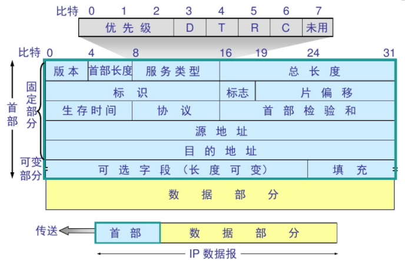
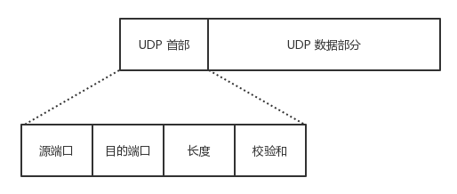

## TCP/IP 四层与 OSI

TCP/IP 四层模型与 OSI 参考模型

1. 链路层（数据链路层 / 网络接口层）：包括操作系统中的设备驱动程序、计算机中对应的网络接口卡
2. 网络层（互联网层）：处理分组在网络中的活动，比如分组的选路。
3. 运输层：主要为两台主机上的应用提供端到端的通信。
4. 应用层：负责处理特定的应用程序细节。

  

  假设在一个局域网 (LAN) 如以太网中有两台主机，二者运行FTP 协议：

  

  TCP/IP 四层模型：

  网络层与运输层的区别：
  　　在 TCP/TP 协议族中，网络层 IP 提供的是一种不可靠的服务。它只是尽可能快地把分组从源节点送到目的节点，但不提供任何可靠性的保证。
  　　Tcp 在不可靠的 ip 层上，提供了一个可靠的运输层，为了提供这种可靠的服务，TCP 采用了超时重传、发送和接受端到端的确认分组等机制。
  TCP/IP 协议族的分层：

  

  

  1、物理层：
  　　主要功能：利用传输介质为数据链路层提供屋里连接，实现比特流的透明传输。
  　　作用：实现相邻计算机节点之间比特流的透明传输，尽可能屏蔽掉具体传输介质与物理设备的差异。使其上面的数据链路层不必考虑网络的具体传输介质是什么。
  　　透明传输的意义就是：不管传的是什么，所采用的设备只是起一个通道作用，把要传输的内容完好的传到对方！
  2、数据链路层：负责建立和管理节点间的链路。
  　　主要功能：通过各种控制协议，将有差错的物理信道变为无差错的、能可靠传输数据帧的数据链路。
  　　具体工作：接受来自物理层的位流形式的数据，并封装成帧，传送到上一层；同样，也将来自上一层的数据帧，拆装为位流形式的数据转发到物理层；并且还负责处理接受端发回的确认帧的信息，以便提供可靠的数据传输。
  　　该层通常又被分为 介质访问控制 (MAC) 和逻辑链路控制 (LLC) 两个子层：
  　　MAC 子层的主要任务是解决共享型网络中多用户对信道竞争的问题，完成网络介质的访问控制。
  　　LLC 子层的主要任务是建立和维护网络连接，执行差错校验、流量控制和链路控制。
  3、网络层：是 OSI 参考模型中最复杂的一层，也是通信子网最高的一层，它在下两层的基础上向资源子网提供服务。
  　　主要任务：通过路由算法，为报文或分组通过通信子网选择最适当的路径。该层控制数据链路层与物理层之间的信息转发，建立、维持与终止网络的连接。具体的说，数据链路层的数据在这一层被转换为数据包，然后通过路径选择、分段组合、顺序、进 / 出路由等控制，将信息从一个网络设备传送到另一个网络设备。
  　　一般的，数据链路层是解决统一网络内节点之间的通信，而网络层主要解决不同子网之间的通信。例如路由选择问题。
  　　在实现网络层功能时，需要解决的主要问题如下：
  　　寻址：数据链路层中使用的物理地址（如 MAC 地址）仅解决网络内部的寻址问题。在不同子网之间通信时，为了识别和找到网络中的设备，每一子网中的设备都会被分配一 个唯一的地址。由于各个子网使用的物理技术可能不同因此这个地址应当是逻辑地址（如IP 地址）
  　　交换：规定不同的交换方式。常见的交换技术有：线路交换技术和存储转发技术，后者包括报文转发技术和分组转发技术。
  　　路由算法：当源节点和路由节点之间存在多条路径时，本层可以根据路由算法，通过网络为数据分组选择最佳路径，并将信息从最合适的路径，由发送端传送的接受端。
  　　连接服务：与数据链路层的流量控制不同的是，前者控制的是网络相邻节点间的流量，后者控制的是从源节点到目的节点间的流量。其目的在于防止阻塞，并进行差错检测
  4、传输层：
  　　OSI 的下三层的主要任务是数据传输，上三层的主要任务是数据处理。而传输层是第四层，因此该层是通信子网和资源子网的接口和桥梁，起到承上启下的作用。
  　　主要任务：向用户提供可靠的、端到端的差错和流量控制，保证报文的正确传输。
  　　主要作用：向高层屏蔽下层数据通信的具体细节，即向用户透明的传送报文。
  　　传输层提供会话层和网络层之间的传输服务，这种服务从会话层获得数据，并在必要时，对数据进行分割，然后，传输层将数据传送到网络层，并确保数据能准确无误的传送到网络层。因此，传输层负责提供两节点之间数据的可靠传送，当两节点的联系确定之后，传输层负责监督工作。综上，传输层的主要功能如下：
  	传输连接管理：提供建立、连接和拆除传输连接的功能。传输层在网络层的基础上，提供 “面向连接” 和 “面向无连接” 两种服务。　　　　　　　　　　　　　　　　　
  	处理理传输差错：提供可靠的 “面向连接” 和不可靠的 “面向无连接” 的数据传输服务、差错控制和流量控制。在提供 “面向连接” 服务时，通过这一层传输的数据将由目标设备确认如果在指定的时间内未收到确认信息数据将被重新发送。　　　　　　　　　　　　　　　　　　　　　　　　
  5、会话层：是 OSI 参考模型的第五层，是用户应用程序和网络之间的接口
  　　主要任务：向两个实体的表示层提供建立和使用连接的方法。将不同实体之间的表示层的连接称为会话。因此会话层的任务就是组织和协调两个会话进程之间的通信，并对数据交换进行管理。
  　　用户可以按照半双工、单工和全工的方式建立会话。当建立会话时，用户必须提供他们想要连接的远程地址。而这些地址与 MAC（介质访问控制子层）地址或网络层的逻辑地址不同，他们是为用户专门设计的，更便于用户记忆。域名(DN) 就是网络上使用的远程地址。会话层的具体功能如下：

  　　会话管理：允许用户在两个实体设备之间建立、维持和终止会话，并支持它们之间的数据交换。例如提供单方向会话或双向同时会话，并管理会话中的发送顺序，以及会话所占用时间的长短。

  ​	会话流量控制：提供流量控制和交叉会话功能。　　　　　　　　　　　　　　　　　　　　　　　　
  ​	寻址：使用远程地址建立会话连接。　　　　　　　　　　　　　　　　　　　　　　　　
  ​	出错控制：从逻辑上讲，会话层主要负责数据交换的建立、保持和终止，但实际的工作却是接收来自传输层的数据，并负责纠错。会话控制和远程过程调用均属于这一层的功能。但应注意，此层检查的错误不是通信介质的错误而是磁盘空间打印机缺纸等高级类的错误。
  6、表示层：
  　　表示层是 OSI 模型的第六层，它对来自应用层的命令和数据进行解释，对各种语法赋予相应的含义，并按照一定的格式传送给会话层。
  　　其主要功能是 “处理用户信息的表示问题，如编码、数据格式转换和加密解密” 等。
  　　表示层的具体功能如下：
  　　数据格式处理：协商和建立数据交换的格式，解决各应用程序之间在数据格式表示上的差异。
  　　数据的编码：处理字符集和数字的转换。例如由于用户程序中的数据类型（整型或实型、有符号或无符号
  等）、用户标识等都可以有不同的表示方式，因此，在设备之间需要具有在不同字符集或格式之间转换的功能。
  　　压缩和解压缩：为了减少数据的传输量，这一层还负责数据的压缩与恢复。
  　　数据的加密和解密：可以提高网络的安全性。
  7、应用层
  　　应用层是 OSI 参考模型的最高层，它是计算机用户，以及各种应用程序和网络之间的接口。
  　　主要功能：直接向用户提供服务，完成用户希望在网络上完成的各种工作。它在其他 6 层工作的基础上，负责完成网络中应用程序与网络操作系统之间的联系，建立与结束使用者之间的联系，并完成网络用户提出的各种网络服务及应用所需的监督、管理和服务等各种协议。此外，该层还负责协调各个应用程序间的工作。
  　　应用层为用户提供的服务和协议有：文件服务、目录服务、文件传输服务（FTP）、远程登录服务（Telnet）、电子邮件服务（E-mail）、打印服务、安全服务、网络管理服务数据库服务等上述的各种网络服务由该层的不同应用协议和程序完成，不同的网络操作系统之间在功能、界面、实现技术、对硬件的支持、安全可靠性以及具有的各种应用程序接口等各个方面的差异是很大的。应用层的主要功能如下：
  　　用户接口：应用层是用户与网络，以及应用程序与网络间的直接接口，使得用户能够与网络进行交互式联系。
  　　实现各种服务：该层具有的各种应用程序可以完成和实现用户请求的各种服务。
  OSI 7 层模型的小结
  由于 OSI 是一个理想的模型，因此一般网络系统只涉及其中的几层，很少有系统能够具有所有的 7 层，并完全遵循它的规定。
  在 7 层模型中，每一层都提供一个特殊的网络功能。从网络功能的角度观察：下面 4 层（物理层、数据链路层、网络层和传输层）主要提供数据传输和交换功能，即以节点到节点之间的通信为主；第 4 层作为上下两部分的桥梁，是整个网络体系结构中最关键的部分；而上 3 层（会话层、表示层和应用层）则以提供用户与应用程序之间的信息和数据处理功能为主。简言之，下 4 层主要完成通信子网的功能，上 3 层主要完成资源子网的功能。
  一个很容易理解 OSI 七层模型的例子：
  OSI 七层模式简单通俗理解这个模型推出的最开始，是因为美国人有两台机器之间进行通信的需求。
  需求 1：
  科学家要解决的第一个问题是，两个硬件之间怎么通信。具体就是一台发些比特流，然后另一台能收到。
  于是，科学家发明了物理层：
  主要定义物理设备标准如网线的接类型光纤的接类

  主要定义物理设备标准，如网线的接口类型、光纤的接口类型、各种传输介质的传输速率等。它的主要作用是传输比特流 (就是由 1、0 转化为电流强弱来进行传输，到达目的地后在转化为 1、0，也就是我们常说的数模转换与模数转换)。这一层的数据叫做比特。
  需求 2：
  现在通过电线我能发数据流了，但是，我还希望通过无线电波，通过其它介质来传输。然后我还要保证传输过去的比特流是正确的，要有纠错功能。
  于是，发明了数据链路层：
  通过各种控制协议，将有差错的物理信道变为无差错的、能可靠传输数据帧的数据链路。
  需求 3：
  现在我可以在两台计算机之间发送数据了，那么如果我要在多台计算机之间发送数据呢？怎么找到我要发的那台？或者，A 要给 F 发信息，中间要经过 B，C，D,E，但是中间还有好多节点如 K.J.Z.Y。我怎么选择最佳路径？这就是路由要做的事。
  于是，发明了网络层。　　　　　　　　　　　　　　　　　　　　　　　　
  　　　　　　　　　　　　　　　　　　　　　　　　　　
  通过路由算法，
  为报文或分组通过通信子网选择最适当的路径。该层控制数据链路层与物理层之间的信息转发，建立、维持与终止网络的连接。具体的说，数据链路层的数据在这一层被转换为数据包，然后通过路径选择、分段组合、顺序、进 / 出路由等控制，将信息从一个网络设备传送到另一个网络设备。一般的，数据链路层是解决统一网络内节点之间的通信，而网络层主要解决不同子网之间的通信。例如路由选择问题。
  需求
  4：　　　　　　　　　　　　　　　　　　　　　　　　　
  现在
  我能发正确的发比特流数据到另一台计算机了，但是当我发大量数据时候，可能需要好长时间，例如一个视频格式的，网络会中断好多次（事实上，即使有了物理层和数据链路层，网络还是经常中断，只是中断的时间是毫秒级别的）。
  那么，我还须要保证传输大量文件时的准确性。于是，我要对发出去的数据进行封装。就像发快递一样，一个个地发。于是，先发明了传输层。向用户提供可靠的、端到端的差错和流量控制，保证报文的正确传输。提供建立、连接和拆除传输连接的功能。传输层在网络层基础上，提供 “面向连接” 和“面向无连接”两种服务。例如 TCP，是用于发大量数据的，我发了 1 万个包出去，另一台电脑就要告诉我是否接受到了 1 万个包，如果缺
  了 3 个包，就告诉我是第 1001，234，8888 个包丢了，那我再发一次。这样，就能保证对方把这个视频完整接收了。例如 UDP，是用于发送少量数据的。我发 20 个包出去，一般不会丢包，所以，我不管你收到多少个。在多人互动游戏，也经常用 UDP 协议，因为一般都是简单的信息，而且有广播的需求。如果用 TCP，效率就很低，因为它会不停地告诉主机我收到了 20 个包，或者我收到了 18 个包，再发我两个！如果同时有 1 万台计算机都这样做，那么用 TCP 反而会降低效率，还不如用 UDP，主机发出去就算了，丢几个包你就卡一下，算了，下次再发包你再更新。
  需求 5：
  现在我们已经保证给正确的计算机，发送正确的封装过后的信息了。但是用户级别的体验好不好？难道我每次都要调用TCP 去打包，然后调用 IP 协议去找路由，自己去发？当然不行，所以我们要建立一个自动收发包，自动寻址的功能。于是，发明了会话层。　　　　　　　　　　　　　　　　　　　　　　　　
  	会话层的作用就是建立和管理应用程序之间的通信。允许用户在两个实体设备之间建立、维持和终止会话，并支持它们之间的数据交换。例如提供单方向会话或双向同时会话，并管理会话中的发送顺序，以及会话所占用时间的长短。

  需求 6：
  现在我能保证应用程序自动收发包和寻址了。但是我要用Linux 给 window 发包，两个系统语法不一致，就像安装包一样，exe 是不能在 linux 下用的，shell 在 window 下也是不能直接运行的。于是需要表示层，帮我们解决不同系统之间的通信语法问题。
  需求 7：
  OK，现在所有必要条件都准备好了，我们可以写个 android程序，web 程序去实现需求把。
  TCP/IP 与 OSI 最大的不同在于 OSI 是一个理论上的网络通信模型，而 TCP/IP 则是实际运行的网络协议。

  　

## 网络分层

各层作用及协议

| 分层       | 作用                                                | 协议                                                |
| ---------- | --------------------------------------------------- | --------------------------------------------------- |
| 物理层     | 通过媒介传输比特，确定机械及电气规范（比特 Bit）    | RJ45、CLOCK、IEEE802.3（中继器，集线器）            |
| 数据链路层 | 将比特组装成帧和点到点的传递（帧 Frame）            | PPP、FR、HDLC、VLAN、MAC（网桥，交换机）            |
| 网络层     | 负责数据包从源到宿的传递和网际互连（包 Packet）     | IP、ICMP、ARP、RARP、OSPF、IPX、RIP、IGRP（路由器） |
| 运输层     | 提供端到端的可靠报文传递和错误恢复（ 段Segment）    | TCP、UDP、SPX                                       |
| 会话层     | 建立、管理和终止会话（会话协议数据单元 SPDU）       | NFS、SQL、NETBIOS、RPC                              |
| 表示层     | 对数据进行翻译、加密和压缩（表示协议数据单元 PPDU） | JPEG、MPEG、ASII                                    |
| 应用层     | 允许访问OSI环境的手段（应用协议数据单元 APDU）      | FTP、DNS、Telnet、SMTP、HTTP、WWW、NFS              |

### 物理层

- 传输数据的单位：比特
- 数据传输系统：源系统（源点、发送器） --> 传输系统 --> 目的系统（接收器、终点）

通道：

- 单向通道（单工通道）：只有一个方向通信，没有反方向交互，如广播
- 双向交替通信（半双工通信）：通信双方都可发消息，但不能同时发送或接收
- 双向同时通信（全双工通信）：通信双方可以同时发送和接收信息

通道复用技术：

- 频分复用（FDM，Frequency Division Multiplexing）：不同用户在不同频带，所用用户在同样时间占用不同带宽资源
- 时分复用（TDM，Time Division Multiplexing）：不同用户在同一时间段的不同时间片，所有用户在不同时间占用同样的频带宽度
- 波分复用（WDM，Wavelength Division Multiplexing）：光的频分复用
- 码分复用（CDM，Code Division Multiplexing）：不同用户使用不同的码，可以在同样时间使用同样频带通信

### 数据链路层

主要信道：

- 点对点信道
- 广播信道

#### 点对点信道

- 数据单元：帧

三个基本问题：

- 封装成帧：把网络层的 IP 数据报封装成帧，`SOH - 数据部分 - EOT`
- 透明传输：不管数据部分什么字符，都能传输出去；可以通过字节填充方法解决（冲突字符前加转义字符）
- 差错检测：降低误码率（BER，Bit Error Rate），广泛使用循环冗余检测（CRC，Cyclic Redundancy Check）

点对点协议（Point-to-Point Protocol）：

- 点对点协议（Point-to-Point Protocol）：用户计算机和 ISP 通信时所使用的协议

#### 广播信道

广播通信：

- 硬件地址（物理地址、MAC 地址）
- 单播（unicast）帧（一对一）：收到的帧的 MAC 地址与本站的硬件地址相同
- 广播（broadcast）帧（一对全体）：发送给本局域网上所有站点的帧
- 多播（multicast）帧（一对多）：发送给本局域网上一部分站点的帧

### 网络层

- IP（Internet Protocol，网际协议）是为计算机网络相互连接进行通信而设计的协议。
- ARP（Address Resolution Protocol，地址解析协议）
- ICMP（Internet Control Message Protocol，网际控制报文协议）
- IGMP（Internet Group Management Protocol，网际组管理协议）

#### IP 网际协议

IP 地址分类：

- `IP 地址 ::= {<网络号>,<主机号>}`

| IP 地址类别 | 网络号                                 | 网络范围               | 主机号 | IP 地址范围                  |
| ----------- | -------------------------------------- | ---------------------- | ------ | ---------------------------- |
| A 类        | 8bit，第一位固定为 0                   | 0 —— 127               | 24bit  | 1.0.0.0 —— 127.255.255.255   |
| B 类        | 16bit，前两位固定为  10                | 128.0 —— 191.255       | 16bit  | 128.0.0.0 —— 191.255.255.255 |
| C  类       | 24bit，前三位固定为  110               | 192.0.0 —— 223.255.255 | 8bit   | 192.0.0.0 —— 223.255.255.255 |
| D  类       | 前四位固定为 1110，后面为多播地址      |                        |        |                              |
| E  类       | 前五位固定为 11110，后面保留为今后所用 |                        |        |                              |

IP 数据报格式：

#### ICMP 网际控制报文协议

ICMP 报文格式：

应用：

- PING（Packet InterNet Groper，分组网间探测）测试两个主机之间的连通性
- TTL（Time To Live，生存时间）该字段指定 IP 包被路由器丢弃之前允许通过的最大网段数量

#### 内部网关协议

- RIP（Routing Information Protocol，路由信息协议）
- OSPF（Open Sortest Path First，开放最短路径优先）

#### 外部网关协议

- BGP（Border Gateway Protocol，边界网关协议）

#### IP多播

- IGMP（Internet Group Management Protocol，网际组管理协议）
- 多播路由选择协议

#### VPN 和 NAT

- VPN（Virtual Private Network，虚拟专用网）
- NAT（Network Address Translation，网络地址转换）

#### 路由表包含什么？

1. 网络 ID（Network ID, Network number）：就是目标地址的网络 ID。
2. 子网掩码（subnet mask）：用来判断 IP 所属网络
3. 下一跳地址/接口（Next hop / interface）：就是数据在发送到目标地址的旅途中下一站的地址。其中 interface 指向 next hop（即为下一个 route）。一个自治系统（AS, Autonomous system）中的 route 应该包含区域内所有的子网，而默认网关（Network id: `0.0.0.0`, Netmask: `0.0.0.0`）指向自治系统的出口。

根据应用和执行的不同，路由表可能含有如下附加信息：

1. 花费（Cost）：就是数据发送过程中通过路径所需要的花费。
2. 路由的服务质量
3. 路由中需要过滤的出/入连接列表

### 传输层

协议：

- TCP（Transmission Control Protocol，传输控制协议）
- UDP（User Datagram Protocol，用户数据报协议）

端口：

| 应用程序 | FTP  | TELNET | SMTP | DNS  | TFTP | HTTP | HTTPS | SNMP |
| -------- | ---- | ------ | ---- | ---- | ---- | ---- | ----- | ---- |
| 端口号   | 21   | 23     | 25   | 53   | 69   | 80   | 443   | 161  |

#### TCP

- TCP（Transmission Control Protocol，传输控制协议）是一种面向连接的、可靠的、基于字节流的传输层通信协议，其传输的单位是报文段。

特征：

- 面向连接
- 只能点对点（一对一）通信
- 可靠交互
- 全双工通信
- 面向字节流

TCP 如何保证可靠传输：

- 确认和超时重传
- 数据合理分片和排序
- 流量控制
- 拥塞控制
- 数据校验

TCP 报文结构

TCP 首部

TCP：状态控制码（Code，Control Flag），占 6 比特，含义如下：

- URG：紧急比特（urgent），当 `URG＝1` 时，表明紧急指针字段有效，代表该封包为紧急封包。它告诉系统此报文段中有紧急数据，应尽快传送(相当于高优先级的数据)， 且上图中的 Urgent Pointer 字段也会被启用。
- ACK：确认比特（Acknowledge）。只有当 `ACK＝1` 时确认号字段才有效，代表这个封包为确认封包。当 `ACK＝0` 时，确认号无效。
- PSH：（Push function）若为 1 时，代表要求对方立即传送缓冲区内的其他对应封包，而无需等缓冲满了才送。
- RST：复位比特(Reset)，当 `RST＝1` 时，表明 TCP 连接中出现严重差错（如由于主机崩溃或其他原因），必须释放连接，然后再重新建立运输连接。
- SYN：同步比特(Synchronous)，SYN 置为 1，就表示这是一个连接请求或连接接受报文，通常带有 SYN 标志的封包表示『主动』要连接到对方的意思。
- FIN：终止比特(Final)，用来释放一个连接。当 `FIN＝1` 时，表明此报文段的发送端的数据已发送完毕，并要求释放运输连接。

#### UDP

- UDP（User Datagram Protocol，用户数据报协议）是 OSI（Open System Interconnection 开放式系统互联） 参考模型中一种无连接的传输层协议，提供面向事务的简单不可靠信息传送服务，其传输的单位是用户数据报。

特征：

- 无连接
- 尽最大努力交付
- 面向报文
- 没有拥塞控制
- 支持一对一、一对多、多对一、多对多的交互通信
- 首部开销小

UDP 报文结构

UDP 首部

>

#### TCP 与 UDP 的区别

1. TCP 面向连接，UDP 是无连接的；
2. TCP 提供可靠的服务，也就是说，通过 TCP 连接传送的数据，无差错，不丢失，不重复，且按序到达；UDP 尽最大努力交付，即不保证可靠交付
3. TCP 的逻辑通信信道是全双工的可靠信道；UDP 则是不可靠信道
4. 每一条 TCP 连接只能是点到点的；UDP 支持一对一，一对多，多对一和多对多的交互通信
5. TCP 面向字节流（可能出现黏包问题），实际上是 TCP 把数据看成一连串无结构的字节流；UDP 是面向报文的（不会出现黏包问题）
6. UDP 没有拥塞控制，因此网络出现拥塞不会使源主机的发送速率降低（对实时应用很有用，如 IP 电话，实时视频会议等）
7. TCP 首部开销20字节；UDP 的首部开销小，只有 8 个字节

##### TCP 三次握手建立连接

【TCP 建立连接全过程解释】

1. 客户端发送 SYN 给服务器，说明客户端请求建立连接；
2. 服务端收到客户端发的 SYN，并回复 SYN+ACK 给客户端（同意建立连接）；
3. 客户端收到服务端的 SYN+ACK 后，回复 ACK 给服务端（表示客户端收到了服务端发的同意报文）；
4. 服务端收到客户端的 ACK，连接已建立，可以数据传输。

##### TCP 为什么要进行三次握手？

【答案一】因为信道不可靠，而 TCP 想在不可靠信道上建立可靠地传输，那么三次通信是理论上的最小值。（而 UDP 则不需建立可靠传输，因此 UDP 不需要三次握手。）

> [Google Groups . TCP 建立连接为什么是三次握手？{技术}{网络通信}](https://groups.google.com/forum/#!msg/pongba/kF6O7-MFxM0/5S7zIJ4yqKUJ)

【答案二】因为双方都需要确认对方收到了自己发送的序列号，确认过程最少要进行三次通信。

> [知乎 . TCP 为什么是三次握手，而不是两次或四次？](https://www.zhihu.com/question/24853633/answer/115173386)

【答案三】为了防止已失效的连接请求报文段突然又传送到了服务端，因而产生错误。

TCP 四次挥手释放连接

【TCP 释放连接全过程解释】

1. 客户端发送 FIN 给服务器，说明客户端不必发送数据给服务器了（请求释放从客户端到服务器的连接）；
2. 服务器接收到客户端发的 FIN，并回复 ACK 给客户端（同意释放从客户端到服务器的连接）；
3. 客户端收到服务端回复的 ACK，此时从客户端到服务器的连接已释放（但服务端到客户端的连接还未释放，并且客户端还可以接收数据）；
4. 服务端继续发送之前没发完的数据给客户端；
5. 服务端发送 FIN+ACK 给客户端，说明服务端发送完了数据（请求释放从服务端到客户端的连接，就算没收到客户端的回复，过段时间也会自动释放）；
6. 客户端收到服务端的 FIN+ACK，并回复 ACK 给客户端（同意释放从服务端到客户端的连接）；
7. 服务端收到客户端的 ACK 后，释放从服务端到客户端的连接。

##### TCP 为什么要进行四次挥手？

【问题一】TCP 为什么要进行四次挥手？ / 为什么 TCP 建立连接需要三次，而释放连接则需要四次？

【答案一】因为 TCP 是全双工模式，客户端请求关闭连接后，客户端向服务端的连接关闭（一二次挥手），服务端继续传输之前没传完的数据给客户端（数据传输），服务端向客户端的连接关闭（三四次挥手）。所以 TCP 释放连接时服务器的 ACK 和 FIN 是分开发送的（中间隔着数据传输），而 TCP 建立连接时服务器的 ACK 和 SYN 是一起发送的（第二次握手），所以 TCP 建立连接需要三次，而释放连接则需要四次。

【问题二】为什么 TCP 连接时可以 ACK 和 SYN 一起发送，而释放时则 ACK 和 FIN 分开发送呢？（ACK 和 FIN 分开是指第二次和第三次挥手）

【答案二】因为客户端请求释放时，服务器可能还有数据需要传输给客户端，因此服务端要先响应客户端 FIN 请求（服务端发送 ACK），然后数据传输，传输完成后，服务端再提出 FIN 请求（服务端发送 FIN）；而连接时则没有中间的数据传输，因此连接时可以 ACK 和 SYN 一起发送。

【问题三】为什么客户端释放最后需要 TIME-WAIT 等待 2MSL 呢？

【答案三】

1. 为了保证客户端发送的最后一个 ACK 报文能够到达服务端。若未成功到达，则服务端超时重传 FIN+ACK 报文段，客户端再重传 ACK，并重新计时。
2. 防止已失效的连接请求报文段出现在本连接中。TIME-WAIT 持续 2MSL 可使本连接持续的时间内所产生的所有报文段都从网络中消失，这样可使下次连接中不会出现旧的连接报文段。

#### TCP 和UDP 适用场景

从特点上我们已经知道，TCP 是可靠的但传输速度慢，UDP 是不可靠的但传输速度快。因此在选用具体协议通信时，应该根据通信数据的要求而决定。

若通信数据完整性需让位与通信实时性，则应该选用TCP 协议（如文件传输、重要状态的更新等）；反之，则使用UDP 协议（如视频传输、实时通信等）。

#### TCP超时重传

原理是在发送某一个数据以后就开启一个计时器，在一定时间内如果没有得到发送的数据报的ACK报文，那么就重新发送数据，直到发送成功为止。 
影响超时重传机制协议效率的一个关键参数是重传超时时间（RTO，Retransmission TimeOut）。RTO的值被设置过大过小都会对协议造成不利影响。 
　　（1）RTO设长了，重发就慢，没有效率，性能差。 
　　（2）RTO设短了，重发的就快，会增加网络拥塞，导致更多的超时，更多的超时导致更多的重发。 
连接往返时间（RTT，Round Trip Time），指发送端从发送TCP包开始到接收它的立即响应所消耗的时间

#### TCP 黏包问题

##### 原因

TCP 是一个基于字节流的传输服务（UDP 基于报文的），“流” 意味着 TCP 所传输的数据是没有边界的。所以可能会出现两个数据包黏在一起的情况。

##### 解决

- 发送定长包。如果每个消息的大小都是一样的，那么在接收对等方只要累计接收数据，直到数据等于一个定长的数值就将它作为一个消息。
- 包头加上包体长度。包头是定长的 4 个字节，说明了包体的长度。接收对等方先接收包头长度，依据包头长度来接收包体。

#### 流量控制和拥塞控制的区别

流量控制是端到端的控制，例如A给B发数据，A发送的太快导致B没法接收(B缓冲窗口过小或者处理过慢)，这时候的控制就是流量控制，原理是通过滑动窗口的大小改变来实现。 

拥塞控制是A与B之间的网络发生堵塞导致传输过慢或者丢包，来不及传输。防止过多的数据注入到网络中，这样可以使网络中的路由器或链路不至于过载。拥塞控制是一个全局性的过程，涉及到所有的主机、路由器，以及与降低网络性能有关的所有因素。

#### TCP 流量控制（滑动窗口）

滑动窗口的可靠性是建立在“确认重传”基础上的。发送窗口只有收到对端对于本段发送窗口内字节的ACK确认，才会移动发送窗口的左边界。 接收端根据自己的状况通告窗口大小，从而控制发送端的接收，进行流量控制。 

#### TCP 拥塞控制（拥塞窗口）

##### 概念

拥塞控制就是防止过多的数据注入到网络中，防止网络中的路由器或链路过载。

##### 方法

- 慢开始( slow-start )
- 拥塞避免( congestion avoidance )
- 快重传( fast retransmit )
- 快恢复( fast recovery )

慢开始算法的思路就是，不要一开始就发送大量的数据，先探测一下网络的拥塞程度，也就是说由小到大逐渐增加拥塞窗口的大小。

拥塞避免算法让拥塞窗口缓慢增长，即每经过一个往返时间RTT就把发送发的拥塞窗口cwnd加1，而不是加倍。

为了防止cwnd增长过大引起网络拥塞，还需设置一个慢开始门限ssthresh状态变量。ssthresh的用法如下： 
当cwnd < ssthresh时，使用慢开始算法。 
当cwnd > ssthresh时，改用拥塞避免算法。 
当cwnd = ssthresh时，慢开始与拥塞避免算法任意。

无论是在慢开始阶段还是在拥塞避免阶段，只要发送方判断网络出现拥塞，就把慢开始门限设置为出现拥塞时的发送窗口大小的一半。然后把拥塞窗口设置为1，执行慢开始算法。如下图：

拥塞控制的具体过程如下： 
（1）TCP连接初始化，将拥塞窗口设置为1 
（2）执行慢开始算法，cwnd按指数规律增长，直到cwnd=ssthresh时，开始执行拥塞避免算法，cwnd按线性规律增长 
（3）当网络发生拥塞，把ssthresh值更新为拥塞前ssthresh值的一半，cwnd重新设置为1，按照步骤（2）执行

快速重传(Fast retransmit)要求接收方在收到一个失序的报文段后就立即发出重复确认（为的是使发送方及早知道有报文段没有到达对方），而不要等到自己发送数据时捎带确认。 
　　快重传算法规定，发送方只要一连收到3个重复确认就应当立即重传对方尚未收到的报文段，而不必继续等待设置的重传计数器时间到期。  

快速恢复(Fast Recovery) 
（1）当发送方连续收到三个重复确认，就执行“乘法减小”算法，把慢开始门限ssthresh减半。这是为了预防网络发生拥塞。请注意：接下去不执行慢开始算法。 
（2）由于发送方现在认为网络很可能没有发生拥塞，因此与慢开始不同之处是现在不执行慢开始算法（即拥塞窗口cwnd现在不设置为1），而是把cwnd值设置为慢开始门限ssthresh减半后的数值，然后开始执行拥塞避免算法（“加法增大”），使拥塞窗口缓慢地线性增大。 

发送方窗口的上限值 = Min [ rwnd, cwnd ]
当rwnd < cwnd 时，是接收方的接收能力限制发送方窗口的最大值。
当cwnd < rwnd 时，则是网络的拥塞限制发送方窗口的最大值。

滑动窗口https://blog.csdn.net/yao5hed/article/details/81046945

https://blog.csdn.net/qq_26499321/article/details/71429813

https://blog.csdn.net/ailunlee/article/details/53716367

TCP 有限状态机

### 应用层

#### DNS

- DNS（Domain Name System，域名系统）是互联网的一项服务。它作为将域名和 IP 地址相互映射的一个分布式数据库，能够使人更方便地访问互联网。DNS 使用 TCP 和 UDP 端口 53。当前，对于每一级域名长度的限制是 63 个字符，域名总长度则不能超过 253 个字符。

域名：

- `域名 ::= {<三级域名>.<二级域名>.<顶级域名>}`，如：`blog.huihut.com`

#### FTP

- FTP（File Transfer Protocol，文件传输协议）是用于在网络上进行文件传输的一套标准协议，使用客户/服务器模式，使用 TCP 数据报，提供交互式访问，双向传输。
- TFTP（Trivial File Transfer Protocol，简单文件传输协议）一个小且易实现的文件传输协议，也使用客户-服务器方式，使用UDP数据报，只支持文件传输而不支持交互，没有列目录，不能对用户进行身份鉴定

#### TELNET

- TELNET 协议是 TCP/IP 协议族中的一员，是 Internet 远程登陆服务的标准协议和主要方式。它为用户提供了在本地计算机上完成远程主机工作的能力。
- HTTP（HyperText Transfer Protocol，超文本传输协议）是用于从 WWW（World Wide Web，万维网）服务器传输超文本到本地浏览器的传送协议。
- SMTP（Simple Mail Transfer Protocol，简单邮件传输协议）是一组用于由源地址到目的地址传送邮件的规则，由它来控制信件的中转方式。SMTP 协议属于 TCP/IP 协议簇，它帮助每台计算机在发送或中转信件时找到下一个目的地。er
- Socket 建立网络通信连接至少要一对端口号（Socket）。Socket 本质是编程接口（API），对 TCP/IP 的封装，TCP/IP 也要提供可供程序员做网络开发所用的接口，这就是 Socket 编程接口。

#### WWW

- WWW（World Wide Web，环球信息网，万维网）是一个由许多互相链接的超文本组成的系统，通过互联网访问

##### URL

- URL（Uniform Resource Locator，统一资源定位符）是因特网上标准的资源的地址（Address）

##### HTTP

HTTP（HyperText Transfer Protocol，超文本传输协议）是一种用于分布式、协作式和超媒体信息系统的应用层协议。HTTP 是万维网的数据通信的基础。

请求方法

| 方法    | 意义                                                         |
| ------- | ------------------------------------------------------------ |
| OPTIONS | 请求一些选项信息，允许客户端查看服务器的性能                 |
| GET     | 请求指定的页面信息，并返回实体主体                           |
| HEAD    | 类似于 get 请求，只不过返回的响应中没有具体的内容，用于获取报头 |
| POST    | 向指定资源提交数据进行处理请求（例如提交表单或者上传文件）。数据被包含在请求体中。POST请求可能会导致新的资源的建立和/或已有资源的修改 |
| PUT     | 从客户端向服务器传送的数据取代指定的文档的内容               |
| DELETE  | 请求服务器删除指定的页面                                     |
| TRACE   | 回显服务器收到的请求，主要用于测试或诊断                     |

状态码（Status-Code）

- 1xx：表示通知信息，如请求收到了或正在进行处理
  - 100 Continue：继续，客户端应继续其请求
  - 101 Switching Protocols 切换协议。服务器根据客户端的请求切换协议。只能切换到更高级的协议，例如，切换到 HTTP 的新版本协议
- 2xx：表示成功，如接收或知道了
  - 200 OK: 请求成功
- 3xx：表示重定向，如要完成请求还必须采取进一步的行动
  - 301 Moved Permanently: 永久移动。请求的资源已被永久的移动到新 URL，返回信息会包括新的 URL，浏览器会自动定向到新 URL。今后任何新的请求都应使用新的 URL 代替
- 4xx：表示客户的差错，如请求中有错误的语法或不能完成
  - 400 Bad Request: 客户端请求的语法错误，服务器无法理解
  - 401 Unauthorized: 请求要求用户的身份认证
  - 403 Forbidden: 服务器理解请求客户端的请求，但是拒绝执行此请求（权限不够）
    - 404 Not Found: 服务器无法根据客户端的请求找到资源85··现在一头热完全、】【poiuytrew-sdfghjjjjjjjjjjkl‘；立刻脚后跟打A？。，mnbvcxz那边v从，mnbvcxznbvmnbvcxzz（网页）。通过此代码，网站设计人员可设置 “您所请求的资源无法找到” 的个性页面
  - 408 Request Timeout: 服务器等待客户端发送的请求时间过长，超时
- 5xx：表示服务器的差错，如服务器失效无法完成请求
  - 500 Internal Server Error: 服务器内部错误，无法完成请求
  - 503 Service Unavailable: 由于超载或系统维护，服务器暂时的无法处理客户端的请求。延时的长度可包含在服务器的 Retry-After 头信息中
  - 504 Gateway Timeout: 充当网关或代理的服务器，未及时从远端服务器获取请求

> 更多状态码：[菜鸟教程 . HTTP状态码](http://www.runoob.com/http/http-status-codes.html)

##### 其他协议

- SMTP（Simple Main Transfer Protocol，简单邮件传输协议）是在 Internet 传输 Email 的标准，是一个相对简单的基于文本的协议。在其之上指定了一条消息的一个或多个接收者（在大多数情况下被确认是存在的），然后消息文本会被传输。可以很简单地通过 Telnet 程序来测试一个 SMTP 服务器。SMTP 使用 TCP 端口 25。
- DHCP（Dynamic Host Configuration Protocol，动态主机设置协议）是一个局域网的网络协议，使用 UDP 协议工作，主要有两个用途：
  - 用于内部网络或网络服务供应商自动分配 IP 地址给用户
  - 用于内部网络管理员作为对所有电脑作中央管理的手段
- SNMP（Simple Network Management Protocol，简单网络管理协议）构成了互联网工程工作小组（IETF，Internet Engineering Task Force）定义的 Internet 协议族的一部分。该协议能够支持网络管理系统，用以监测连接到网络上的设备是否有

### **常用端口号大全**

代理服务器常用以下端口：

（1）. HTTP协议代理服务器常用端口号：80/8080/3128/8081/9080

（2）. SOCKS代理协议服务器常用端口号：1080

（3）. FTP（文件传输）协议代理服务器常用端口号：21

（4）. Telnet（远程登录）协议代理服务器常用端口：23

**HTTP**服务器，默认的端口号为80/tcp（木马Executor开放此端口）；

**HTTPS**（securely transferring web pages）服务器，默认的端口号为443/tcp 443/udp；

**Telnet**（不安全的文本传送），默认端口号为23/tcp（木马Tiny Telnet Server所开放的端口）；

**FTP**，默认的端口号为21/tcp（木马Doly Trojan、Fore、Invisible FTP、WebEx、WinCrash和Blade Runner所开放的端口）；

**TFTP**（Trivial File Transfer Protocol ），默认的端口号为69/udp；

**SSH**（安全登录）、SCP（文件传输）、端口重定向，默认的端口号为22/tcp；

## 计网协议详解

1）物理层（Physical Layer）**

　　激活、维持、关闭通信端点之间的机械特性、电气特性、功能特性以及过程特性。**该层为上层协议提供了一个传输数据的可靠的物理媒体。简单的说，物理层确保原始的数据可在各种物理媒体上传输。**物理层记住两个重要的设备名称，中继器（Repeater，也叫放大器）和集线器。

　　**2）数据链路层（Data Link Layer）**

　　数据链路层在物理层提供的服务的基础上向网络层提供服务，其最基本的服务是将源自网络层来的数据可靠地传输到相邻节点的目标机网络层。为达到这一目的，数据链路必须具备一系列相应的功能，主要有：如何将数据组合成数据块，在数据链路层中称这种数据块为帧（frame），帧是数据链路层的传送单位；如何控制帧在物理信道上的传输，包括如何处理传输差错，如何调节发送速率以使与接收方相匹配；以及在两个网络实体之间提供数据链路通路的建立、维持和释放的管理。数据链路层在不可靠的物理介质上提供可靠的传输。该层的作用包括：物理地址寻址、数据的成帧、流量控制、数据的检错、重发等。

　　有关数据链路层的重要知识点：

　　**1> 数据链路层为网络层提供可靠的数据传输；**

　　**2> 基本数据单位为帧；**

　　**3> 主要的协议：以太网协议；**

　　**4> 两个重要设备名称：网桥和交换机。**

　　**3）网络层（Network Layer）**

　　网络层的目的是实现两个端系统之间的数据透明传送，具体功能包括寻址和路由选择、连接的建立、保持和终止等。它提供的服务使传输层不需要了解网络中的数据传输和交换技术。如果您想用尽量少的词来记住网络层，那就是“路径选择、路由及逻辑寻址”。

　　网络层中涉及众多的协议，其中包括最重要的协议，也是TCP/IP的核心协议——IP协议。IP协议非常简单，仅仅提供不可靠、无连接的传送服务。IP协议的主要功能有：无连接数据报传输、数据报路由选择和差错控制。与IP协议配套使用实现其功能的还有地址解析协议ARP、逆地址解析协议RARP、因特网报文协议ICMP、因特网组管理协议IGMP。具体的协议我们会在接下来的部分进行总结，有关网络层的重点为：

　　**1> 网络层负责对子网间的数据包进行路由选择。此外，网络层还可以实现拥塞控制、网际互连等功能；**

　　**2> 基本数据单位为IP数据报；**

　　**3> 包含的主要协议：**

　　**IP协议（Internet Protocol，因特网互联协议）;**

　　**ICMP协议（Internet Control Message Protocol，因特网控制报文协议）;**

　　**ARP协议（Address Resolution Protocol，地址解析协议）;**

　　**RARP协议（Reverse Address Resolution Protocol，逆地址解析协议）。**

　　**4> 重要的设备：路由器。**

　　**4）传输层（Transport Layer）**

　　第一个端到端，即主机到主机的层次。传输层负责将上层数据分段并提供端到端的、可靠的或不可靠的传输。此外，传输层还要处理端到端的差错控制和流量控制问题。

　　传输层的任务是根据通信子网的特性，最佳的利用网络资源，为两个端系统的会话层之间，提供建立、维护和取消传输连接的功能，负责端到端的可靠数据传输。在这一层，信息传送的协议数据单元称为段或报文。

　　网络层只是根据网络地址将源结点发出的数据包传送到目的结点，而传输层则负责将数据可靠地传送到相应的端口。

　　有关网络层的重点：

　　**1> 传输层负责将上层数据分段并提供端到端的、可靠的或不可靠的传输以及端到端的差错控制和流量控制问题；**

　　**2> 包含的主要协议：TCP协议（Transmission Control Protocol，传输控制协议）、UDP协议（User Datagram Protocol，用户数据报协议）；**

　　**3> 重要设备：网关。**

　　**5）会话层**

　　会话层管理主机之间的会话进程，即负责建立、管理、终止进程之间的会话。会话层还利用在数据中插入校验点来实现数据的同步。

　　**6）表示层**

　　表示层对上层数据或信息进行变换以保证一个主机应用层信息可以被另一个主机的应用程序理解。表示层的数据转换包括数据的加密、压缩、格式转换等。

　　**7）应用层**

　　为操作系统或网络应用程序提供访问网络服务的接口。

　　会话层、表示层和应用层重点：

　　**1> 数据传输基本单位为报文；**

　　2> 包含的主要协议：FTP（文件传送协议）、Telnet（远程登录协议）、DNS（域名解析协议）、SMTP（邮件传送协议），POP3协议（邮局协议），HTTP协议（Hyper Text Transfer Protocol）。**

### IP地址

　　**1）网络地址**

　　IP地址由网络号（包括子网号）和主机号组成，网络地址的主机号为全0，网络地址代表着整个网络。

　　**2）广播地址**

　　广播地址通常称为直接广播地址，是为了区分受限广播地址。

　　广播地址与网络地址的主机号正好相反，广播地址中，主机号为全1。当向某个网络的广播地址发送消息时，该网络内的所有主机都能收到该广播消息。

　　**3）组播地址**

　　D类地址就是组播地址。

　　先回忆下A，B，C，D类地址吧：

　　A类地址以0开头，第一个字节作为网络号，地址范围为：0.0.0.0~127.255.255.255；(**modified @2016.05.31**)

　　B类地址以10开头，前两个字节作为网络号，地址范围是：128.0.0.0~191.255.255.255;

　　C类地址以110开头，前三个字节作为网络号，地址范围是：192.0.0.0~223.255.255.255。

　　D类地址以1110开头，地址范围是224.0.0.0~239.255.255.255，D类地址作为组播地址（一对多的通信）；

　　E类地址以1111开头，地址范围是240.0.0.0~255.255.255.255，E类地址为保留地址，供以后使用。

　　注：只有A,B,C有网络号和主机号之分，D类地址和E类地址没有划分网络号和主机号。

　　**4）255.255.255.255**

　　该IP地址指的是受限的广播地址。受限广播地址与一般广播地址（直接广播地址）的区别在于，受限广播地址只能用于本地网络，路由器不会转发以受限广播地址为目的地址的分组；一般广播地址既可在本地广播，也可跨网段广播。例如：主机192.168.1.1/30上的直接广播数据包后，另外一个网段192.168.1.5/30也能收到该数据报；若发送受限广播数据报，则不能收到。

　　注：一般的广播地址（直接广播地址）能够通过某些路由器（当然不是所有的路由器），而受限的广播地址不能通过路由器。

　　**5）0.0.0.0**

　　常用于寻找自己的IP地址，例如在我们的RARP，BOOTP和DHCP协议中，若某个未知IP地址的无盘机想要知道自己的IP地址，它就以255.255.255.255为目的地址，向本地范围（具体而言是被各个路由器屏蔽的范围内）的服务器发送IP请求分组。

　　**6）回环地址**

　　127.0.0.0/8被用作回环地址，回环地址表示本机的地址，常用于对本机的测试，用的最多的是127.0.0.1。

　　**7）A、B、C类私有地址**

　　私有地址(private address)也叫专用地址，它们不会在全球使用，只具有本地意义。

　　A类私有地址：10.0.0.0/8，范围是：10.0.0.0~10.255.255.255

　　B类私有地址：172.16.0.0/12，范围是：172.16.0.0~172.31.255.255

　　C类私有地址：192.168.0.0/16，范围是：192.168.0.0~192.168.255.255

### 子网掩码及网络划分

　　随着互连网应用的不断扩大，原先的IPv4的弊端也逐渐暴露出来，即网络号占位太多，而主机号位太少，所以其能提供的主机地址也越来越稀缺，目前除了使用NAT在企业内部利用保留地址自行分配以外，通常都对一个高类别的IP地址进行再划分，以形成多个子网，提供给不同规模的用户群使用。

　　这里主要是为了在网络分段情况下有效地利用IP地址，通过对主机号的高位部分取作为子网号，从通常的网络位界限中扩展或压缩子网掩码，用来创建某类地址的更多子网。但创建更多的子网时，在每个子网上的可用主机地址数目会比原先减少。

　　**什么是子网掩码？**

　　子网掩码是标志两个IP地址是否同属于一个子网的，也是32位二进制地址，其每一个为1代表该位是网络位，为0代表主机位。它和IP地址一样也是使用点式十进制来表示的。如果两个IP地址在子网掩码的按位与的计算下所得结果相同，即表明它们共属于同一子网中。

　　**在计算子网掩码时，我们要注意IP地址中的保留地址，即“ 0”地址和广播地址，它们是指主机地址或网络地址全为“ 0”或“ 1”时的IP地址，它们代表着本网络地址和广播地址，一般是不能被计算在内的。**

　　**子网掩码的计算：**

　　对于无须再划分成子网的IP地址来说，其子网掩码非常简单，即按照其定义即可写出：如某B类IP地址为 10.12.3.0，无须再分割子网，则该IP地址的子网掩码255.255.0.0。如果它是一个C类地址，则其子网掩码为 255.255.255.0。其它类推，不再详述。下面我们关键要介绍的是一个IP地址，还需要将其高位主机位再作为划分出的子网网络号，剩下的是每个子网的主机号，这时该如何进行每个子网的掩码计算。

　　下面总结一下有关子网掩码和网络划分常见的面试考题：

　　**1）利用子网数来计算**

　　在求子网掩码之前必须先搞清楚要划分的子网数目，以及每个子网内的所需主机数目。

　　(1) 将子网数目转化为二进制来表示;

　　如欲将B类IP地址168.195.0.0划分成27个子网：27=11011；

　　(2) 取得该二进制的位数，为N；

　　该二进制为五位数，N = 5

　　(3) 取得该IP地址的类子网掩码，将其主机地址部分的的前N位置1即得出该IP地址划分子网的子网掩码。

　　将B类地址的子网掩码255.255.0.0的主机地址前5位置 1，得到 255.255.248.0

　　**2）利用主机数来计算**

　　如欲将B类IP地址168.195.0.0划分成若干子网，每个子网内有主机700台：

　　(1) 将主机数目转化为二进制来表示；

　　700=1010111100；

　　(2) 如果主机数小于或等于254（注意去掉保留的两个IP地址），则取得该主机的二进制位数，为N，这里肯定 N<8。如果大于254，则 N>8，这就是说主机地址将占据不止8位；

　　该二进制为十位数，N=10；

　　(3) 使用255.255.255.255来将该类IP地址的主机地址位数全部置1，然后从后向前的将N位全部置为 0，即为子网掩码值。

　　将该B类地址的子网掩码255.255.0.0的主机地址全部置1，得到255.255.255.255，然后再从后向前将后 10位置0,即为：11111111.11111111.11111100.00000000，即255.255.252.0。这就是该欲划分成主机为700台的B类IP地址 168.195.0.0的子网掩码。

　　**3）还有一种题型，要你根据每个网络的主机数量进行子网地址的规划和****计算子网掩码。这也可按上述原则进行计算。**

　　比如一个子网有10台主机，那么对于这个子网需要的IP地址是：

　　10＋1＋1＋1＝13

　　**注意：加的第一个1是指这个网络连接时所需的网关地址，接着的两个1分别是指网****络地址和广播地址。**

　　因为13小于16（16等于2的4次方），所以主机位为4位。而256－16＝240，所以该子网掩码为255.255.255.240。

　　如果一个子网有14台主机，不少人常犯的错误是：依然分配具有16个地址空间的子网，而忘记了给网关分配地址。这样就错误了，因为14＋1＋1＋1＝17，17大于16，所以我们只能分配具有32个地址（32等于2的5次方）空间的子网。这时子网掩码为：255.255.255.224。

### ARP/RARP协议

　　**地址解析协议，即ARP（Address Resolution Protocol），是根据IP地址获取物理地址的一个TCP/IP协议。**主机发送信息时将包含目标IP地址的ARP请求广播到网络上的所有主机，并接收返回消息，以此确定目标的物理地址；收到返回消息后将该IP地址和物理地址存入本机ARP缓存中并保留一定时间，下次请求时直接查询ARP缓存以节约资源。地址解析协议是建立在网络中各个主机互相信任的基础上的，网络上的主机可以自主发送ARP应答消息，其他主机收到应答报文时不会检测该报文的真实性就会将其记入本机ARP缓存；由此攻击者就可以向某一主机发送伪ARP应答报文，使其发送的信息无法到达预期的主机或到达错误的主机，这就构成了一个ARP欺骗。**ARP命令可用于查询本机ARP缓存中IP地址和MAC地址的对应关系、添加或删除静态对应关系等。**

　　ARP工作流程举例：

　　主机A的IP地址为192.168.1.1，MAC地址为0A-11-22-33-44-01；

　　主机B的IP地址为192.168.1.2，MAC地址为0A-11-22-33-44-02；

　　当主机A要与主机B通信时，地址解析协议可以将主机B的IP地址（192.168.1.2）解析成主机B的MAC地址，以下为工作流程：

　　（1）根据主机A上的路由表内容，IP确定用于访问主机B的转发IP地址是192.168.1.2。然后A主机在自己的本地ARP缓存中检查主机B的匹配MAC地址。

　　（2）如果主机A在ARP缓存中没有找到映射，它将询问192.168.1.2的硬件地址，从而将ARP请求帧广播到本地网络上的所有主机。源主机A的IP地址和MAC地址都包括在ARP请求中。本地网络上的每台主机都接收到ARP请求并且检查是否与自己的IP地址匹配。如果主机发现请求的IP地址与自己的IP地址不匹配，它将丢弃ARP请求。

　　（3）主机B确定ARP请求中的IP地址与自己的IP地址匹配，则将主机A的IP地址和MAC地址映射添加到本地ARP缓存中。

　　（4）主机B将包含其MAC地址的ARP回复消息直接发送回主机A。

　　（5）当主机A收到从主机B发来的ARP回复消息时，会用主机B的IP和MAC地址映射更新ARP缓存。本机缓存是有生存期的，生存期结束后，将再次重复上面的过程。主机B的MAC地址一旦确定，主机A就能向主机B发送IP通信了。

　　**逆地址解析协议，即RARP，功能和ARP协议相对，其将局域网中某个主机的物理地址转换为IP地址**，比如局域网中有一台主机只知道物理地址而不知道IP地址，那么可以通过RARP协议发出征求自身IP地址的广播请求，然后由RARP服务器负责回答。

　　RARP协议工作流程：

　　（1）给主机发送一个本地的RARP广播，在此广播包中，声明自己的MAC地址并且请求任何收到此请求的RARP服务器分配一个IP地址；

　　（2）本地网段上的RARP服务器收到此请求后，检查其RARP列表，查找该MAC地址对应的IP地址；

　　（3）如果存在，RARP服务器就给源主机发送一个响应数据包并将此IP地址提供给对方主机使用；

　　（4）如果不存在，RARP服务器对此不做任何的响应；

　　（5）源主机收到从RARP服务器的响应信息，就利用得到的IP地址进行通讯；如果一直没有收到RARP服务器的响应信息，表示初始化失败。

[回到顶部](https://www.cnblogs.com/maybe2030/p/4781555.html#_labelTop)

### 6. 路由选择协议

　　常见的路由选择协议有：RIP协议、OSPF协议。

　　**RIP****协议** ：底层是贝尔曼福特算法，它选择路由的度量标准（metric)是跳数，最大跳数是15跳，如果大于15跳，它就会丢弃数据包。

　　**OSPF****协议** ：Open Shortest Path First开放式最短路径优先，底层是迪杰斯特拉算法，是链路状态路由选择协议，它选择路由的度量标准是带宽，延迟。

[回到顶部](https://www.cnblogs.com/maybe2030/p/4781555.html#_labelTop)

### 7. TCP/IP协议

　　**TCP/IP协议是Internet最基本的协议、Internet国际互联网络的基础，由网络层的IP协议和传输层的TCP协议组成。通俗而言：TCP负责发现传输的问题，一有问题就发出信号，要求重新传输，直到所有数据安全正确地传输到目的地。而IP是给因特网的每一台联网设备规定一个地址。**

　　IP层接收由更低层（网络接口层例如以太网设备驱动程序）发来的数据包，并把该数据包发送到更高层---TCP或UDP层；相反，IP层也把从TCP或UDP层接收来的数据包传送到更低层。IP数据包是不可靠的，因为IP并没有做任何事情来确认数据包是否按顺序发送的或者有没有被破坏，IP数据包中含有发送它的主机的地址（源地址）和接收它的主机的地址（目的地址）。

 　　TCP是面向连接的通信协议，通过三次握手建立连接，通讯完成时要拆除连接，由于TCP是面向连接的所以只能用于端到端的通讯。TCP提供的是一种可靠的数据流服务，采用“带重传的肯定确认”技术来实现传输的可靠性。TCP还采用一种称为“滑动窗口”的方式进行流量控制，所谓窗口实际表示接收能力，用以限制发送方的发送速度。

**注：seq**:"sequance"序列号；**ack**:"acknowledge"确认号；**SYN**:"synchronize"请求同步标志；**；ACK**:"acknowledge"确认标志"**；****FIN**："Finally"结束标志。

　　**TCP连接建立过程：**首先Client端发送连接请求报文，Server段接受连接后回复ACK报文，并为这次连接分配资源。Client端接收到ACK报文后也向Server段发生ACK报文，并分配资源，这样TCP连接就建立了。

　　**TCP连接断开过程：**假设Client端发起中断连接请求，也就是发送FIN报文。Server端接到FIN报文后，意思是说"我Client端没有数据要发给你了"，但是如果你还有数据没有发送完成，则不必急着关闭Socket，可以继续发送数据。所以你先发送ACK，"告诉Client端，你的请求我收到了，但是我还没准备好，请继续你等我的消息"。这个时候Client端就进入FIN_WAIT状态，继续等待Server端的FIN报文。当Server端确定数据已发送完成，则向Client端发送FIN报文，"告诉Client端，好了，我这边数据发完了，准备好关闭连接了"。Client端收到FIN报文后，"就知道可以关闭连接了，但是他还是不相信网络，怕Server端不知道要关闭，所以发送ACK后进入TIME_WAIT状态，如果Server端没有收到ACK则可以重传。“，Server端收到ACK后，"就知道可以断开连接了"。Client端等待了2MSL后依然没有收到回复，则证明Server端已正常关闭，那好，我Client端也可以关闭连接了。Ok，TCP连接就这样关闭了！

　　**为什么要三次挥手？**

　　在只有两次“握手”的情形下，假设Client想跟Server建立连接，但是却因为中途连接请求的数据报丢失了，故Client端不得不重新发送一遍；这个时候Server端仅收到一个连接请求，因此可以正常的建立连接。但是，有时候Client端重新发送请求不是因为数据报丢失了，而是有可能数据传输过程因为网络并发量很大在某结点被阻塞了，这种情形下Server端将先后收到2次请求，并持续等待两个Client请求向他发送数据...问题就在这里，Cient端实际上只有一次请求，而Server端却有2个响应，极端的情况可能由于Client端多次重新发送请求数据而导致Server端最后建立了N多个响应在等待，因而造成极大的资源浪费！所以，“三次握手”很有必要！

　　**为什么要四次挥手？**

　　试想一下，假如现在你是客户端你想断开跟Server的所有连接该怎么做？第一步，你自己先停止向Server端发送数据，并等待Server的回复。但事情还没有完，虽然你自身不往Server发送数据了，但是因为你们之前已经建立好平等的连接了，所以此时他也有主动权向你发送数据；故Server端还得终止主动向你发送数据，并等待你的确认。其实，说白了就是保证双方的一个合约的完整执行！

　　使用TCP的协议：FTP（文件传输协议）、Telnet（远程登录协议）、SMTP（简单邮件传输协议）、POP3（和SMTP相对，用于接收邮件）、HTTP协议等。

[回到顶部](https://www.cnblogs.com/maybe2030/p/4781555.html#_labelTop)

### 8. UDP协议　

　　**UDP用户数据报协议，是面向无连接的通讯协议，UDP数据包括目的端口号和源端口号信息，由于通讯不需要连接，所以可以实现广播发送。****UDP通讯时不需要接收方确认，属于不可靠的传输，可能会出现丢包现象，实际应用中要求程序员编程验证。**

　　UDP与TCP位于同一层，但它不管数据包的顺序、错误或重发。因此，UDP不被应用于那些使用虚电路的面向连接的服务，UDP主要用于那些面向查询---应答的服务，例如NFS。相对于FTP或Telnet，这些服务需要交换的信息量较小。

　　每个UDP报文分UDP报头和UDP数据区两部分。报头由四个16位长（2字节）字段组成，分别说明该报文的源端口、目的端口、报文长度以及校验值。UDP报头由4个域组成，其中每个域各占用2个字节，具体如下：
　　（1）源端口号；

　　（2）目标端口号；

　　（3）数据报长度；

　　（4）校验值。

　　使用UDP协议包括：TFTP（简单文件传输协议）、SNMP（简单网络管理协议）、DNS（域名解析协议）、NFS、BOOTP。

　　**TCP** **与** **UDP** **的区别：**TCP是面向连接的，可靠的字节流服务；UDP是面向无连接的，不可靠的数据报服务。

[回到顶部](https://www.cnblogs.com/maybe2030/p/4781555.html#_labelTop)

### 9. DNS协议

　　DNS是域名系统(DomainNameSystem)的缩写，该系统用于命名组织到域层次结构中的计算机和网络服务，**可以简单地理解为将URL转换为IP地址**。域名是由圆点分开一串单词或缩写组成的，每一个域名都对应一个惟一的IP地址，在Internet上域名与IP地址之间是一一对应的，DNS就是进行域名解析的服务器。DNS命名用于Internet等TCP/IP网络中，通过用户友好的名称查找计算机和服务。

[回到顶部](https://www.cnblogs.com/maybe2030/p/4781555.html#_labelTop)

### 10. NAT协议

　　NAT网络地址转换(Network Address Translation)属接入广域网(WAN)技术，是一种将私有（保留）地址转化为合法IP地址的转换技术，它被广泛应用于各种类型Internet接入方式和各种类型的网络中。原因很简单，NAT不仅完美地解决了lP地址不足的问题，而且还能够有效地避免来自网络外部的攻击，隐藏并保护网络内部的计算机。

[回到顶部](https://www.cnblogs.com/maybe2030/p/4781555.html#_labelTop)

### 11. DHCP协议

　　DHCP动态主机设置协议（Dynamic Host Configuration Protocol）是一个局域网的网络协议，使用UDP协议工作，主要有两个用途：给内部网络或网络服务供应商自动分配IP地址，给用户或者内部网络管理员作为对所有计算机作中央管理的手段。

[回到顶部](https://www.cnblogs.com/maybe2030/p/4781555.html#_labelTop)

### 12. HTTP协议

　　超文本传输协议（HTTP，HyperText Transfer Protocol)是互联网上应用最为广泛的一种网络协议。所有的WWW文件都必须遵守这个标准。

　　**HTTP** **协议包括哪些请求？**

　　GET：请求读取由URL所标志的信息。

　　POST：给服务器添加信息（如注释）。

　　PUT：在给定的URL下存储一个文档。

　　DELETE：删除给定的URL所标志的资源。

　　**HTTP** **中，** **POST** **与** **GET** **的区别**

　　1）Get是从服务器上获取数据，Post是向服务器传送数据。

　　2）Get是把参数数据队列加到提交表单的Action属性所指向的URL中，值和表单内各个字段一一对应，在URL中可以看到。

　　3）Get传送的数据量小，不能大于2KB；Post传送的数据量较大，一般被默认为不受限制。

　　4）根据HTTP规范，GET用于信息获取，而且应该是安全的和幂等的。

　　I. 所谓 **安全的** 意味着该操作用于获取信息而非修改信息。换句话说，GET请求一般不应产生副作用。就是说，它仅仅是获取资源信息，就像数据库查询一样，不会修改，增加数据，不会影响资源的状态。

　　II. **幂等** 的意味着对同一URL的多个请求应该返回同样的结果。

[回到顶部](https://www.cnblogs.com/maybe2030/p/4781555.html#_labelTop)

### 13. 一个举例

　　**在浏览器中输入** [**www.baidu.com** ](http://www.baidu.com/) **后执行的全部过程**

　　现在假设如果我们在客户端（客户端）浏览器中输入http://www.baidu.com,而baidu.com为要访问的服务器（服务器），下面详细分析客户端为了访问服务器而执行的一系列关于协议的操作：

　　1）客户端浏览器通过DNS解析到www.baidu.com的IP地址220.181.27.48，通过这个IP地址找到客户端到服务器的路径。客户端浏览器发起一个HTTP会话到220.161.27.48，然后通过TCP进行封装数据包，输入到网络层。

　　2）在客户端的传输层，把HTTP会话请求分成报文段，添加源和目的端口，如服务器使用80端口监听客户端的请求，客户端由系统随机选择一个端口如5000，与服务器进行交换，服务器把相应的请求返回给客户端的5000端口。然后使用IP层的IP地址查找目的端。

　　3）客户端的网络层不用关系应用层或者传输层的东西，主要做的是通过查找路由表确定如何到达服务器，期间可能经过多个路由器，这些都是由路由器来完成的工作，不作过多的描述，无非就是通过查找路由表决定通过那个路径到达服务器。

　　4）客户端的链路层，包通过链路层发送到路由器，通过邻居协议查找给定IP地址的MAC地址，然后发送ARP请求查找目的地址，如果得到回应后就可以使用ARP的请求应答交换的IP数据包现在就可以传输了，然后发送IP数据包到达服务器的地址。

## TCP/UDP

### TCP 建立连接和断开连接的过程：

### 三次握手：

1. Client 将标志位SYN 置为1，随机产生一个值seq=J，并将该数据包发送给Server，Client进入SYN_SENT 状态，等待Server 确认。
2. Server 收到数据包后由标志位SYN=1 知道Client 请求建立连接，Server 将标志位SYN和ACK 都置为1，ack=J+1，随机产生一个值seq=K，并将该数据包发送给Client 以确认连接请求，Server 进入SYN_RCVD 状态。
3. Client 收到确认后，检查ack 是否为J+1，ACK 是否为1，如果正确则将标志位ACK 置为1，ack=K+1，并将该数据包发送给Server，Server 检查ack 是否为K+1，ACK 是否为1，如果正确则连接建立成功，Client 和Server 进入ESTABLISHED 状态，完成三次握手，随后Client 与Server 之间可以开始传输数据了。

### 四次挥手：

由于TCP 连接时全双工的，因此，每个方向都必须要单独进行关闭，这一原则是当一方完成数据发送任务后，发送一个FIN 来终止这一方向的连接，收到一个FIN 只是意味着这一方向上没有数据流动了，即不会再收到数据了，但是在这个TCP 连接上仍然能够发送数据，直到这一方向也发送了FIN。首先进行关闭的一方将执行主动关闭，而另一方则执行被动关闭。

1.数据传输结束后，客户端的应用进程发出连接释放报文段，并停止发送数据，客户端进入FIN_WAIT_1 状态，此时客户端依然可以接收服务器发送来的数据。
2.服务器接收到FIN 后，发送一个ACK 给客户端，确认序号为收到的序号+1，服务器进入CLOSE_WAIT 状态。客户端收到后进入FIN_WAIT_2 状态。
3.当服务器没有数据要发送时，服务器发送一个FIN 报文，此时服务器进入LAST_ACK 状态，等待客户端的确认
4.客户端收到服务器的FIN 报文后，给服务器发送一个ACK 报文，确认序列号为收到的序号+1。此时客户端进入TIME_WAIT 状态，等待2MSL（MSL：报文段最大生存时间），然后关闭连接。

### 三次握手四次挥手的原因

三次握手的原因：三次握手可以防止已经失效的连接请求报文突然又传输到服务器端导致的服务器资源浪费。例如，客户端先发送了一个SYN，但是由于网络阻塞，该SYN 数据包在某个节点长期滞留。然后客户端又重传SYN 数据包并正确建立TCP 连接，然后传输完数据后关闭该连接。

该连接释放后失效的SYN 数据包才到达服务器端。在二次握手的前提下，服务器端会认为这是客户端发起的又一次请求，然后发送SYN ，并且在服务器端创建socket 套接字，一直等待客户端发送数据。但是由于客户端并没有发起新的请求，所以会丢弃服务端的SYN 。此时服务器会一直等待客户端发送数据从而造成资源浪费。

四次挥手的原因：由于连接的关闭控制权在应用层，所以被动关闭的一方在接收到FIN 包时，TCP 协议栈会直接发送一个ACK 确认包，优先关闭一端的通信。然后通知应用层，由应用层决定什么时候发送FIN 包。应用层可以使用系统调用函数read==0 来判断对端是否关闭连接。

### TCP和UDP的对比

1.面向链接：TCP面向链接，面向连接意味着两个使用TCP的应用（通常是一个客户和一个服务器）在彼此交换数据之前必须通过三次握手先建立一个TCP连接。在一个TCP中仅有两方彼此通信，多播和广播不能用于TCP。UDP是不可靠的传输，传输前不需要建立链接，可以应用多播和广播实现一对多的通信。 

2.可靠性：TCP提供端到端的流量控制，对收到的数据进行确认，采用超时重发，对失序的数据进行重新排序等机制保证数据通信的可靠性。而UDP是一种不可靠的服务，接收方可能不能收到发送方的数据报。

3.TCP是一种流模式的协议，UDP是一种数据报模式的协议。进程的每个输出操作都正好产生一个UDP数据报，并组装成一份待发送的IP数据报。TCP应用程序产生的全体数据与真正发送的单个IP数据报可能没有什么联系。TCP会有粘包和半包的现象。

4.效率上：速度上，一般TCP速度慢，传输过程中需要对数据进行确认，超时重发，还要对数据进行排序。UDP没有这些机制所以速度快。数据比例，TCP头至少20个字节，UDP头8个字节，相对效率高。组装效率上：TCP头至少20个字节，UDP头8个字节，系统组装上TCP相对慢。

5.用途上：用于TCP可靠性，http，ftp使用。而由于UDP速度快，视频，在线游戏多用UDP，保证实时性

对于第三点的理解。TCP可能发送100个“包”，而接收到50个“包”，不是丢“包”了，而是每次接受的“包”都比发送的多，其实TCP并没有包的概念。例如，每次发10个字节，可能读得时候一次读了20个字节。TCP是一种流模式的协议，在接收到的缓存中按照发送的包得顺序自动按照顺序拼接好，因为数据基本来自同一个主机，而且是按照顺序发送过来的，TCP的缓存中存放的就是，连续的数据。感觉好像是多封装了一步比UDP。而UDP因为可能两个不同的主机，给同一个主机发送，（一个端口可能收到多个应用程序的数据），或者按照TCP那样合并数据，必然会造成数据错误。我觉得关键的原因还是，TCP是面向连接，而UDP是无连接的，

### 请问tcp握手为什么两次不可以？为什么不用四次？

两次不可以：tcp 是全双工通信，两次握手只能确定单向数据链路是可以通信的，并不能保证反向的通信正常
不用四次：
本来握手应该和挥手一样都是需要确认两个方向都能联通的，本来模型应该是：
1.客户端发送syn0 给服务器
2.服务器收到syn0，回复ack(syn0+1)
3.服务器发送syn1
4.客户端收到syn1，回复ack(syn1+1)
因为tcp 是全双工的，上边的四部确认了数据在两个方向上都是可以正确到达的，但是2，3 步没有没有上下的联系，可以将其合并，加快握手效率，所有就变成了3 步握手。

### TCP怎么保证可靠性，**并且**简述**一下**TCP建立连接和断开连接的过程 ，如何使UDP可靠

TCP 保证可靠性：
（1）序列号、确认应答、超时重传
数据到达接收方，接收方需要发出一个确认应答，表示已经收到该数据段，并且确认序号会说明了它下一次需要接收的数据序列号。如果发送发迟迟未收到确认应答，那么可能是发送的数据丢失，也可能是确认应答丢失，这时发送方在等待一定时间后会进行重传。这个时间一般是2*RTT(报文段往返时间）+一个偏差值。
（2）窗口控制与高速重发控制/快速重传（重复确认应答）
TCP 会利用窗口控制来提高传输速度，意思是在一个窗口大小内，不用一定要等到应答才能发送下一段数据，窗口大小就是无需等待确认而可以继续发送数据的最大值。如果不使用窗口控制，每一个没收到确认应答的数据都要重发。
使用窗口控制，如果数据段1001-2000 丢失，后面数据每次传输，确认应答都会不停地发送序号为1001 的应答，表示我要接收1001 开始的数据，发送端如果收到3 次相同应答，就会立刻进行重发；但还有种情况有可能是数据都收到了，但是有的应答丢失了，这种情况不会进行重发，因为发送端知道，如果是数据段丢失，接收端不会放过它的，会疯狂向它提醒......
（3）拥塞控制

如果把窗口定的很大，发送端连续发送大量的数据，可能会造成网络的拥堵（大家都在用网，你在这狂发，吞吐量就那么大，当然会堵），甚至造成网络的瘫痪。所以TCP 在为了防止这种情况而进行了拥塞控制。

慢启动：定义拥塞窗口，一开始将该窗口大小设为1，之后每次收到确认应答（经过一个rtt），将拥塞窗口大小*2。

拥塞避免：设置慢启动阈值，一般开始都设为65536。拥塞避免是指当拥塞窗口大小达到这个阈值，拥塞窗口的值不再指数上升，而是加法增加（每次确认应答/每个rtt，拥塞窗口大小+1），以此来避免拥塞。
将报文段的超时重传看做拥塞，则一旦发生超时重传，我们需要先将阈值设为当前窗口大小的一半，并且将窗口大小设为初值1，然后重新进入慢启动过程。
快速重传：在遇到3 次重复确认应答（高速重发控制）时，代表收到了3 个报文段，但是这之前的1 个段丢失了，便对它进行立即重传。
然后，先将阈值设为当前窗口大小的一半，然后将拥塞窗口大小设为慢启动阈值+3 的大小。这样可以达到：在TCP 通信时，网络吞吐量呈现逐渐的上升，并且随着拥堵来降低吞吐量，
再进入慢慢上升的过程，网络不会轻易的发生瘫痪。

### TCP拥塞控制？**以及**达到什么情况的时候开始减慢增长的速度

发送方维持一个叫做拥塞窗口cwnd（congestion window）的状态变量。拥塞窗口的大小取决于网络的拥塞程度，并且动态地在变化。发送方让自己的发送窗口等于拥塞窗口，另外考虑到接受方的接收能力，发送窗口可能小于拥塞窗口。慢开始算法的思路就是，不要一开始就发送大量的数据，先探测一下网络的拥塞程度，也就是说由小到大逐渐增加拥塞窗口的大小。过程cwnd 的大小呈指数增长，直到超过慢启动门限，然后进入拥塞避免阶段，cwnd 的大小线性
增长，当出现网络拥塞(三个重复的ack 或者超时)时候，将慢启动门限设置为出现拥塞时候大小的一半，cwnd 的大小重新从0 开始进入慢启动阶段。
快重传和快恢复：快重传要求接收方在收到一个失序的报文段后就立即发出重复确认（为的是使发送方及早知道有报文段没有到达对方）而不要等到自己发送数据时捎带确认。快重传算法规定，发送方只要一连收到三个重复确认就应当立即重传对方尚未收到的报文段，而不必继续等待设置的重传计时器时间到期

拥塞控制是防止过多的数据注入网络，使得网络中的路由器或者链路过载。流量控制是点对点的通信量控制，而拥塞控制是全局的网络流量整体性的控制。发送双方都有一个拥塞窗口——cwnd。
1、慢开始
最开始发送方的拥塞窗口为1，由小到大逐渐增大发送窗口和拥塞窗口。每经过一个传输轮次，拥塞窗口cwnd 加倍。当cwnd 超过慢开始门限，则使用拥塞避免算法，避免cwnd 增长过大。
2、拥塞避免
每经过一个往返时间RTT，cwnd 就增长1。在慢开始和拥塞避免的过程中，一旦发现网络拥塞，就把慢开始门限设为当前值的一半，并且重新设置cwnd 为1，重新慢启动。（乘法减小，加法增大）
3、快重传
接收方每次收到一个失序的报文段后就立即发出重复确认，发送方只要连续收到三个重复确认就立即重传（尽早重传未被确认的报文段）。
4、快恢复
当发送方连续收到了三个重复确认，就乘法减半（慢开始门限减半），将当前的cwnd 设置为慢开始门限，并且采用拥塞避免算法（连续收到了三个重复请求，说明当前网络可能没有拥塞）。采用快恢复算法时，慢开始只在建立连接和网络超时才使用。

达到什么情况的时候开始减慢增长的速度？

采用慢开始和拥塞避免算法的时候

1. 一旦cwnd>慢开始门限，就采用拥塞避免算法，减慢增长速度
2. 一旦出现丢包的情况，就重新进行慢开始，减慢增长速度
   采用快恢复和快重传算法的时候
3. 一旦cwnd>慢开始门限，就采用拥塞避免算法，减慢增长速度
4. 一旦发送方连续收到了三个重复确认，就采用拥塞避免算法，减慢增长速度

### TCP/IP数据链路层的交互过程 

网络层等到数据链层用mac 地址作为通信目标，数据包到达网络等准备往数据链层发送的时候，首先会去自己的arp 缓存表(存着ip-mac 对应关系)去查找改目标ip 的mac 地址，如果查到了，就讲目标ip 的mac 地址封装到链路层数据包的包头。如果缓存中没有找到，会发起一个广播：who is ip XXX tell ip XXX,所有收到的广播的机器看这个ip 是不是自己的，如果是自己的，则以单拨的形式将自己的mac 地址回复给请求的机器

### HTTP和HTTPS

HTTP 协议是Hyper Text Transfer Protocol（超文本传输协议）的缩写，是用于从万维网（WWW:World Wide Web）服务器传输超文本到本地浏览器的传送协议。

HTTP 是一个基于TCP/IP 通信协议来传递数据（HTML 文件，图片文件，查询结果等）。

2）HTTP 协议特点
1、简单快速：
客户向服务器请求服务时，只需传送请求方法和路径。请求方法常用的有GET、HEAD、POST。每种方法规定了客户与服务器联系的类型不同。由于HTTP 协议简单，使得HTTP 服务器的程序规模小，因而通信速度很快。
2、灵活：
HTTP 允许传输任意类型的数据对象。正在传输的类型由Content-Type 加以标记。
3、无连接：
无连接的含义是限制每次连接只处理一个请求。服务器处理完客户的请求，并收到客户的应答后，即断开连接。采用这种方式可以节省传输时间。

4、无状态：
HTTP 协议是无状态协议。无状态是指协议对于事务处理没有记忆能力。缺少状态意味着如果后续处理需要前面的信息，则它必须重传，这样可能导致每次连接传送的数据量增大。另一方面，在服务器不需要先前信息时它的应答就较快。
5、支持B/S 及C/S 模式。
6、默认端口80
7、基于TCP 协议

3）HTTP 过程概述：
HTTP 协议定义Web 客户端如何从Web 服务器请求Web 页面，以及服务器如何把Web 页面传送给客户端。HTTP 协议采用了请求/响应模型。客户端向服务器发送一个请求报文，请求报文包含请求的方法、URL、协议版本、请求头部和请求数据。服务器以一个状态行作为响应，响应的内容包括协议的版本、成功或者错误代码、服务器信息、响应头部和响应数据。

HTTP 请求/响应的步骤如下：
1、客户端连接到Web 服务器

一个HTTP 客户端，通常是浏览器，与Web 服务器的HTTP 端口（默认为80）建立一个TCP套接字连接。例如，http://www.baidu.com。
2、发送HTTP 请求
通过TCP 套接字，客户端向Web 服务器发送一个文本的请求报文，一个请求报文由请求行、请求头部、空行和请求数据4 部分组成。
3、服务器接受请求并返回HTTP 响应
Web 服务器解析请求，定位请求资源。服务器将资源复本写到TCP 套接字，由客户端读取。一个响应由状态行、响应头部、空行和响应数据4 部分组成。
4、释放连接TCP 连接
若connection 模式为close，则服务器主动关闭TCP 连接，客户端被动关闭连接，释放TCP连接;若connection 模式为keepalive，则该连接会保持一段时间，在该时间内可以继续接收请求;
5、客户端浏览器解析HTML 内容
客户端浏览器首先解析状态行，查看表明请求是否成功的状态代码。然后解析每一个响应头，响应头告知以下为若干字节的HTML 文档和文档的字符集。客户端浏览器读取响应数据HTML，根据HTML 的语法对其进行格式化，并在浏览器窗口中显示。

4、举例：
在浏览器地址栏键入URL，按下回车之后会经历以下流程：
1、浏览器向DNS 服务器请求解析该URL 中的域名所对应的IP 地址；
2、解析出IP 地址后，根据该IP 地址和默认端口80，和服务器建立TCP 连接；
3、浏览器发出读取文件（URL 中域名后面部分对应的文件）的HTTP 请求，该请求报文作为
TCP 三次握手的第三个报文的数据发送给服务器；
4、服务器对浏览器请求作出响应，并把对应的html 文本发送给浏览器；
5、释放TCP 连接；
6、浏览器将该html 文本并显示内容；

### HTTP 和HTTPS 区别：

1）HTTP 协议是以明文的方式在网络中传输数据，而HTTPS 协议传输的数据则是经过TLS 加密后的，HTTPS 具有更高的安全性
2）HTTPS 在TCP 三次握手阶段之后，还需要进行SSL 的handshake，协商加密使用的对称加密密钥
3）HTTPS 协议需要服务端申请证书，浏览器端安装对应的根证书
4）HTTP 协议端口是80，HTTPS 协议端口是443
HTTPS 优点：
HTTPS 传输数据过程中使用密钥进行加密，所以安全性更高
HTTPS 协议可以认证用户和服务器，确保数据发送到正确的用户和服务器

HTTPS 缺点：
HTTPS 握手阶段延时较高：由于在进行HTTP 会话之前还需要进行SSL 握手，因此HTTPS 协议握手阶段延时增加
HTTPS 部署成本高：一方面HTTPS 协议需要使用证书来验证自身的安全性，所以需要购买CA证书；另一方面由于采用HTTPS 协议需要进行加解密的计算，占用CPU 资源较多，需要的服务器配置或数目高

HTTP 协议和HTTPS 协议区别如下：
1）HTTP 协议是以明文的方式在网络中传输数据，而HTTPS 协议传输的数据则是经过TLS 加密后的，HTTPS 具有更高的安全性
2）HTTPS 在TCP 三次握手阶段之后，还需要进行SSL 的handshake，协商加密使用的对称加密密钥
3）HTTPS 协议需要服务端申请证书，浏览器端安装对应的根证书
4）HTTP 协议端口是80，HTTPS 协议端口是443

### HTTP**返回码** 

HTTP 协议的响应报文由状态行、响应头部和响应包体组成，其响应状态码总体描述如下：
1xx：指示信息--表示请求已接收，继续处理。
2xx：成功--表示请求已被成功接收、理解、接受。
3xx：重定向--要完成请求必须进行更进一步的操作。
4xx：客户端错误--请求有语法错误或请求无法实现。
5xx：服务器端错误--服务器未能实现合法的请求。

常见状态代码、状态描述的详细说明如下。
**200：**请求被正常处理
**204：**请求被受理但没有资源可以返回
**206：**客户端只是请求资源的一部分，服务器只对请求的部分资源执行GET方法，相应报文中通过Content-Range指定范围的资源。
**301：**永久性重定向
**302：**临时重定向
**303：**与302状态码有相似功能，只是它希望客户端在请求一个URI的时候，能通过GET方法重定向到另一个URI上
**304：**发送附带条件的请求时，条件不满足时返回，与重定向无关
**307：**临时重定向，与302类似，只是强制要求使用POST方法
**400：**请求报文语法有误，服务器无法识别
**401：**请求需要认证
**403：**请求的对应资源禁止被访问
**404：**服务器无法找到对应资源
**500：**服务器内部错误
**503：**服务器正忙

http请求由三部分组成，分别是：请求行、消息报头、请求正文

HTTP（超文本传输协议）是一个基于请求与响应模式的、无状态的、应用层的协议，常基于TCP的连接方式，HTTP1.1版本中给出一种持续连接的机制，绝大多数的Web开发，都是构建在HTTP协议之上的Web应用。

**1、常用的HTTP方法有哪些？****GET：** 用于请求访问已经被URI（统一资源标识符）识别的资源，可以通过URL传参给服务器。
**POST：**用于传输信息给服务器，主要功能与GET方法类似，但一般推荐使用POST方式。
**PUT：** 传输文件，报文主体中包含文件内容，保存到对应URI位置。
**HEAD：** 获得报文首部，与GET方法类似，只是不返回报文主体，一般用于验证URI是否有效。
**DELETE：**删除文件，与PUT方法相反，删除对应URI位置的文件。
**OPTIONS：**查询相应URI支持的HTTP方法。

**2、GET方法与POST方法的区别****区别一：**
get重点在从服务器上获取资源，post重点在向服务器发送数据；
**区别二：**
get传输数据是通过URL请求，以field（字段）= value的形式，置于URL后，并用"?"连接，多个请求数据间用"&"连接，如http://127.0.0.1/Test/login.action?name=admin&password=admin，这个过程用户是可见的；
post传输数据通过Http的post机制，将字段与对应值封存在请求实体中发送给服务器，这个过程对用户是不可见的；
**区别三：**
Get传输的数据量小，因为受URL长度限制，但效率较高；
Post可以传输大量数据，所以上传文件时只能用Post方式；
**区别四：**
get是不安全的，因为URL是可见的，可能会泄露私密信息，如密码等；
post较get安全性较高；
**区别五：**
get方式只能支持ASCII字符，向服务器传的中文字符可能会乱码。
post支持标准字符集，可以正确传递中文字符。

**3、HTTP请求报文与响应报文格式**

**请求报文包含三部分：**
a、请求行：包含请求方法、URI、HTTP版本信息
b、请求首部字段
c、请求内容实体
**响应报文包含三部分：**
a、状态行：包含HTTP版本、状态码、状态码的原因短语
b、响应首部字段
c、响应内容实体

**5、HTTP1.1版本新特性**
a、默认持久连接节省通信量，只要客户端服务端任意一端没有明确提出断开TCP连接，就一直保持连接，可以发送多次HTTP请求

b、管线化，客户端可以同时发出多个HTTP请求，而不用一个个等待响应

c、断点续传原理

**7、HTTP的缺点与HTTPS**
a、通信使用明文不加密，内容可能被窃听
b、不验证通信方身份，可能遭到伪装
c、无法验证报文完整性，可能被篡改

HTTPS就是HTTP加上加密处理（一般是SSL安全通信线路）+认证+完整性保护

**8、HTTP优化**

利用负载均衡优化和加速HTTP应用

利用HTTP Cache来优化网站

### GET和POST的区别

1、概括
对于GET 方式的请求，浏览器会把http header 和data 一并发送出去，服务器响应200（返回数据）；
而对于POST，浏览器先发送header，服务器响应100 continue，浏览器再发送data，服务器响应200 ok（返回数据）
2、区别：
1、get 参数通过url 传递，post 放在request body 中。
2、get 请求在url 中传递的参数是有长度限制的，而post 没有。
3、get 比post 更不安全，因为参数直接暴露在url 中，所以不能用来传递敏感信息。
4、get 请求只能进行url 编码，而post 支持多种编码方式。
5、get 请求会浏览器主动cache，而post 支持多种编码方式。
6、get 请求参数会被完整保留在浏览历史记录里，而post 中的参数不会被保留。
7、GET 和POST 本质上就是TCP 链接，并无差别。但是由于HTTP 的规定和浏览器/服务器的
限制，导致他们在应用过程中体现出一些不同。
8、GET 产生一个TCP 数据包；POST 产生两个TCP 数据包。

### 搜索baidu，会用到计算机网络中的什么层？每层是干什么的 

浏览器要将URL 解析为IP 地址，解析域名就要用到DNS 协议，首先主机会查询DNS 的缓存，如果没有就给本地DNS 发送查询请求。DNS 查询分为两种方式，一种是递归查询，一种是迭代查询。如果是迭代查询，本地的DNS 服务器，向根域名服务器发送查询请求，根域名服务器告知该域名的一级域名服务器，然后本地服务器给该一级域名服务器发送查询请求，然后依次类推直到查询到该域名的IP 地址。DNS 服务器是基于UDP 的，因此会用到UDP 协议。

得到IP 地址后，浏览器就要与服务器建立一个http 连接。因此要用到http 协议，http 协议报文格式上面已经提到。http 生成一个get 请求报文，将该报文传给TCP 层处理，所以还会用到TCP 协议。如果采用https 还会使用https 协议先对http 数据进行加密。TCP 层如果有需要先将HTTP 数据包分片，分片依据路径MTU 和MSS。TCP 的数据包然后会发送给IP 层，用到IP协议。IP 层通过路由选路，一跳一跳发送到目的地址。当然在一个网段内的寻址是通过以太网协议实现(也可以是其他物理层协议，比如PPP，SLIP)，以太网协议需要直到目的IP 地址的物
理地址，有需要ARP 协议。
其中：
1、DNS 协议，http 协议，https 协议属于应用层
应用层是体系结构中的最高层。应用层确定进程之间通信的性质以满足用户的需要。这里的进程就是指正在运行的程序。应用层不仅要提供应用进程所需要的信息交换和远地操作，而且还要作为互相作用的应用进程的用户代理，来完成一些为进行语义上有意义的信息交换所必须的功能。应用层直接为用户的应用进程提供服务。
2、TCP/UDP 属于传输层
传输层的任务就是负责主机中两个进程之间的通信。因特网的传输层可使用两种不同协议：即面向连接的传输控制协议TCP，和无连接的用户数据报协议UDP。面向连接的服务能够提供可靠的交付，但无连接服务则不保证提供可靠的交付，它只是“尽最大努力交付”。这两种服务方式都很有用，备有其优缺点。在分组交换网内的各个交换结点机都没有传输层。

3、IP 协议，ARP 协议属于网络层
网络层负责为分组交换网上的不同主机提供通信。在发送数据时，网络层将运输层产生的报文段或用户数据报封装成分组或包进行传送。在TCP/IP 体系中，分组也叫作IP 数据报，或简称为数据报。网络层的另一个任务就是要选择合适的路由，使源主机运输层所传下来的分组能够交付到目的主机。
4、数据链路层
当发送数据时，数据链路层的任务是将在网络层交下来的IP 数据报组装成帧，在两个相邻结点间的链路上传送以帧为单位的数据。每一帧包括数据和必要的控制信息（如同步信息、地址信息、差错控制、以及流量控制信息等）。控制信息使接收端能够知道—个帧从哪个比特开始和到哪个比特结束。控制信息还使接收端能够检测到所收到的帧中有无差错。
5、物理层
物理层的任务就是透明地传送比特流。在物理层上所传数据的单位是比特。传递信息所利用的一些物理媒体，如双绞线、同轴电缆、光缆等，并不在物理层之内而是在物理层的下面。因此也有人把物理媒体当做第0 层。

### socket编程中C/S的主要函数流程，函数介绍

1）基于TCP 的socket：
1、服务器端程序：
1 创建一个socket，用函数socket()
2 绑定IP 地址、端口等信息到socket 上，用函数bind()
3 设置允许的最大连接数，用函数listen()
4 接收客户端上来的连接，用函数accept()
5 收发数据，用函数send()和recv()，或者read()和write()

6 关闭网络连接
2、客户端程序：
1 创建一个socket，用函数socket()
2 设置要连接的对方的IP 地址和端口等属性
3 连接服务器，用函数connect()
4 收发数据，用函数send()和recv()，或read()和write()
5 关闭网络连接

2）基于UDP 的socket：
1、服务器端流程
1 建立套接字文件描述符，使用函数socket()，生成套接字文件描述符。
2 设置服务器地址和侦听端口，初始化要绑定的网络地址结构。
3 绑定侦听端口，使用bind()函数，将套接字文件描述符和一个地址类型变量进行绑定。
4 接收客户端的数据，使用recvfrom()函数接收客户端的网络数据。
5 向客户端发送数据，使用sendto()函数向服务器主机发送数据。
6 关闭套接字，使用close()函数释放资源。UDP 协议的客户端流程
2、客户端流程
1 建立套接字文件描述符，socket()。

2 设置服务器地址和端口，struct sockaddr。
3 向服务器发送数据，sendto()。
4 接收服务器的数据，recvfrom()。
5 关闭套接字，close()。

### 请问server端监听端口，但还没有客户端连接进来，此时进程处于什么状态？

这个需要看服务端的编程模型，如果如上一个问题的回答描述的这样，则处于阻塞状态，如果使用了epoll,select 等这样的io 复用情况下，处于运行状态

### 同步异步，阻塞和非阻塞的区别

同步和异步：调用者必须循环自去查看事件有没有发生，这种情况是同步。调用者不用自己去查看事件有没有发生，而是等待着注册在事件上的回调函数通知自己，这种情况是异步。

阻塞和非阻塞：调用者在事件没有发生的时候，一直在等待事件发生，不能去处理别的任务这是阻塞。调用者在事件没有发生的时候，可以去处理别的任务这是非阻塞。

### connect会阻塞，怎么解决?

最通常的方法最有效的是加定时器；也可以采用非阻塞模式。
设置非阻塞，返回之后用select检测状态)

### 如果select返回可读，结果只读到0字节，什么情况？

某个套接字集合中没有准备好，可能会select内存用FD_CLR清该位为0；

### socket什么情况下可读？

每次读操作返回前都要检查是否还有剩余数据没读完，如果是的话保持数据有效标志，不这样设计的话会出现明显的不一致，那就是数据在读缓冲但没有读有效标志。

### keepalive是什么

设置Keepalive参数，检测已中断的客户连接
在TCP中有一个Keep-alive的机制可以检测死连接，原理很简单，TCP会在空闲了一定时间后发送数据给对方：
1.如果主机可达，对方就会响应ACK应答，就认为是存活的。
2.如果可达，但应用程序退出，对方就发RST应答，发送TCP撤消连接。
3.如果可达，但应用程序崩溃，对方就发FIN消息。
4.如果对方主机不响应ack, rst，继续发送直到超时，就撤消连接。这个时间就是默认的二个小时。

### UDP中使用connect的好处:

1:会提升效率.前面已经描述了.2:高并发服务中会增加系统稳定性.原因:假设client A 通过非connect的UDP与serverB,C通信.B,C提供相同服务.为了负载均衡,我们让A与B,C交替通信.A 与 B通信IPa:PORTa<----> IPb:PORTbA 与 C通信IPa:PORTa'<---->IPc:PORTc 
假设PORTa 与 PORTa'相同了(在大并发情况下会发生这种情况),那么就有可能出现A等待B的报文,却收到了C的报文.导致收报错误.解决方法内就是采用connect的UDP通信方式.在A中创建两个udp,然后分别connect到B,C.

### ping

命令所利用的原理是这样的:网络上的机器都有唯一确定的IP地址，我们给目标IP地址发送一个数据包，对方就要返回一个同样大小的数据包，根据返回的数据包我们可以确定目标主机的存在，可以初步判断目标主机的操作系统等。

### 文件描述符（fd：file descriptor）：

每个文件进程控制块中都有一份文件描述符表（可以把它看成是一个数组，里面的元素是指向file结构体指针类型），这个数组的下标就是文件描述符。

### IP**地址作用**，**以及**M**AC**地址作用 

MAC 地址是一个硬件地址，用来定义网络设备的位置，主要由数据链路层负责。而IP 地址是IP 协议提供的一种统一的地址格式，为互联网上的每一个网络和每一台主机分配一个逻辑地址，以此来屏蔽物理地址的差异。

### 操作系统中的中断 

中断是指CPU 对系统发生的某个事件做出的一种反应，CPU 暂停正在执行的程序，保存现场后自动去执行相应的处理程序，处理完该事件后再返回中断处继续执行原来的程序。中断一般三类，一种是由CPU 外部引起的，如I/O 中断、时钟中断，一种是来自CPU 内部事件或程序执行中引起的中断，例如程序非法操作，地址越界、浮点溢出），最后一种是在程序中使用了系统调用引起的。而中断处理一般分为中断响应和中断处理两个步骤，中断响应由硬件实施，中断处理主要由软件实施。

### **OSI**七层模型和T**CP/IP**四层模型，每层列举2个协议

OSI 七层模型及其包含的协议如下:
物理层: 通过媒介传输比特,确定机械及电气规范,传输单位为bit，主要包括的协议为：
IEE802.3 CLOCK RJ45
数据链路层: 将比特组装成帧和点到点的传递,传输单位为帧,主要包括的协议为MAC VLAN
PPP
网络层：负责数据包从源到宿的传递和网际互连，传输单位为包,主要包括的协议为IP ARP
ICMP
传输层：提供端到端的可靠报文传递和错误恢复，传输单位为报文,主要包括的协议为TCP
UDP
会话层：建立、管理和终止会话，传输单位为SPDU，主要包括的协议为RPC NFS 

表示层: 对数据进行翻译、加密和压缩,传输单位为PPDU，主要包括的协议为JPEG ASII
应用层: 允许访问OSI 环境的手段,传输单位为APDU，主要包括的协议为FTP HTTP DNS
TCP/IP 4 层模型包括：
网络接口层：MAC VLAN
网络层:IP ARP ICMP
传输层:TCP UDP
应用层:HTTP DNS SMTP

### 附加

客户端发送SYN包A1,由于网络链路问题,到达时间滞后
因为客户端迟迟收不到服务器的响应,以为丢包,清理A1,重发SYN包B1
B1顺利到达,响应B2,与客户端建立连接
A1姗姗来迟,响应A2,由于A1被清理,客户端不理会A2
但是服务器还是会维持这个僵尸连接

数据流和数据包：
在编程角度上：
结合TCP的概念，水池就好比接收缓存，倒水就相当于发送数据，接水就相当于读取数据。好比你通过TCP连接给另一端发送数据，你只调用了一次 write，发送了100个字节，但是对方可以分10次收完，每次10个字节;你也可以调用10次write，每次10个字节，但是对方可以一次就收完。 (假设数据都能到达)但是，你发送的数据量不能大于对方的接收缓存(流量控制)，如果你硬是要发送过量数据，则对方的缓存满了就会把多出的数据丢弃。

UDP和TCP不同，发送端调用了几次write，接收端必须用相同次数的read读完。UPD是基于报文的，在接收的时候，每次最多只能读取一个 报文，报文和报文是不会合并的，如果缓冲区小于报文长度，则多出的部分会被丢弃。也就说，如果不指定MSG_PEEK标志，每次读取操作将消耗一个报文。

应用场景：若通信数据完整性需让位与通信实时性，则应该选用 TCP 协议（如文件传输、重要状态的更新等）；反之，则使用 UDP 协议（如视频传输、实时通信等）。

长连接和短链接：
首先看两个概念： 
短连接： http1.0
连接->传输数据->关闭连接 

HTTP是无状态的，浏览器和服务器每进行一次HTTP操作，就建立一次连接，但任务结束就中断连接。 
也可以这样说：短连接是指SOCKET连接后发送后接收完数据后马上断开连接。 

长连接： 
连接->传输数据->保持连接 -> 传输数据-> 。。。 ->关闭连接。 
长连接指建立SOCKET连接后不管是否使用都保持连接，但安全性较差。

粘包与分包 （半包）
指发送方发送的若干包数据到接收方接收时粘成一包，从接收缓冲区看，后一包数据的头紧接着前一包数据的尾。出现粘包现象的原因是多方面的，它既可能由发送方造成，也可能由接收方造成。发送方引起的粘包是由TCP协议本身造成的，TCP为提高传输效率，发送方往往要收集到足够多的数据后才发送一包数据。若连续几次发送的数据都很少，通常TCP会根据优化算法把这些数据合成一包后一次发送出去，这样接收方就收到了粘包数据。接收方引起的粘包是由于接收方用户进程不及时接收数据，从而导致粘包现象。这是因为接收方先把收到的数据放在系统接收缓冲区，用户进程从该缓冲区取数据，若下一包数据到达时前一包数据尚未被用户进程取走，则下一包数据放到系统接收缓冲区时就接到前一包数据之后，而用户进程根据预先设定的缓冲区大小从系统接收缓冲区取数据，这样就一次取到了多包数据。分包是指在出现粘包的时候我们的接收方要进行分包处理。

总结：粘包是一包连着一包，发送方会因单包数据太少而优化合并发送，接收方会因处理不及时导致缓冲区堆积连包数据。分包即接收的时候得到半包，a尾b头之类的。

超时重传、滑动窗口、拥塞控制、快重传和快恢复
超时重传：原理是在发送某一个数据以后就开启一个计时器，在一定时间内如果没有得到发送的数据报的ACK报文，那么就重新发送数据，直到发送成功为止。 
滑动窗口：
概述
滑动窗口实现了TCP流控制。首先明确滑动窗口的范畴：TCP是双工的协议，会话的双方都可以同时接收和发送数据。TCP会话的双方都各自维护一个发送窗口和一个接收窗口。各自的接收窗口大小取决于应用、系统、硬件的限制（TCP传输速率不能大于应用的数据处理速率）。各自的发送窗口则要求取决于对端通告的接收窗口，要求相同。

滑动窗口解决的是流量控制的的问题，就是如果接收端和发送端对数据包的处理速度不同，如何让双方达成一致。接收端的缓存传输数据给应用层，但这个过程不一定是即时的，如果发送速度太快，会出现接收端数overflow，流量控制解决的是这个问题。
发送窗口只有收到对端对于本段发送窗口内字节的ACK确认，才会移动发送窗口的左边界。 接收端可以根据自己的状况通告窗口大小，从而控制发送端的接收，进行流量控制。
稳定：信息a到z，发送方只有收到ack才会发送下一个，接收方按现状态已收到的发送ack。
流控：调整窗口大小，避免溢出。

TCP拥塞控制
　　拥塞控制是一个全局性的过程； 流量控制是点对点通信量的控制 
　　TCP拥塞控制4个核心算法：慢开始（slow start）、拥塞避免（Congestion Avoidance）、快速重传（fast retransmit）、快速回复（fast recovery） 

慢开始算法的思路就是，不要一开始就发送大量的数据，先探测一下网络的拥塞程度，也就是说由小到大逐渐增加拥塞窗口的大小。 

快重传算法规定，发送方只要一连收到3个重复确认就应当立即重传对方尚未收到的报文段，而不必继续等待设置的重传计数器时间到期。

对比滑动窗口和拥塞窗口
滑动窗口是控制接收以及同步数据范围的，通知发送端目前接收的数据范围，用于流量控制，接收端使用。拥塞窗口是控制发送速率的，避免发的过多，发送端使用。因为tcp是全双工，所以两边都有滑动窗口。 
两个窗口的维护是独立的，滑动窗口主要由接收方反馈缓存情况来维护，拥塞窗口主要由发送方的拥塞控制算法检测出的网络拥塞程度来决定的。

session和cookie的区别和联系

https://www.cnblogs.com/endlessdream/p/4699273.html

OSI，TCP/IP，五层协议的体系结构，以及各层协议

答:OSI分层 （7层）：物理层、数据链路层、网络层、传输层、会话层、表示层、应用层。（被淘汰）
TCP/IP分层（4层）：网络接口层、 网络层、运输层、 应用层。（前后被整合）
包括操作系统中的设备驱动程序、计算机中对应的网络接口卡
处理分组在网络中的活动，比如分组的选路。
主要为两台主机上的应用提供端到端的通信。
负责处理特定的应用程序细节。

每一层的协议如下：
物理层：RJ45、CLOCK、IEEE802.3 （中继器，集线器）
数据链路：PPP、FR、HDLC、VLAN、MAC （网桥，交换机）
网络层：IP、ICMP、ARP、RARP、OSPF、IPX、RIP、IGRP、 （路由器）
传输层：TCP、UDP、SPX
会话层：NFS、SQL、NETBIOS、RPC
表示层：JPEG、MPEG、ASII
应用层：FTP、DNS、Telnet、SMTP、HTTP、WWW、NFS

每一层的作用如下：
物理层：通过媒介传输比特,确定机械及电气规范（比特Bit），透明传输
数据链路层：负责建立和管理节点间的链路。将比特组装成帧和点到点的传递（帧Frame）
网络层：通过路由算法，为报文或分组通过通信子网选择最适当的路径。
该层控制数据链路层与物理层之间的信息转发，建立、维持与终止网络的连接。
具体的说，数据链路层的数据在这一层被转换为数据包，
然后通过路径选择、分段组合、顺序、进/出路由等控制，
将信息从一个网络设备传送到另一个网络设备。
负责数据包从源到宿的传递和网际互连（包PackeT）

一般的，数据链路层是解决统一网络内节点之间的通信，而网络层主要解决不同子网之间的通信。例如路由选择问题。
寻址，交换，路由算法，连接服务

传输层：提供端到端的可靠报文传递和错误恢复（段Segment）

OSI的前三层的主要任务是数据传输，后三层的主要任务是数据处理。而传输层是第四层，因此该层是通信子网和资源子网的接口和桥梁，起到承上启下的作用。
主要任务：向用户提供可靠的、端到端的差错和流量控制，保证报文的正确传输。

会话层：用户应用程序和网络之间的接口，建立、管理和终止会话（会话协议数据单元SPDU）
向两个实体的表示层提供建立和使用连接的方法。将不同实体之间的表示层的连接称为会话。因此会话层的任务就是组织和协调两个会话进程之间的通信，并对数据交换进行管理。

表示层：它对来自应用层的命令和数据进行解释，对各种语法赋予相应的含义，并按照一定的格式传送给会话层。
　　其主要功能是“处理用户信息的表示问题，如编码、数据格式转换和加密解密”等。对数据进行翻译、加密和压缩（表示协议数据单元PPDU）
应用层：主要功能：直接向用户提供服务，完成用户希望在网络上完成的各种工作。允许访问OSI环境的手段（应用协议数据单元APDU）

总结：前四层完成通信子网的功能，后3层主要完成资源子网的功能。

IP地址的分类

答:
A类地址：以0开头，   第一个字节范围：1~127（1.0.0.0 - 127.255.255.255）；
B类地址：以10开头，  第一个字节范围：128~191（128.0.0.0 - 191.255.255.255）；
C类地址：以110开头， 第一个字节范围：192~223（192.0.0.0 - 223.255.255.255）；
D类地址：以1110开头，第一个字节范围：224~239（224.0.0.0 - 239.255.255.255）；（作为多播使用）
E类地址：保留

其中A、B、C是基本类，D、E类作为多播和保留使用。
以下是留用的内部私有地址：
A类 10.0.0.0--10.255.255.255
B类 172.16.0.0--172.31.255.255
C类 192.168.0.0--192.168.255.255

IP地址与子网掩码相与得到网络号：
ip       : 192.168.2.110
&

## Submask : 255.255.255.0

网络号   ：192.168.2  .0

注:
主机号，全为0的是网络号（例如：192.168.2.0），
主机号全为1的为广播地址（192.168.2.255）

IP地址是指互联网协议地址（Internet Protocol Address），是IP Address的缩写。
IP地址是IP协议提供的一种统一的地址格式，它为互联网上的每一个网络和每一台主机分配一个逻辑地址，以此来屏蔽物理地址的差异。

地址有两部分组成，一部分为网络地址，另一部分为主机地址。
网络地址的位数直接决定了可以分配的网络数；主机地址的位数则决定了网络中最大的主机数。

MAC地址又称为物理地址、硬件地址，用来定义网络设备的位置。网卡的物理地址通常是由网卡生产厂家烧入网卡的，具有全球唯一性。
MAC地址用于在网络中唯一标示一个网卡，一台电脑会有一或多个网卡，每个网卡都需要有一个唯一的MAC地址。

子网掩码：互联网是由许多小型网络构成的，每个网络上都有许多主机，这样便构成了一个有层次的结构。
IP地址的网络号和主机号各是多少位呢？这就需要通过子网掩码来实现。
子网掩码只有一个作用，就是将某个IP地址划分成网络地址和主机地址两部分。 
子网掩码的长度也是32位，左边是网络位，用二进制数字“1”表示；右边是主机位，用二进制数字“0”表示。
例如IP地址为“192.168.1.1”和子网掩码为“255.255.255.0”。其中，“1”有24个，代表与此相对应的IP地址左边24位是网络号；
“0”有8个，代表与此相对应的IP地址右边8位是主机号。

默认网关：按照不同的分类标准，网关也有很多种。TCP/IP协议里的网关是最常用的，这里我们所讲的“网关”均指TCP/IP协议下的网关。
网关实质上是一个网络通向其他网络的IP地址。
比如有网络A和网络B，网络A的IP地址范围为“192.168.1.1~192.168.1.254”，子网掩码为255.255.255.0；
网络B的IP地址范围为“192.168.2.1~192.168.2.254”，子网掩码为255.255.255.0。
在没有路由器的情况下，两个网络之间是不能进行TCP/IP通信的，即使是两个网络连接在同一台交换机（或集线器）上，
TCP/IP协议也会根据子网掩码（255.255.255.0）判定两个网络中的主机处在不同的网络里。而要实现这两个网络之间的通信，
则必须通过网关。如果网络A中的主机发现数据包的目的主机不在本地网络中，就把数据包转发给它自己的网关，
再由网关转发给网络B的网关，网络B的网关再转发给网络B的某个主机。
网关的IP地址是具有路由功能的设备的IP地址，具有路由功能的设备有路由器、启用了路由协议的服务器（实质上相当于一台路由器）、代理服务器（也相当于一台路由器）。
一台主机可以有多个网关。默认网关的意思是一台主机如果找不到可用的网关，就把数据包发给默认指定的网关，由这个网关来处理数据包。现在主机使用的网关，一般指的是默认网关。
意思是：所有的需要转发的数据包，都经过默认网关的IP（接口）发送出去，当然返回也是从那里经过。

ARP是地址解析协议，简单语言解释一下工作原理。

答:1：首先，每个主机都会在自己的ARP缓冲区中建立一个ARP列表，以表示IP地址和MAC地址之间的对应关系。
2：当源主机要发送数据时，首先检查ARP列表中是否有对应IP地址的目的主机的MAC地址，如果有，则直接发送数据，
如果没有，就向本网段的所有主机发送ARP数据包，该数据包包括的内容有：源主机 IP地址，源主机MAC地址，目的主机的IP 地址。
3：当本网络的所有主机收到该ARP数据包时，首先检查数据包中的IP地址是否是自己的IP地址，如果不是，则忽略该数据包，
如果是，则首先从数据包中取出源主机的IP和MAC地址写入到ARP列表中，如果已经存在，则覆盖，然后将自己的MAC地址写入ARP响应包中，告诉源主机自己是它想要找的MAC地址。
4：源主机收到ARP响应包后。将目的主机的IP和MAC地址写入ARP列表，并利用此信息发送数据。如果源主机一直没有收到ARP响应数据包，表示ARP查询失败。
广播发送ARP请求，单播发送ARP响应。

各种协议的介绍
答:ICMP协议： 因特网控制报文协议。它是TCP/IP协议族的一个子协议，用于在IP主机、路由器之间传递控制消息。
TFTP协议： 是TCP/IP协议族中的一个用来在客户机与服务器之间进行简单文件传输的协议，提供不复杂、开销不大的文件传输服务。
HTTP协议： 超文本传输协议，是一个属于应用层的面向对象的协议，由于其简捷、快速的方式，适用于分布式超媒体信息系统。
NAT协议：网络地址转换属接入广域网(WAN)技术，是一种将私有（保留）地址转化为合法IP地址的转换技术，
DHCP协议：动态主机配置协议，是一种让系统得以连接到网络上，并获取所需要的配置参数手段，使用UDP协议工作。具体用途：给内部网络或网络服务供应商自动分配IP地址，给用户或者内部网络管理员作为对所有计算机作中央管理的手段。

描述RARP协议

答:RARP是逆地址解析协议，作用是完成硬件地址到IP地址的映射，主要用于无盘工作站，因为给无盘工作站配置的IP地址不能保存。
工作流程：在网络中配置一台RARP服务器，里面保存着IP地址和MAC地址的映射关系，当无盘工作站启动后，就封装一个RARP数据包，里面有其MAC地址，
然后广播到网络上去，当服务器收到请求包后，就查找对应的MAC地址的IP地址装入响应报文中发回给请求者。因为需要广播请求报文，因此RARP只能用于具有广播能力的网络。

TCP三次握手和四次挥手的全过程

答:三次握手：
第一次握手：客户端发送syn包(syn=x)到服务器，并进入SYN_SEND状态，等待服务器确认；（syn包理解为握手信号）
第二次握手：服务器收到syn包，必须确认客户的SYN（ack=x+1），同时自己也发送一个SYN包（syn=y），即SYN+ACK包，此时服务器进入SYN_RECV状态；
第三次握手：客户端收到服务器的SYN＋ACK包，向服务器发送确认包ACK(ack=y+1)，此包发送完毕，客户端和服务器进入ESTABLISHED状态，完成三次握手。
握手过程中传送的包里不包含数据，三次握手完毕后，客户端与服务器才正式开始传送数据。
理想状态下，TCP连接一旦建立，在通信双方中的任何一方主动关闭连接之前，TCP 连接都将被一直保持下去。

四次挥手（用于断开）
与建立连接的“三次握手”类似，断开一个TCP连接则需要“四次握手”。
第一次挥手：主动关闭方发送一个FIN，用来关闭主动方到被动关闭方的数据传送，也就是主动关闭方告诉被动关闭方：我已经不会再给你发数据了
(当然，在fin包之前发送出去的数据，如果没有收到对应的ack确认报文，主动关闭方依然会重发这些数据)，但是，此时主动关闭方还可以接受数据。
第二次挥手：被动关闭方收到FIN包后，发送一个ACK给对方，确认序号为收到序号+1（与SYN相同，一个FIN占用一个序号）。
第三次挥手：被动关闭方发送一个FIN，用来关闭被动关闭方到主动关闭方的数据传送，也就是告诉主动关闭方，我的数据也发送完了，不会再给你发数据了。
第四次挥手：主动关闭方收到FIN后，发送一个ACK给被动关闭方，确认序号为收到序号+1，至此，完成四次挥手。

在浏览器中输入www.baidu.com后执行的全部过程
参考答案

答:1、客户端浏览器通过DNS解析到www.baidu.com 的IP地址220.181.27.48，通过这个IP地址找到客户端到服务器的路径。客户端浏览器发起一个HTTP会话到220.181.27.48，然后通过TCP进行封装数据包，输入到网络层。
2、在客户端的传输层，把HTTP会话请求分成报文段，添加源和目的端口，如服务器使用80端口监听客户端的请求，客户端由系统随机选择一个端口如5000，与服务器进行交换，服务器把相应的请求返回给客户端的5000端口。然后使用IP层的IP地址查找目的端。
3、客户端的网络层不用关心应用层或者传输层的东西，主要做的是通过查找路由表确定如何到达服务器，期间可能经过多个路由器，这些都是由路由器来完成的工作，我不作过多的描述，无非就是通过查找路由表决定通过那个路径到达服务器。
4、客户端的链路层，包通过链路层发送到路由器，通过邻居协议查找给定IP地址的MAC地址，然后发送ARP请求查找目的地址，如果得到回应后就可以使用ARP的请求应答交换的IP数据包现在就可以传输了，然后发送IP数据包到达服务器的地址。

TCP和UDP的区别？

答:TCP提供面向连接的、可靠的数据流传输，而UDP提供的是非面向连接的、不可靠的数据流传输。
TCP传输单位称为TCP报文段，UDP传输单位称为用户数据包。
TCP注重数据安全性，UDP数据传输快，因为不需要连接等待，少了许多操作，但是其安全性却一般。
TCP对应的协议和UDP对应的协议
TCP对应的协议：
（1） FTP：定义了文件传输协议，使用21端口。
（2） Telnet：一种用于远程登陆的端口，使用23端口，用户可以以自己的身份远程连接到计算机上，可提供基于DOS模式下的通信服务。
（3） SMTP：邮件传送协议，用于发送邮件。服务器开放的是25号端口。
（4） POP3：它是和SMTP对应，POP3用于接收邮件。POP3协议所用的是110端口。
（5）HTTP：是从Web服务器传输超文本到本地浏览器的传送协议。
UDP对应的协议：
（1） DNS：用于域名解析服务，将域名地址转换为IP地址。DNS用的是53号端口。
（2） SNMP：简单网络管理协议，使用161号端口，是用来管理网络设备的。由于网络设备很多，无连接的服务就体现出其优势。
（3） TFTP(Trival File Transfer Protocal)，简单文件传输协议，该协议在熟知端口69上使用UDP服务。

TCP的三次握手过程？为什么会采用三次握手，若采用二次握手可以吗？
参考答案

答:建立连接的过程是利用客户服务器模式，假设主机A为客户端，主机B为服务器端。
（1）TCP的三次握手过程：主机A向B发送连接请求；主机B对收到的主机A的报文段进行确认；主机A再次对主机B的确认进行确认。
（2）采用三次握手是为了防止失效的连接请求报文段突然又传送到主机B，因而产生错误。失效的连接请求报文段是指：主机A发出的连接请求没有收到主机B的确认，于是经过一段时间后，主机A又重新向主机B发送连接请求，且建立成功，顺序完成数据传输。考虑这样一种特殊情况，主机A第一次发送的连接请求并没有丢失，而是因为网络节点导致延迟达到主机B，主机B以为是主机A又发起的新连接，于是主机B同意连接，并向主机A发回确认，但是此时主机A根本不会理会，主机B就一直在等待主机A发送数据，导致主机B的资源浪费。
（3）采用两次握手不行，原因就是上面说的实效的连接请求的特殊情况。

DNS域名系统，简单描述其工作原理。

答:当DNS客户机需要在程序中使用名称时，它会查询DNS服务器来解析该名称。客户机发送的每条查询信息包括三条信息：包括：指定的DNS域名，指定的查询类型，DNS域名的指定类别。基于UDP服务，端口53. 该应用一般不直接为用户使用，而是为其他应用服务，如HTTP，SMTP等在其中需要完成主机名到IP地址的转换。

了解交换机、路由器、网关的概念，并知道各自的用途
参考答案

答:1）交换机
在计算机网络系统中，交换机是针对共享工作模式的弱点而推出的。交换机拥有一条高带宽的背部总线和内部交换矩阵。交换机的所有的端口都挂接在这条背 部总线上，当控制电路收到数据包以后，处理端口会查找内存中的地址对照表以确定目的MAC（网卡的硬件地址）的NIC（网卡）挂接在哪个端口上，通过内部 交换矩阵迅速将数据包传送到目的端口。目的MAC若不存在，交换机才广播到所有的端口，接收端口回应后交换机会“学习”新的地址，并把它添加入内部地址表 中。
交换机工作于OSI参考模型的第二层，即数据链路层。交换机内部的CPU会在每个端口成功连接时，通过ARP协议学习它的MAC地址，保存成一张 ARP表。在今后的通讯中，发往该MAC地址的数据包将仅送往其对应的端口，而不是所有的端口。因此，交换机可用于划分数据链路层广播，即冲突域；但它不 能划分网络层广播，即广播域。
交换机被广泛应用于二层网络交换，俗称“二层交换机”。
交换机的种类有：二层交换机、三层交换机、四层交换机、七层交换机分别工作在OSI七层模型中的第二层、第三层、第四层盒第七层，并因此而得名。
2）路由器
路由器（Router）是一种计算机网络设备，提供了路由与转送两种重要机制，可以决定数据包从来源端到目的端所经过 的路由路径（host到host之间的传输路径），这个过程称为路由；将路由器输入端的数据包移送至适当的路由器输出端(在路由器内部进行)，这称为转 送。路由工作在OSI模型的第三层——即网络层，例如网际协议。
路由器的一个作用是连通不同的网络，另一个作用是选择信息传送的线路。 路由器与交换器的差别，路由器是属于OSI第三层的产品，交换器是OSI第二层的产品(这里特指二层交换机)。
3）网关
网关（Gateway），网关顾名思义就是连接两个网络的设备，区别于路由器（由于历史的原因，许多有关TCP/IP 的文献曾经把网络层使用的路由器（Router）称为网关，在今天很多局域网采用都是路由来接入网络，因此现在通常指的网关就是路由器的IP），经常在家 庭中或者小型企业网络中使用，用于连接局域网和Internet。 网关也经常指把一种协议转成另一种协议的设备，比如语音网关。
在传统TCP/IP术语中，网络设备只分成两种，一种为网关（gateway），另一种为主机（host）。网关能在网络间转递数据包，但主机不能 转送数据包。在主机（又称终端系统，end system）中，数据包需经过TCP/IP四层协议处理，但是在网关（又称中介系 统，intermediate system）只需要到达网际层（Internet layer），决定路径之后就可以转送。在当时，网关 （gateway）与路由器（router）还没有区别。
在现代网络术语中，网关（gateway）与路由器（router）的定义不同。网关（gateway）能在不同协议间移动数据，而路由器（router）是在不同网络间移动数据，相当于传统所说的IP网关（IP gateway）。
网关是连接两个网络的设备，对于语音网关来说，他可以连接PSTN网络和以太网，这就相当于VOIP，把不同电话中的模拟信号通过网关而转换成数字信号，而且加入协议再去传输。在到了接收端的时候再通过网关还原成模拟的电话信号，最后才能在电话机上听到。
对于以太网中的网关只能转发三层以上数据包，这一点和路由是一样的。而不同的是网关中并没有路由表，他只能按照预先设定的不同网段来进行转发。网关最重要的一点就是端口映射，子网内用户在外网看来只是外网的IP地址对应着不同的端口，这样看来就会保护子网内的用户。